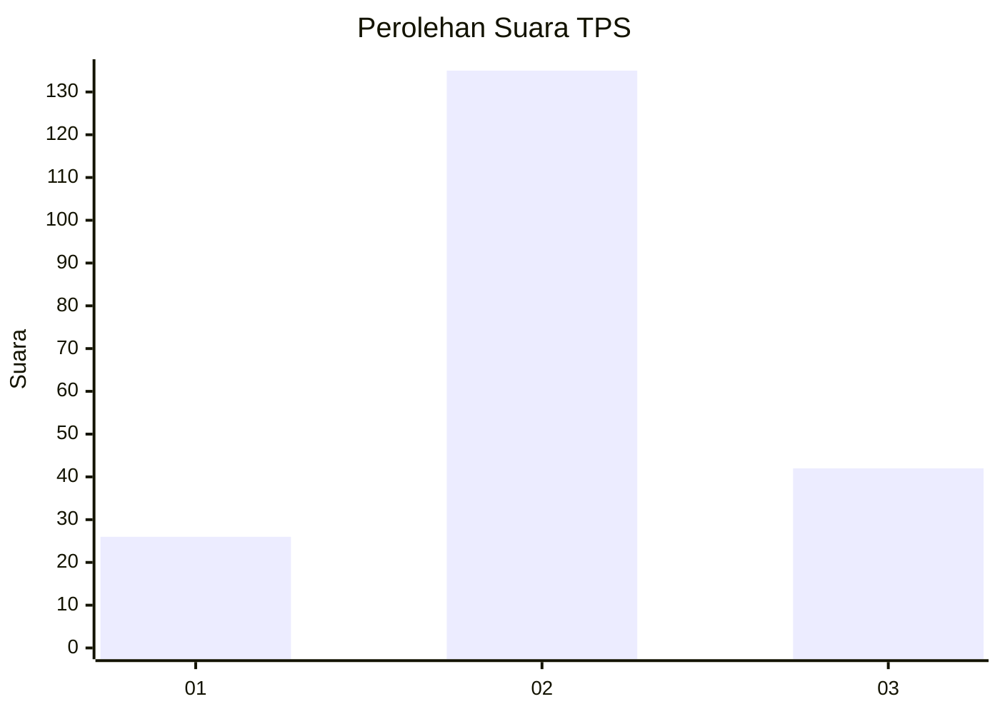
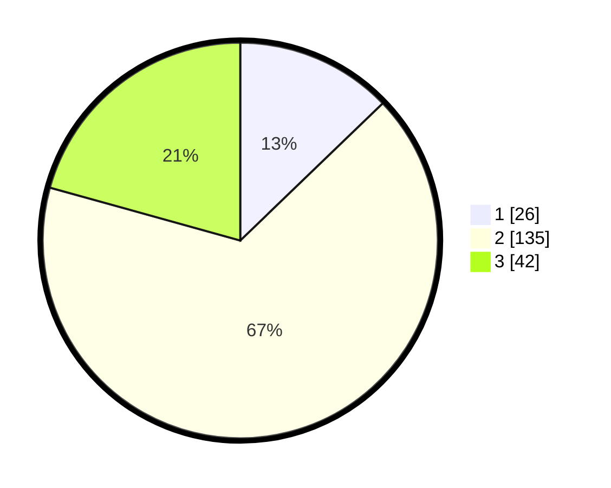

# Hasil

## Grafik

## Tabel

| No. | Nama Paslon    | Suara | Suara (raw) | Persentase |
|:--- |:-------------- | -----:| -----------:| ----------:|
| 1   | ANIES MUHAIMIN | 26    | [26][p-1]   | 12,81      |
| 2   | PRABOWO GIBRAN | 135   | [135][p-2]  | 66,50      |
| 3   | GANJAR MAHFUD  | 42    | [42][p-3]   | 20,69      |

[p-1]: https://github.com/gigit-pemilu/pemilu-2024-51-bali/blob/main/pilpres/hitung-suara/sub/51-bali/sub/08-buleleng/sub/01-gerokgak/sub/2006-penyabangan/sub/017-tps/sub/paslon-1.txt
[p-2]: https://github.com/gigit-pemilu/pemilu-2024-51-bali/blob/main/pilpres/hitung-suara/sub/51-bali/sub/08-buleleng/sub/01-gerokgak/sub/2006-penyabangan/sub/017-tps/sub/paslon-2.txt
[p-3]: https://github.com/gigit-pemilu/pemilu-2024-51-bali/blob/main/pilpres/hitung-suara/sub/51-bali/sub/08-buleleng/sub/01-gerokgak/sub/2006-penyabangan/sub/017-tps/sub/paslon-3.txt

## Foto C Plano

https://sirekap-obj-formc.kpu.go.id/6612/pemilu/ppwp/51/08/01/20/06/5108012006017-20240215-020016--85c878cd-ee86-45ca-9dc0-ce9b385eb702.jpg

https://sirekap-obj-formc.kpu.go.id/6612/pemilu/ppwp/51/08/01/20/06/5108012006017-20240215-020329--1b1bb628-f823-44f9-b504-d6d9fde93607.jpg

https://sirekap-obj-formc.kpu.go.id/6612/pemilu/ppwp/51/08/01/20/06/5108012006017-20240215-020846--195fa8c8-8cf0-4c31-8cb7-e4100b9a5a7e.jpg

## Metadata

| Key        | Value               |
| ---------- | ------------------- |
| Time Stamp | 2024-02-25 11:00:00 |

