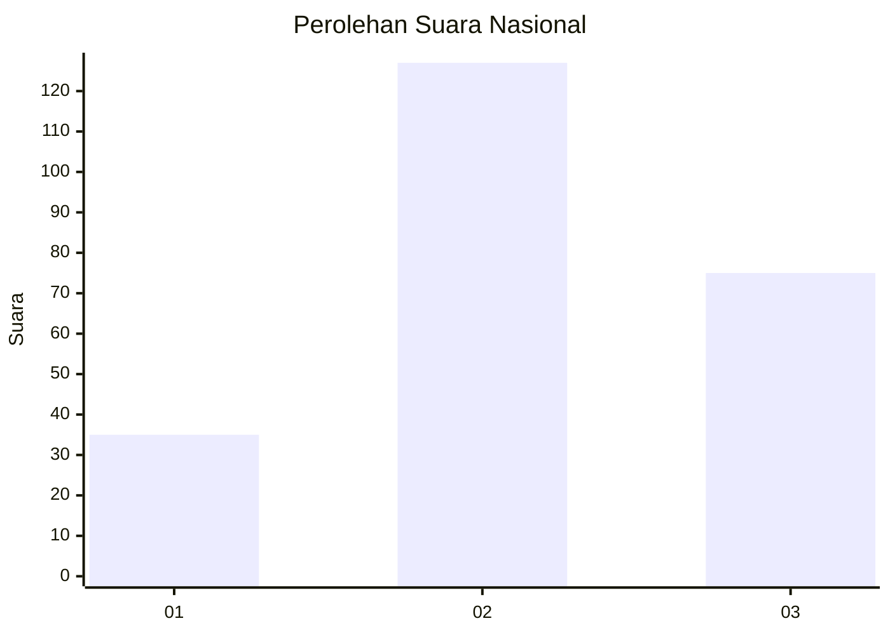
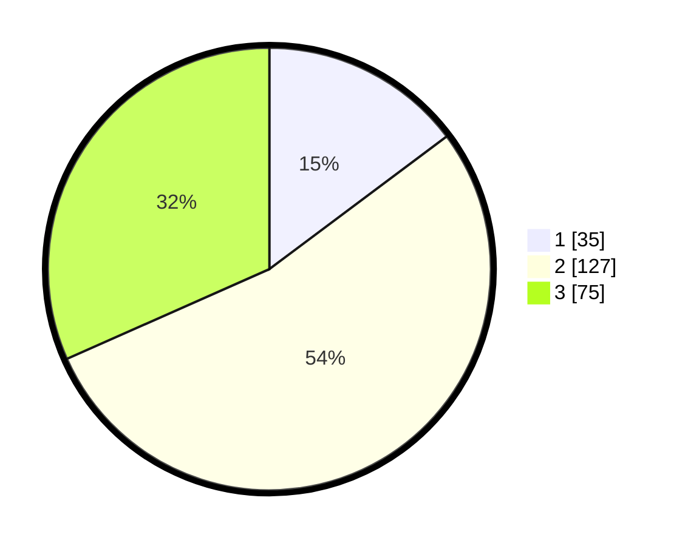

# Hasil

## Grafik

## Tabel

| No. | Nama Paslon    | Suara | Suara (raw) | Persentase |
|:--- |:-------------- | -----:| -----------:| ----------:|
| 1   | ANIES MUHAIMIN | 35    | [35][p-1]   | 14,77      |
| 2   | PRABOWO GIBRAN | 127   | [127][p-2]  | 53,59      |
| 3   | GANJAR MAHFUD  | 75    | [75][p-3]   | 31,65      |

[p-1]: https://github.com/gigit-pemilu/pemilu-2024/blob/main/pilpres/hitung-suara/sub/51-bali/sub/08-buleleng/sub/01-gerokgak/sub/2007-musi/sub/002-tps/sub/paslon-1.txt
[p-2]: https://github.com/gigit-pemilu/pemilu-2024/blob/main/pilpres/hitung-suara/sub/51-bali/sub/08-buleleng/sub/01-gerokgak/sub/2007-musi/sub/002-tps/sub/paslon-2.txt
[p-3]: https://github.com/gigit-pemilu/pemilu-2024/blob/main/pilpres/hitung-suara/sub/51-bali/sub/08-buleleng/sub/01-gerokgak/sub/2007-musi/sub/002-tps/sub/paslon-3.txt

## Foto C Plano

https://sirekap-obj-formc.kpu.go.id/2631/pemilu/ppwp/51/08/01/20/07/5108012007002-20240215-001948--da35f589-ce15-485f-b86d-ed11e2b990bc.jpg

https://sirekap-obj-formc.kpu.go.id/2631/pemilu/ppwp/51/08/01/20/07/5108012007002-20240215-002208--c3b75885-4dc9-4936-afb8-380ea63c6b41.jpg

https://sirekap-obj-formc.kpu.go.id/2631/pemilu/ppwp/51/08/01/20/07/5108012007002-20240215-002319--82838899-3367-49ef-acb7-fe0b9ac54e21.jpg

## Metadata

| Key        | Value               |
| ---------- | ------------------- |
| Time Stamp | 2024-02-24 22:31:28 |

