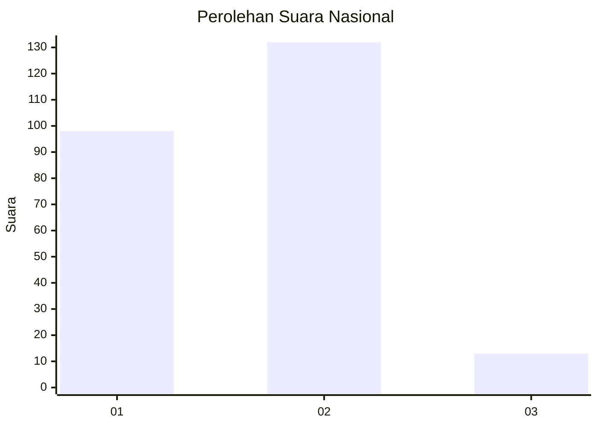
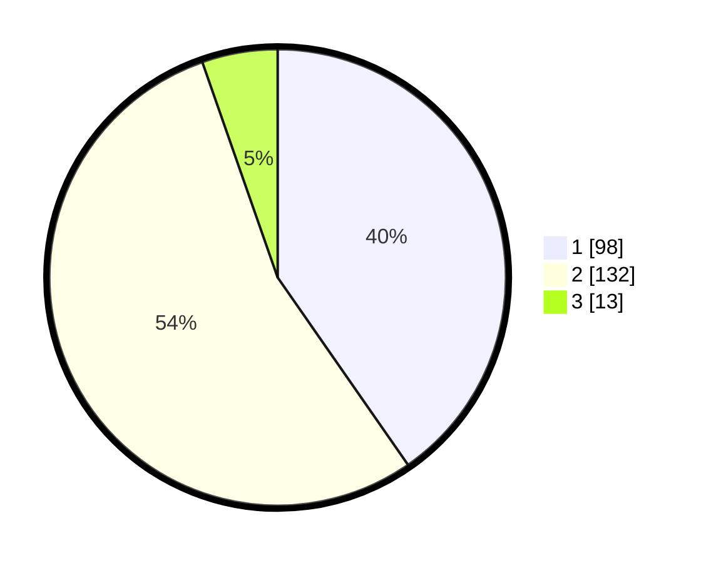

# Hasil

## Grafik

## Tabel

| No. | Nama Paslon    | Suara | Suara (raw) | Persentase |
|:--- |:-------------- | -----:| -----------:| ----------:|
| 1   | ANIES MUHAIMIN | 98    | [98][p-1]   | 40,33      |
| 2   | PRABOWO GIBRAN | 132   | [132][p-2]  | 54,32      |
| 3   | GANJAR MAHFUD  | 13    | [13][p-3]   | 5,35       |

[p-1]: https://github.com/gigit-pemilu/pemilu-2024/blob/main/pilpres/hitung-suara/sub/51-bali/sub/08-buleleng/sub/01-gerokgak/sub/2007-musi/sub/003-tps/sub/paslon-1.txt
[p-2]: https://github.com/gigit-pemilu/pemilu-2024/blob/main/pilpres/hitung-suara/sub/51-bali/sub/08-buleleng/sub/01-gerokgak/sub/2007-musi/sub/003-tps/sub/paslon-2.txt
[p-3]: https://github.com/gigit-pemilu/pemilu-2024/blob/main/pilpres/hitung-suara/sub/51-bali/sub/08-buleleng/sub/01-gerokgak/sub/2007-musi/sub/003-tps/sub/paslon-3.txt

## Foto C Plano

https://sirekap-obj-formc.kpu.go.id/3c1a/pemilu/ppwp/51/08/01/20/07/5108012007003-20240216-144140--7a744a06-d6fa-418e-a763-61dbbf3816c8.jpg

https://sirekap-obj-formc.kpu.go.id/3c1a/pemilu/ppwp/51/08/01/20/07/5108012007003-20240216-144142--e7258067-48ea-432c-888a-033e79d1babe.jpg

https://sirekap-obj-formc.kpu.go.id/3c1a/pemilu/ppwp/51/08/01/20/07/5108012007003-20240216-144141--2d72f49c-7dea-45b5-8a8a-0181c2d7927e.jpg

## Metadata

| Key        | Value               |
| ---------- | ------------------- |
| Time Stamp | 2024-02-16 16:25:10 |

## DATA PEMILIH TETAP

Jumlah pemilih dalam DPT: **293**.
 * L: **147**.
 * P: **146**.

## DATA PENGGUNA HAK PILIH

Jumlah pengguna hak pilih dalam DPT: **240**.
 * L: **121**.
 * P: **119**.

Jumlah pengguna hak pilih dalam DPTb: **2**.
 * L: **2**.
 * P: **0**.

Jumlah pengguna hak pilih dalam DPK: **2**.
 * L: **1**.
 * P: **1**.

Jumlah pengguna hak pilih: **244**.
 * L: **124**.
 * P: **110**.

## JUMLAH SUARA SAH DAN TIDAK SAH

JUMLAH SELURUH SUARA SAH: **243**.

JUMLAH SUARA TIDAK SAH: **1**.

JUMLAH SELURUH SUARA SAH DAN SUARA TIDAK SAH: **244**.

