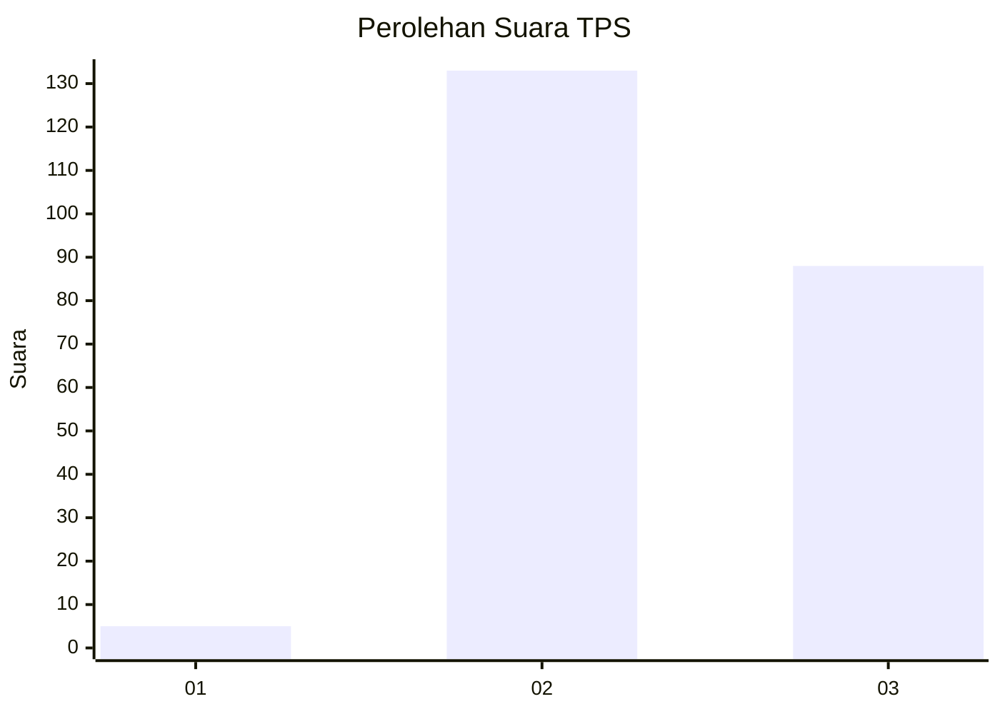
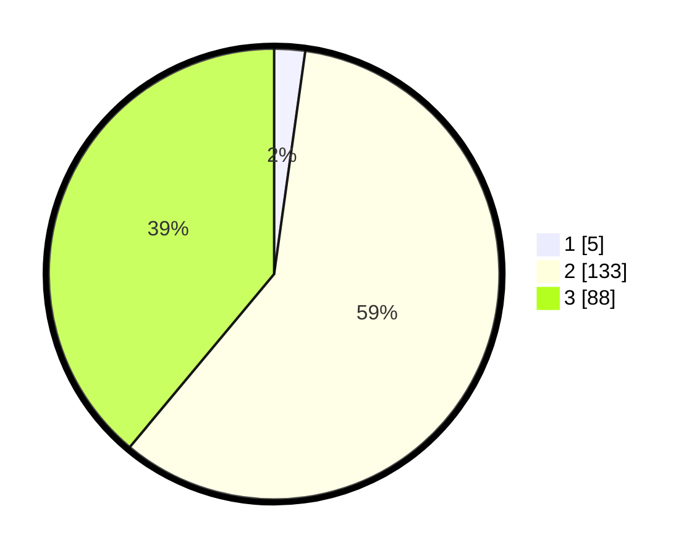

# Hasil

## Grafik

## Tabel

| No. | Nama Paslon    | Suara | Suara (raw) | Persentase |
|:--- |:-------------- | -----:| -----------:| ----------:|
| 1   | ANIES MUHAIMIN | 5     | [5][p-1]    | 2,21       |
| 2   | PRABOWO GIBRAN | 133   | [133][p-2]  | 58,85      |
| 3   | GANJAR MAHFUD  | 88    | [88][p-3]   | 38,94      |

[p-1]: https://github.com/gigit-pemilu/pemilu-2024-51-bali/blob/main/pilpres/hitung-suara/sub/51-bali/sub/08-buleleng/sub/01-gerokgak/sub/2007-musi/sub/005-tps/sub/paslon-1.txt
[p-2]: https://github.com/gigit-pemilu/pemilu-2024-51-bali/blob/main/pilpres/hitung-suara/sub/51-bali/sub/08-buleleng/sub/01-gerokgak/sub/2007-musi/sub/005-tps/sub/paslon-2.txt
[p-3]: https://github.com/gigit-pemilu/pemilu-2024-51-bali/blob/main/pilpres/hitung-suara/sub/51-bali/sub/08-buleleng/sub/01-gerokgak/sub/2007-musi/sub/005-tps/sub/paslon-3.txt

## Foto C Plano

https://sirekap-obj-formc.kpu.go.id/d1a9/pemilu/ppwp/51/08/01/20/07/5108012007005-20240215-010353--8bf022ee-2768-4711-a2cc-fc26b74f154d.jpg

https://sirekap-obj-formc.kpu.go.id/d1a9/pemilu/ppwp/51/08/01/20/07/5108012007005-20240215-010510--7b5fd3c9-caec-4c06-9a2d-7bfcbf098b65.jpg

https://sirekap-obj-formc.kpu.go.id/d1a9/pemilu/ppwp/51/08/01/20/07/5108012007005-20240215-010600--0da371a4-9928-4821-9117-35acaa402235.jpg

## Metadata

| Key        | Value               |
| ---------- | ------------------- |
| Time Stamp | 2024-02-24 22:31:28 |

