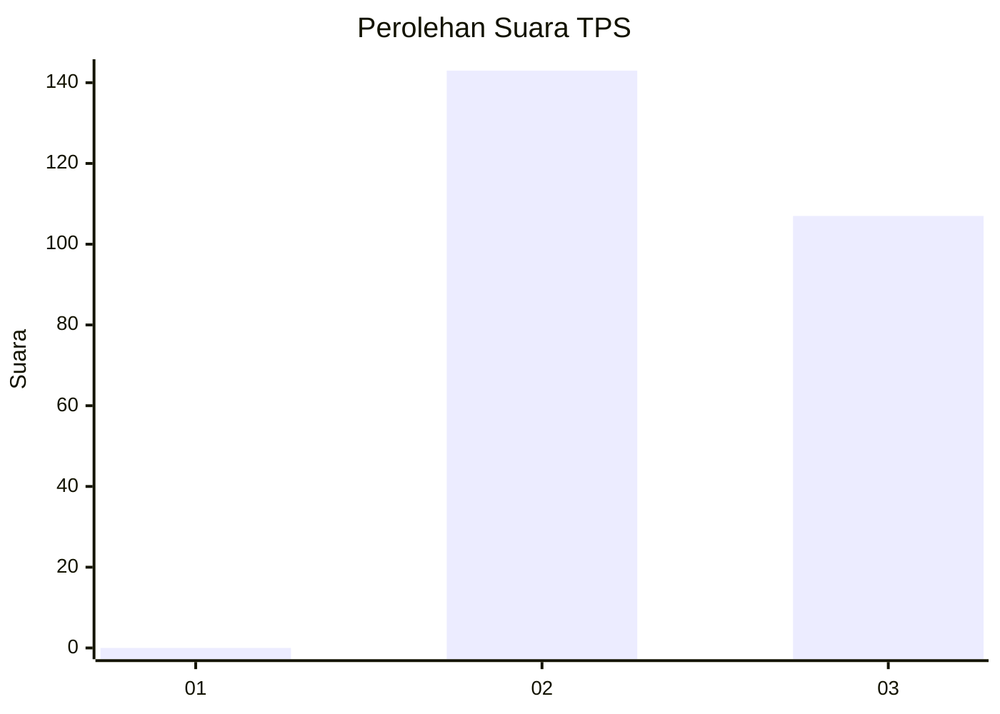
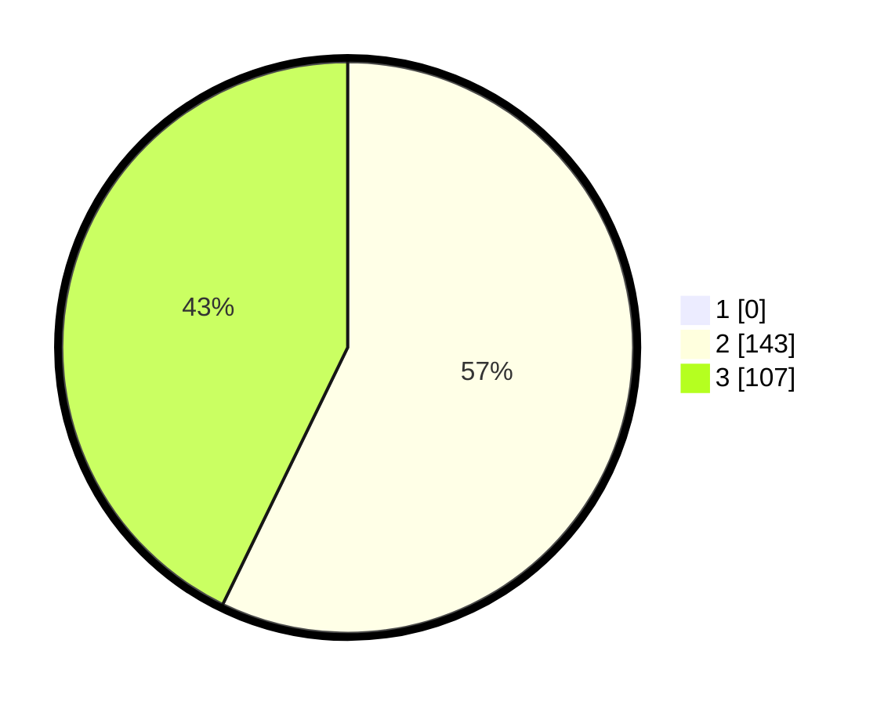

# Hasil

## Grafik

## Tabel

| No. | Nama Paslon    | Suara | Suara (raw) | Persentase |
|:--- |:-------------- | -----:| -----------:| ----------:|
| 1   | ANIES MUHAIMIN | 0     | [0][p-1]    | 0,00       |
| 2   | PRABOWO GIBRAN | 143   | [143][p-2]  | 57,20      |
| 3   | GANJAR MAHFUD  | 107   | [107][p-3]  | 42,80      |

[p-1]: https://github.com/gigit-pemilu/pemilu-2024-51-bali/blob/main/pilpres/hitung-suara/sub/51-bali/sub/08-buleleng/sub/01-gerokgak/sub/2007-musi/sub/006-tps/sub/paslon-1.txt
[p-2]: https://github.com/gigit-pemilu/pemilu-2024-51-bali/blob/main/pilpres/hitung-suara/sub/51-bali/sub/08-buleleng/sub/01-gerokgak/sub/2007-musi/sub/006-tps/sub/paslon-2.txt
[p-3]: https://github.com/gigit-pemilu/pemilu-2024-51-bali/blob/main/pilpres/hitung-suara/sub/51-bali/sub/08-buleleng/sub/01-gerokgak/sub/2007-musi/sub/006-tps/sub/paslon-3.txt

## Foto C Plano

https://sirekap-obj-formc.kpu.go.id/898d/pemilu/ppwp/51/08/01/20/07/5108012007006-20240215-003126--8cfd92f9-945d-4e7b-b36d-b781ce417c0e.jpg

https://sirekap-obj-formc.kpu.go.id/898d/pemilu/ppwp/51/08/01/20/07/5108012007006-20240215-002955--c46fd87c-d9e1-4616-b240-de95f357c9b1.jpg

https://sirekap-obj-formc.kpu.go.id/898d/pemilu/ppwp/51/08/01/20/07/5108012007006-20240215-003252--f4968c27-4fdf-41c7-9d36-95da6be9c3ac.jpg

## Metadata

| Key        | Value               |
| ---------- | ------------------- |
| Time Stamp | 2024-02-24 22:31:28 |

