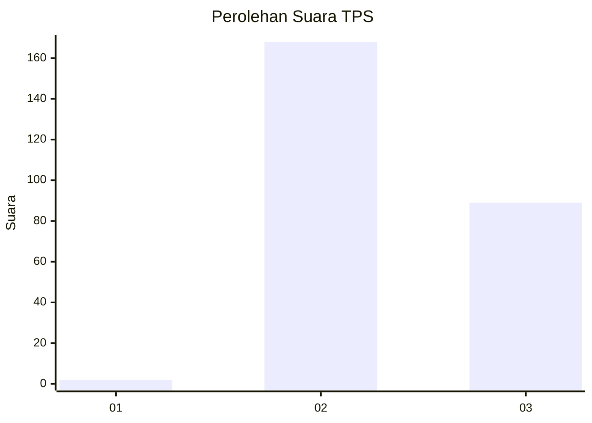
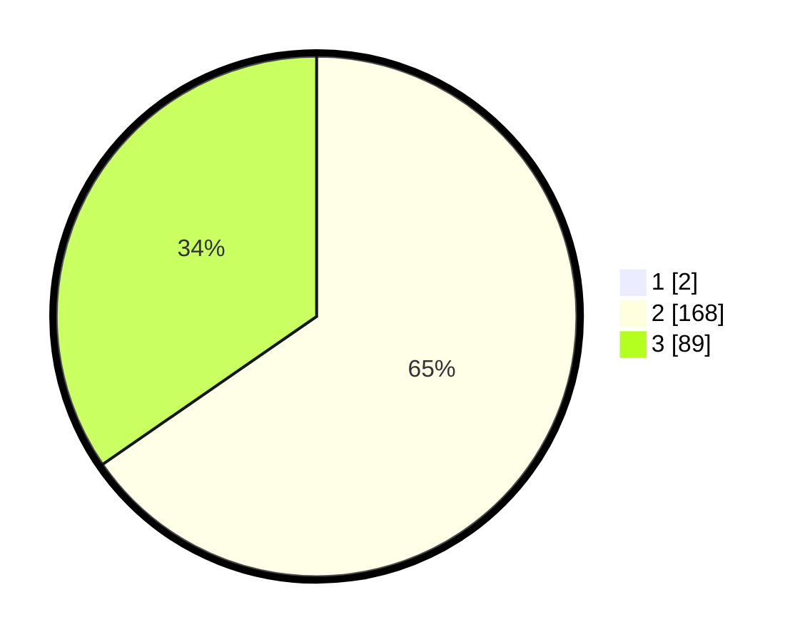

# Hasil

## Grafik

## Tabel

| No. | Nama Paslon    | Suara | Suara (raw) | Persentase |
|:--- |:-------------- | -----:| -----------:| ----------:|
| 1   | ANIES MUHAIMIN | 2     | [2][p-1]    | 0,77       |
| 2   | PRABOWO GIBRAN | 168   | [168][p-2]  | 64,86      |
| 3   | GANJAR MAHFUD  | 89    | [89][p-3]   | 34,36      |

[p-1]: https://github.com/gigit-pemilu/pemilu-2024-51-bali/blob/main/pilpres/hitung-suara/sub/51-bali/sub/08-buleleng/sub/01-gerokgak/sub/2007-musi/sub/007-tps/sub/paslon-1.txt
[p-2]: https://github.com/gigit-pemilu/pemilu-2024-51-bali/blob/main/pilpres/hitung-suara/sub/51-bali/sub/08-buleleng/sub/01-gerokgak/sub/2007-musi/sub/007-tps/sub/paslon-2.txt
[p-3]: https://github.com/gigit-pemilu/pemilu-2024-51-bali/blob/main/pilpres/hitung-suara/sub/51-bali/sub/08-buleleng/sub/01-gerokgak/sub/2007-musi/sub/007-tps/sub/paslon-3.txt

## Foto C Plano

https://sirekap-obj-formc.kpu.go.id/a756/pemilu/ppwp/51/08/01/20/07/5108012007007-20240214-212853--69d7a12c-250c-4ee4-be47-b3f32676e3c4.jpg

https://sirekap-obj-formc.kpu.go.id/a756/pemilu/ppwp/51/08/01/20/07/5108012007007-20240214-213031--0559de08-f79e-4af3-a2cd-c2b40536bdf7.jpg

https://sirekap-obj-formc.kpu.go.id/a756/pemilu/ppwp/51/08/01/20/07/5108012007007-20240214-213140--eb4eeb57-3f49-4272-bb12-323399e484d8.jpg

## Metadata

| Key        | Value               |
| ---------- | ------------------- |
| Time Stamp | 2024-02-25 11:00:00 |

