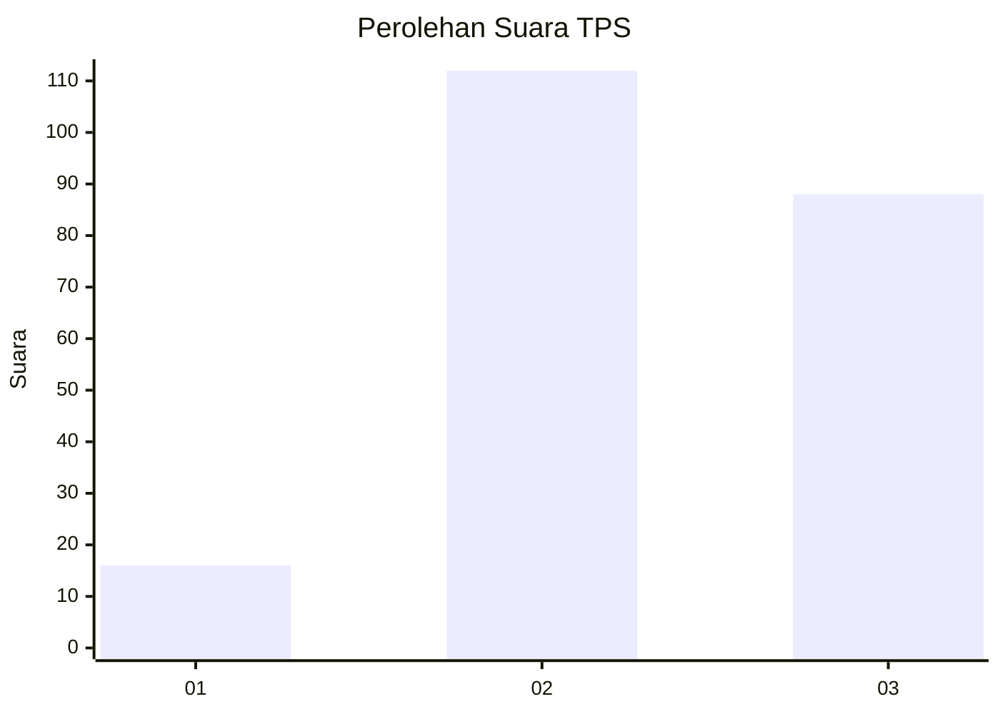
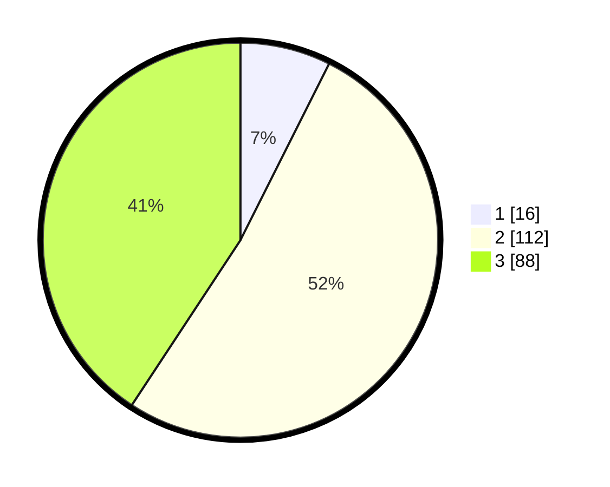

# Hasil

## Grafik

## Tabel

| No. | Nama Paslon    | Suara | Suara (raw) | Persentase |
|:--- |:-------------- | -----:| -----------:| ----------:|
| 1   | ANIES MUHAIMIN | 16    | [16][p-1]   | 7,41       |
| 2   | PRABOWO GIBRAN | 112   | [112][p-2]  | 51,85      |
| 3   | GANJAR MAHFUD  | 88    | [88][p-3]   | 40,74      |

[p-1]: https://github.com/gigit-pemilu/pemilu-2024-51-bali/blob/main/pilpres/hitung-suara/sub/51-bali/sub/08-buleleng/sub/01-gerokgak/sub/2008-sanggalangit/sub/001-tps/sub/paslon-1.txt
[p-2]: https://github.com/gigit-pemilu/pemilu-2024-51-bali/blob/main/pilpres/hitung-suara/sub/51-bali/sub/08-buleleng/sub/01-gerokgak/sub/2008-sanggalangit/sub/001-tps/sub/paslon-2.txt
[p-3]: https://github.com/gigit-pemilu/pemilu-2024-51-bali/blob/main/pilpres/hitung-suara/sub/51-bali/sub/08-buleleng/sub/01-gerokgak/sub/2008-sanggalangit/sub/001-tps/sub/paslon-3.txt

## Foto C Plano

https://sirekap-obj-formc.kpu.go.id/dfa7/pemilu/ppwp/51/08/01/20/08/5108012008001-20240215-002757--4b0cefd3-2a93-464a-b892-fab676aa2ee9.jpg

https://sirekap-obj-formc.kpu.go.id/dfa7/pemilu/ppwp/51/08/01/20/08/5108012008001-20240215-002953--a02a2647-ae82-4cee-a53d-177ab8f10437.jpg

## Metadata

| Key        | Value               |
| ---------- | ------------------- |
| Time Stamp | 2024-02-25 15:00:00 |

