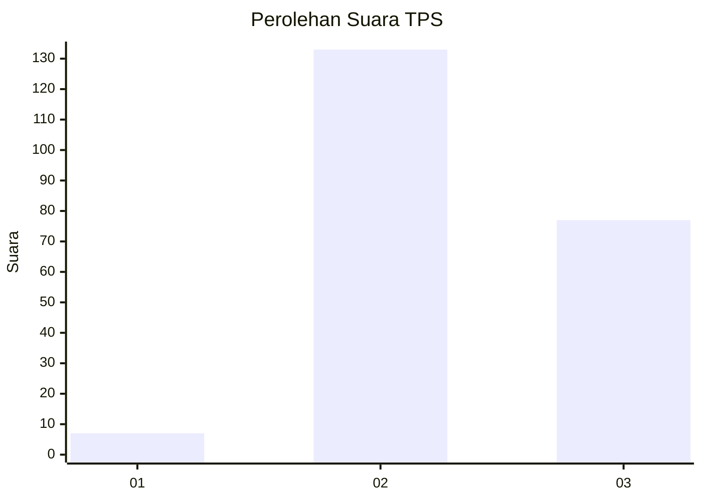
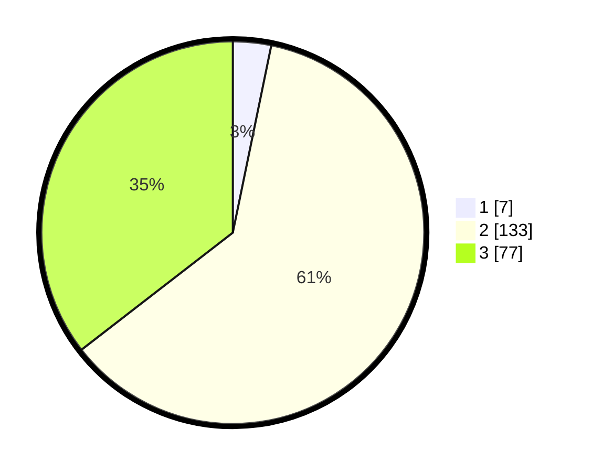

# Hasil

## Grafik

## Tabel

| No. | Nama Paslon    | Suara | Suara (raw) | Persentase |
|:--- |:-------------- | -----:| -----------:| ----------:|
| 1   | ANIES MUHAIMIN | 7     | [7][p-1]    | 3,23       |
| 2   | PRABOWO GIBRAN | 133   | [133][p-2]  | 61,29      |
| 3   | GANJAR MAHFUD  | 77    | [77][p-3]   | 35,48      |

[p-1]: https://github.com/gigit-pemilu/pemilu-2024-51-bali/blob/main/pilpres/hitung-suara/sub/51-bali/sub/08-buleleng/sub/01-gerokgak/sub/2008-sanggalangit/sub/003-tps/sub/paslon-1.txt
[p-2]: https://github.com/gigit-pemilu/pemilu-2024-51-bali/blob/main/pilpres/hitung-suara/sub/51-bali/sub/08-buleleng/sub/01-gerokgak/sub/2008-sanggalangit/sub/003-tps/sub/paslon-2.txt
[p-3]: https://github.com/gigit-pemilu/pemilu-2024-51-bali/blob/main/pilpres/hitung-suara/sub/51-bali/sub/08-buleleng/sub/01-gerokgak/sub/2008-sanggalangit/sub/003-tps/sub/paslon-3.txt

## Foto C Plano

https://sirekap-obj-formc.kpu.go.id/7090/pemilu/ppwp/51/08/01/20/08/5108012008003-20240214-141825--344b8884-b56a-4b35-a0d2-e78572b3e3b4.jpg

https://sirekap-obj-formc.kpu.go.id/7090/pemilu/ppwp/51/08/01/20/08/5108012008003-20240214-141830--14d22bde-aa36-4991-8d78-e41ff7abc4ef.jpg

https://sirekap-obj-formc.kpu.go.id/7090/pemilu/ppwp/51/08/01/20/08/5108012008003-20240214-141835--a6c4e94b-fef0-4b2e-ad5d-6d2287ab3de1.jpg

## Metadata

| Key        | Value               |
| ---------- | ------------------- |
| Time Stamp | 2024-02-14 21:46:01 |

