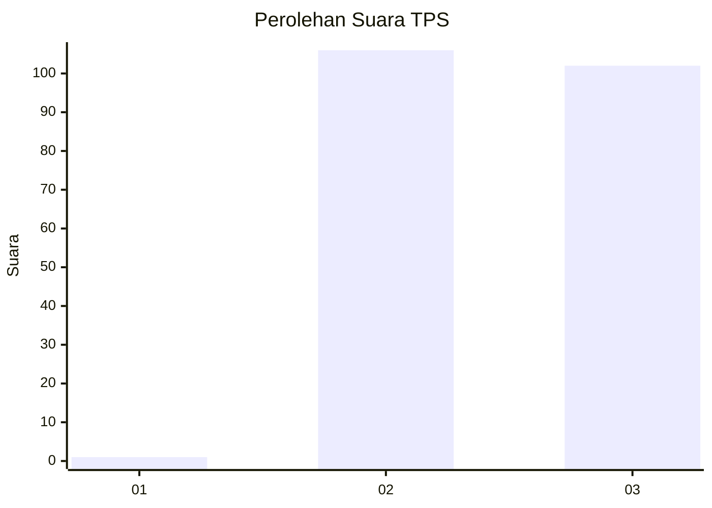
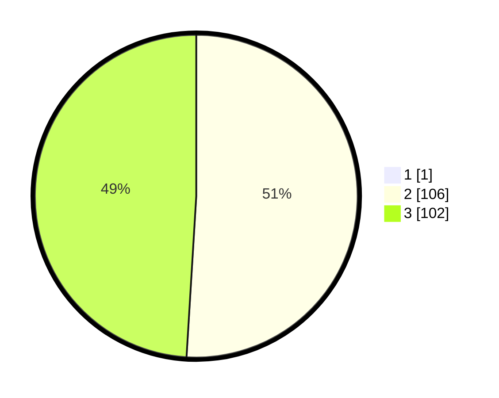

# Hasil

## Grafik

## Tabel

| No. | Nama Paslon    | Suara | Suara (raw) | Persentase |
|:--- |:-------------- | -----:| -----------:| ----------:|
| 1   | ANIES MUHAIMIN | 1     | [1][p-1]    | 0,48       |
| 2   | PRABOWO GIBRAN | 106   | [106][p-2]  | 50,72      |
| 3   | GANJAR MAHFUD  | 102   | [102][p-3]  | 48,80      |

[p-1]: https://github.com/gigit-pemilu/pemilu-2024-51-bali/blob/main/pilpres/hitung-suara/sub/51-bali/sub/08-buleleng/sub/01-gerokgak/sub/2008-sanggalangit/sub/008-tps/sub/paslon-1.txt
[p-2]: https://github.com/gigit-pemilu/pemilu-2024-51-bali/blob/main/pilpres/hitung-suara/sub/51-bali/sub/08-buleleng/sub/01-gerokgak/sub/2008-sanggalangit/sub/008-tps/sub/paslon-2.txt
[p-3]: https://github.com/gigit-pemilu/pemilu-2024-51-bali/blob/main/pilpres/hitung-suara/sub/51-bali/sub/08-buleleng/sub/01-gerokgak/sub/2008-sanggalangit/sub/008-tps/sub/paslon-3.txt

## Foto C Plano

https://sirekap-obj-formc.kpu.go.id/4adf/pemilu/ppwp/51/08/01/20/08/5108012008008-20240214-141112--1fa1db60-fb59-49c5-bced-d06f938f8b38.jpg

https://sirekap-obj-formc.kpu.go.id/4adf/pemilu/ppwp/51/08/01/20/08/5108012008008-20240214-141332--cc2be57b-eba7-4390-867a-fa31a6e31025.jpg

https://sirekap-obj-formc.kpu.go.id/4adf/pemilu/ppwp/51/08/01/20/08/5108012008008-20240215-005554--ffbb0c64-9085-4f2d-8b9a-ff86795d9876.jpg

## Metadata

| Key        | Value               |
| ---------- | ------------------- |
| Time Stamp | 2024-02-15 02:10:27 |

