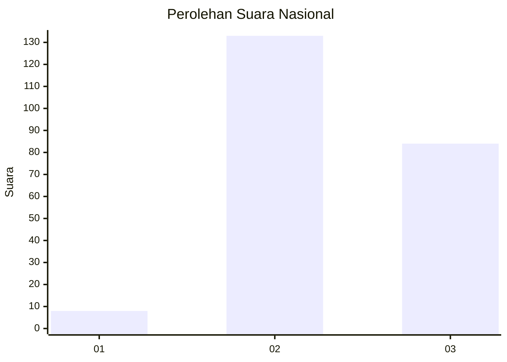
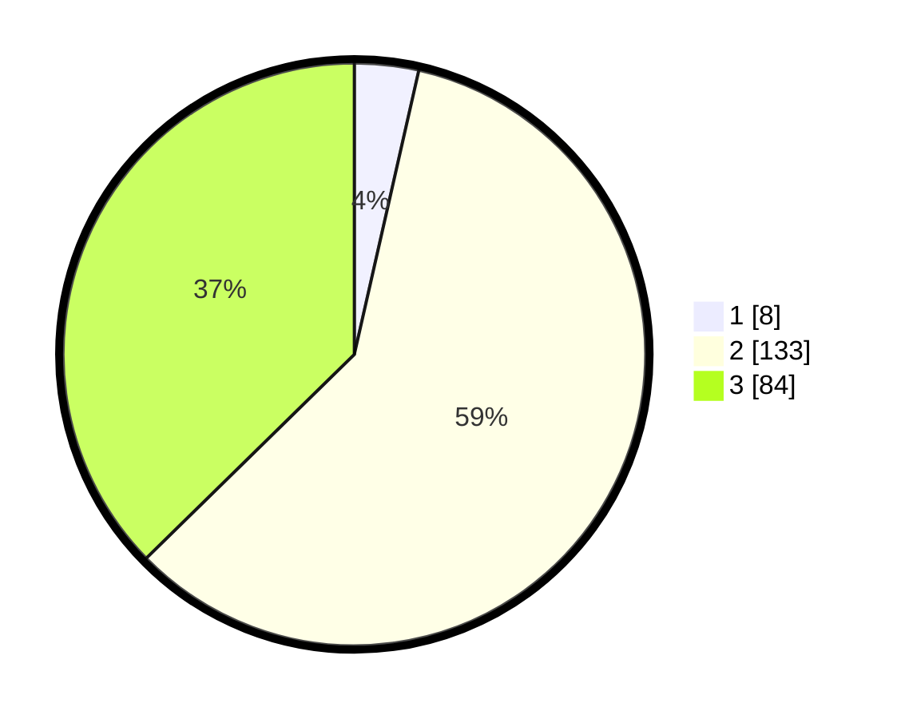

# Hasil

## Grafik

## Tabel

| No. | Nama Paslon    | Suara | Suara (raw) | Persentase |
|:--- |:-------------- | -----:| -----------:| ----------:|
| 1   | ANIES MUHAIMIN | 8     | [8][p-1]    | 3,56       |
| 2   | PRABOWO GIBRAN | 133   | [133][p-2]  | 59,11      |
| 3   | GANJAR MAHFUD  | 84    | [84][p-3]   | 37,33      |

[p-1]: https://github.com/gigit-pemilu/pemilu-2024/blob/main/pilpres/hitung-suara/sub/51-bali/sub/08-buleleng/sub/01-gerokgak/sub/2008-sanggalangit/sub/012-tps/sub/paslon-1.txt
[p-2]: https://github.com/gigit-pemilu/pemilu-2024/blob/main/pilpres/hitung-suara/sub/51-bali/sub/08-buleleng/sub/01-gerokgak/sub/2008-sanggalangit/sub/012-tps/sub/paslon-2.txt
[p-3]: https://github.com/gigit-pemilu/pemilu-2024/blob/main/pilpres/hitung-suara/sub/51-bali/sub/08-buleleng/sub/01-gerokgak/sub/2008-sanggalangit/sub/012-tps/sub/paslon-3.txt

## Foto C Plano

https://sirekap-obj-formc.kpu.go.id/afd1/pemilu/ppwp/51/08/01/20/08/5108012008012-20240214-234924--f9777a9e-ae31-466b-a8cc-7a4940e36cf2.jpg

https://sirekap-obj-formc.kpu.go.id/afd1/pemilu/ppwp/51/08/01/20/08/5108012008012-20240214-234943--14e78869-3615-4a0c-af27-2a7548c1fa8f.jpg

https://sirekap-obj-formc.kpu.go.id/afd1/pemilu/ppwp/51/08/01/20/08/5108012008012-20240214-234951--2460eb18-51cd-4d2f-996e-5a7c18fe6e15.jpg

## Metadata

| Key        | Value               |
| ---------- | ------------------- |
| Time Stamp | 2024-02-25 12:00:00 |

