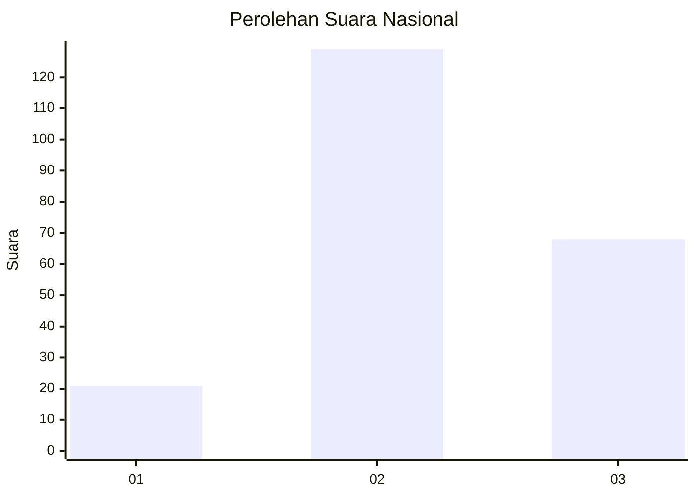
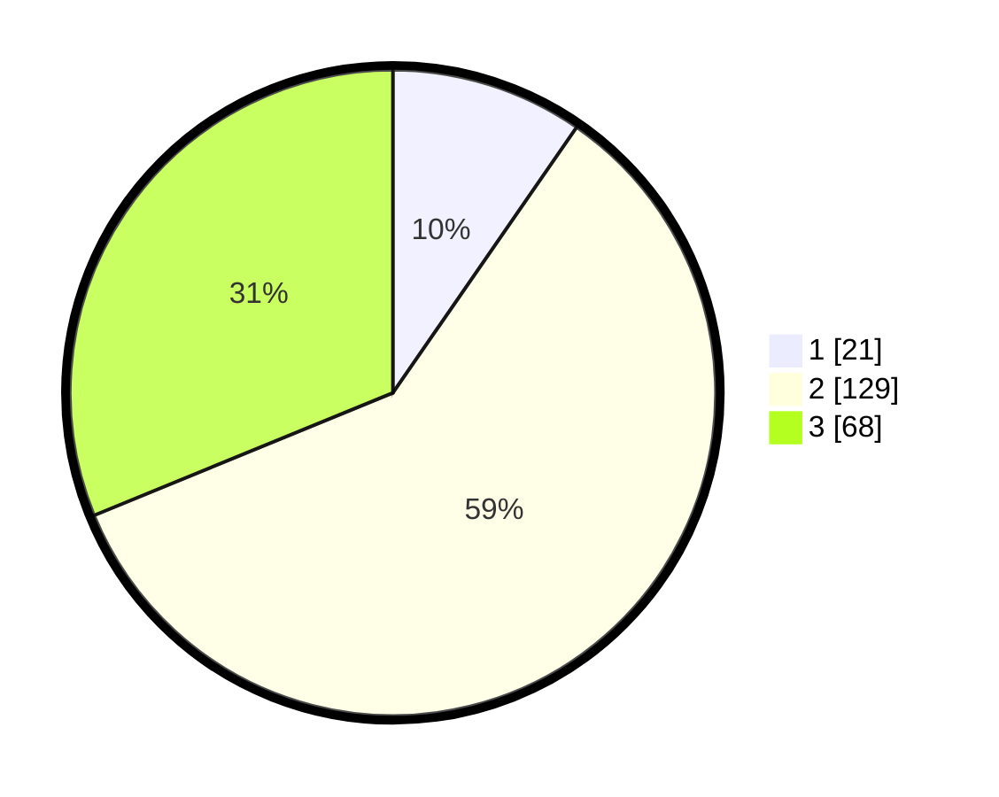

# Hasil

## Grafik

## Tabel

| No. | Nama Paslon    | Suara | Suara (raw) | Persentase |
|:--- |:-------------- | -----:| -----------:| ----------:|
| 1   | ANIES MUHAIMIN | 21    | [21][p-1]   | 9,63       |
| 2   | PRABOWO GIBRAN | 129   | [129][p-2]  | 59,17      |
| 3   | GANJAR MAHFUD  | 68    | [68][p-3]   | 31,19      |

[p-1]: https://github.com/gigit-pemilu/pemilu-2024/blob/main/pilpres/hitung-suara/sub/51-bali/sub/08-buleleng/sub/01-gerokgak/sub/2009-gerokgak/sub/005-tps/sub/paslon-1.txt
[p-2]: https://github.com/gigit-pemilu/pemilu-2024/blob/main/pilpres/hitung-suara/sub/51-bali/sub/08-buleleng/sub/01-gerokgak/sub/2009-gerokgak/sub/005-tps/sub/paslon-2.txt
[p-3]: https://github.com/gigit-pemilu/pemilu-2024/blob/main/pilpres/hitung-suara/sub/51-bali/sub/08-buleleng/sub/01-gerokgak/sub/2009-gerokgak/sub/005-tps/sub/paslon-3.txt

## Foto C Plano

https://sirekap-obj-formc.kpu.go.id/4054/pemilu/ppwp/51/08/01/20/09/5108012009005-20240215-031611--3390aa65-5110-4b27-a823-3ecd3dbe8a69.jpg

https://sirekap-obj-formc.kpu.go.id/4054/pemilu/ppwp/51/08/01/20/09/5108012009005-20240215-031708--eb39378e-7279-47d9-9fba-a02ac88dd235.jpg

https://sirekap-obj-formc.kpu.go.id/4054/pemilu/ppwp/51/08/01/20/09/5108012009005-20240215-031901--1a1715a5-e3ee-4c57-a9fe-f8b62bc976a1.jpg

## Metadata

| Key        | Value               |
| ---------- | ------------------- |
| Time Stamp | 2024-02-24 22:31:28 |

