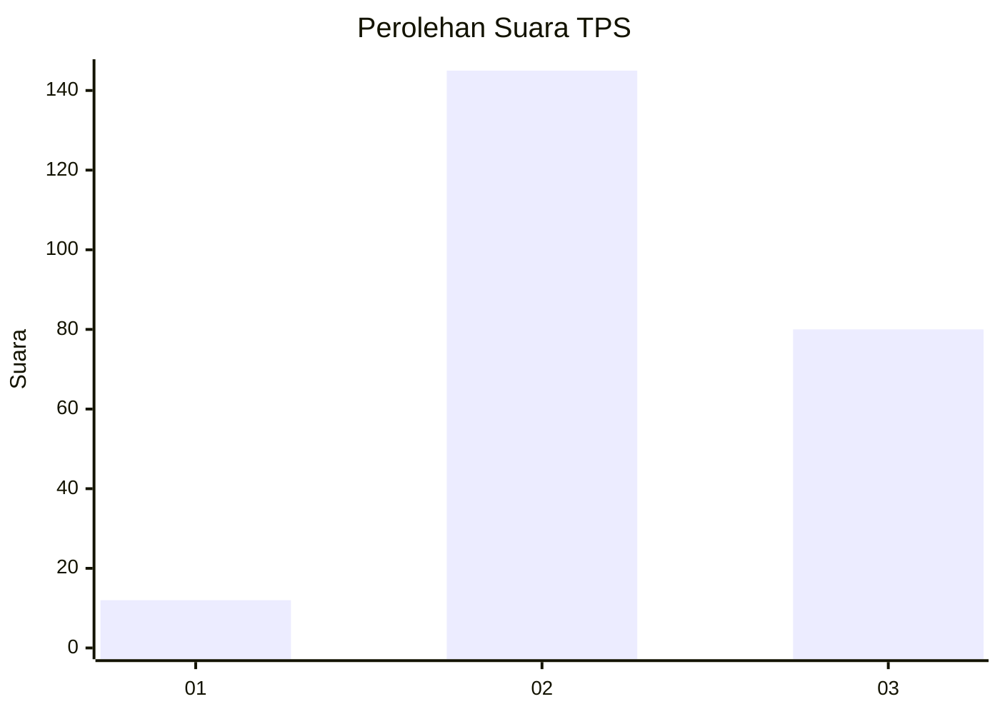
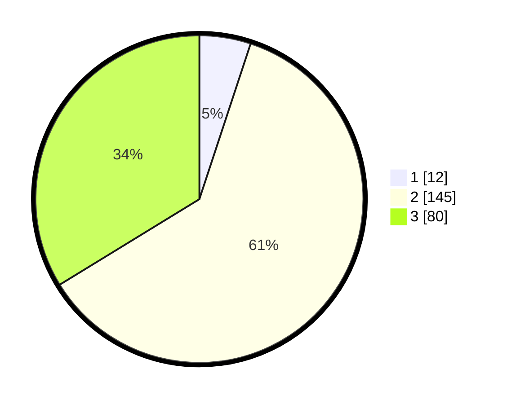

# Hasil

## Grafik

## Tabel

| No. | Nama Paslon    | Suara | Suara (raw) | Persentase |
|:--- |:-------------- | -----:| -----------:| ----------:|
| 1   | ANIES MUHAIMIN | 12    | [12][p-1]   | 5,06       |
| 2   | PRABOWO GIBRAN | 145   | [145][p-2]  | 61,18      |
| 3   | GANJAR MAHFUD  | 80    | [80][p-3]   | 33,76      |

[p-1]: https://github.com/gigit-pemilu/pemilu-2024-51-bali/blob/main/pilpres/hitung-suara/sub/51-bali/sub/08-buleleng/sub/01-gerokgak/sub/2009-gerokgak/sub/006-tps/sub/paslon-1.txt
[p-2]: https://github.com/gigit-pemilu/pemilu-2024-51-bali/blob/main/pilpres/hitung-suara/sub/51-bali/sub/08-buleleng/sub/01-gerokgak/sub/2009-gerokgak/sub/006-tps/sub/paslon-2.txt
[p-3]: https://github.com/gigit-pemilu/pemilu-2024-51-bali/blob/main/pilpres/hitung-suara/sub/51-bali/sub/08-buleleng/sub/01-gerokgak/sub/2009-gerokgak/sub/006-tps/sub/paslon-3.txt

## Foto C Plano

https://sirekap-obj-formc.kpu.go.id/3f53/pemilu/ppwp/51/08/01/20/09/5108012009006-20240214-141707--9c7aaaaa-985e-4ae9-a6e9-0aefbba3f6a2.jpg

https://sirekap-obj-formc.kpu.go.id/3f53/pemilu/ppwp/51/08/01/20/09/5108012009006-20240214-132849--ba3460ec-57dc-4ce0-88c5-53560ba8741a.jpg

https://sirekap-obj-formc.kpu.go.id/3f53/pemilu/ppwp/51/08/01/20/09/5108012009006-20240214-132935--d235cb20-546d-4de3-9880-a7fcbb333a59.jpg

## Metadata

| Key        | Value               |
| ---------- | ------------------- |
| Time Stamp | 2024-02-14 21:46:01 |

## DATA PEMILIH TETAP

Jumlah pemilih dalam DPT: **259**.
 * L: **125**.
 * P: **134**.

## DATA PENGGUNA HAK PILIH

Jumlah pengguna hak pilih dalam DPT: **203**.
 * L: **105**.
 * P: **98**.

Jumlah pengguna hak pilih dalam DPTb: **3**.
 * L: **2**.
 * P: **1**.

Jumlah pengguna hak pilih dalam DPK: **1**.
 * L: **1**.
 * P: **0**.

Jumlah pengguna hak pilih: **207**.
 * L: **108**.
 * P: **99**.

## JUMLAH SUARA SAH DAN TIDAK SAH

JUMLAH SELURUH SUARA SAH: **207**.

JUMLAH SUARA TIDAK SAH: **0**.

JUMLAH SELURUH SUARA SAH DAN SUARA TIDAK SAH: **207**.

