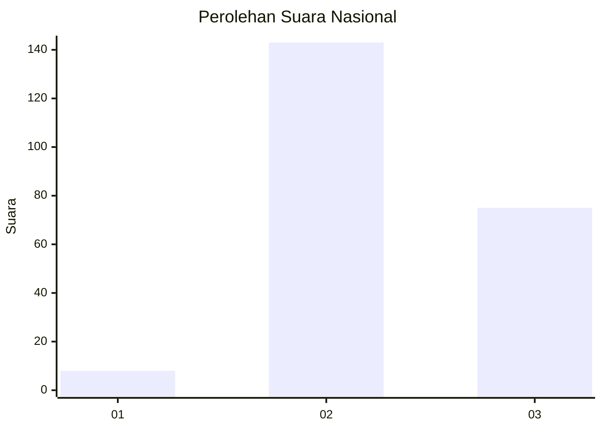
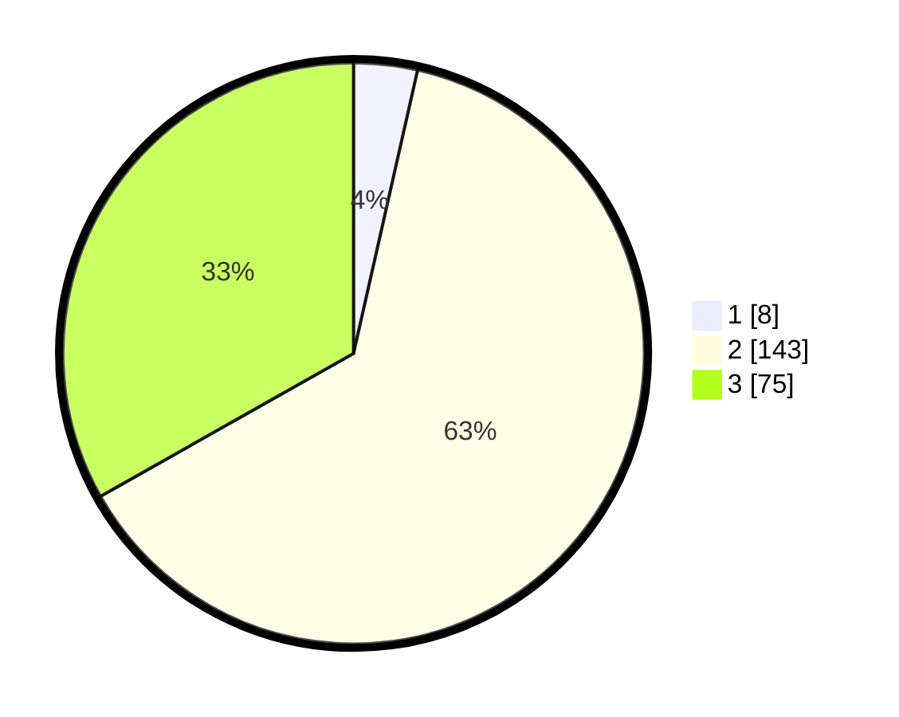

# Hasil

## Grafik

## Tabel

| No. | Nama Paslon    | Suara | Suara (raw) | Persentase |
|:--- |:-------------- | -----:| -----------:| ----------:|
| 1   | ANIES MUHAIMIN | 8     | [8][p-1]    | 3,54       |
| 2   | PRABOWO GIBRAN | 143   | [143][p-2]  | 63,27      |
| 3   | GANJAR MAHFUD  | 75    | [75][p-3]   | 33,19      |

[p-1]: https://github.com/gigit-pemilu/pemilu-2024/blob/main/pilpres/hitung-suara/sub/51-bali/sub/08-buleleng/sub/01-gerokgak/sub/2009-gerokgak/sub/008-tps/sub/paslon-1.txt
[p-2]: https://github.com/gigit-pemilu/pemilu-2024/blob/main/pilpres/hitung-suara/sub/51-bali/sub/08-buleleng/sub/01-gerokgak/sub/2009-gerokgak/sub/008-tps/sub/paslon-2.txt
[p-3]: https://github.com/gigit-pemilu/pemilu-2024/blob/main/pilpres/hitung-suara/sub/51-bali/sub/08-buleleng/sub/01-gerokgak/sub/2009-gerokgak/sub/008-tps/sub/paslon-3.txt

## Foto C Plano

https://sirekap-obj-formc.kpu.go.id/e39d/pemilu/ppwp/51/08/01/20/09/5108012009008-20240214-231135--6e47ec34-4645-497c-893b-01366d8025a7.jpg

https://sirekap-obj-formc.kpu.go.id/e39d/pemilu/ppwp/51/08/01/20/09/5108012009008-20240214-231333--61208607-68e0-4f77-bcbb-795f5ad9bdf4.jpg

https://sirekap-obj-formc.kpu.go.id/e39d/pemilu/ppwp/51/08/01/20/09/5108012009008-20240214-231428--a8b2bace-11b9-4c3e-8351-ca6b1d4a5ce0.jpg

## Metadata

| Key        | Value               |
| ---------- | ------------------- |
| Time Stamp | 2024-02-24 22:31:28 |

