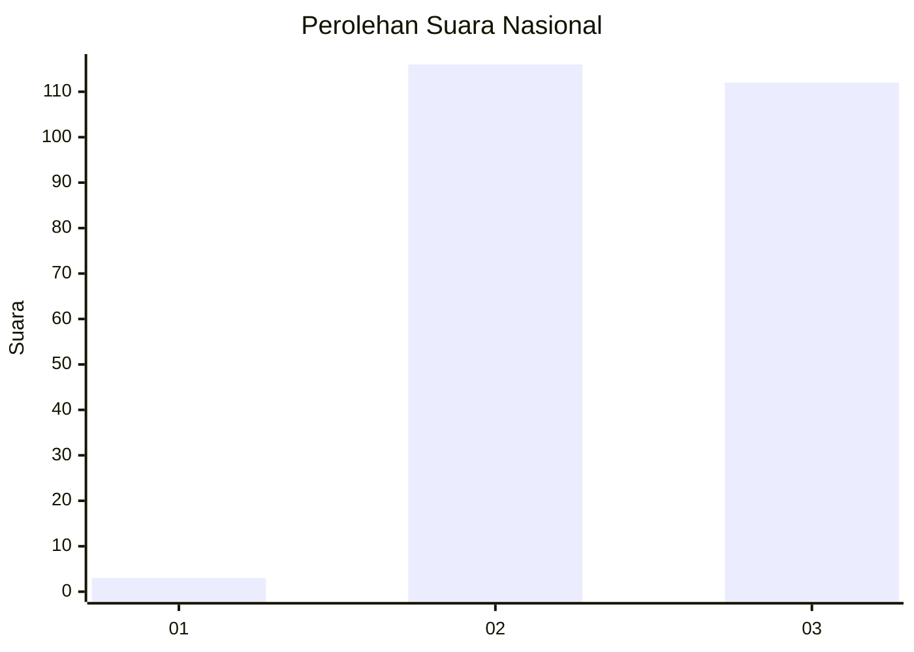
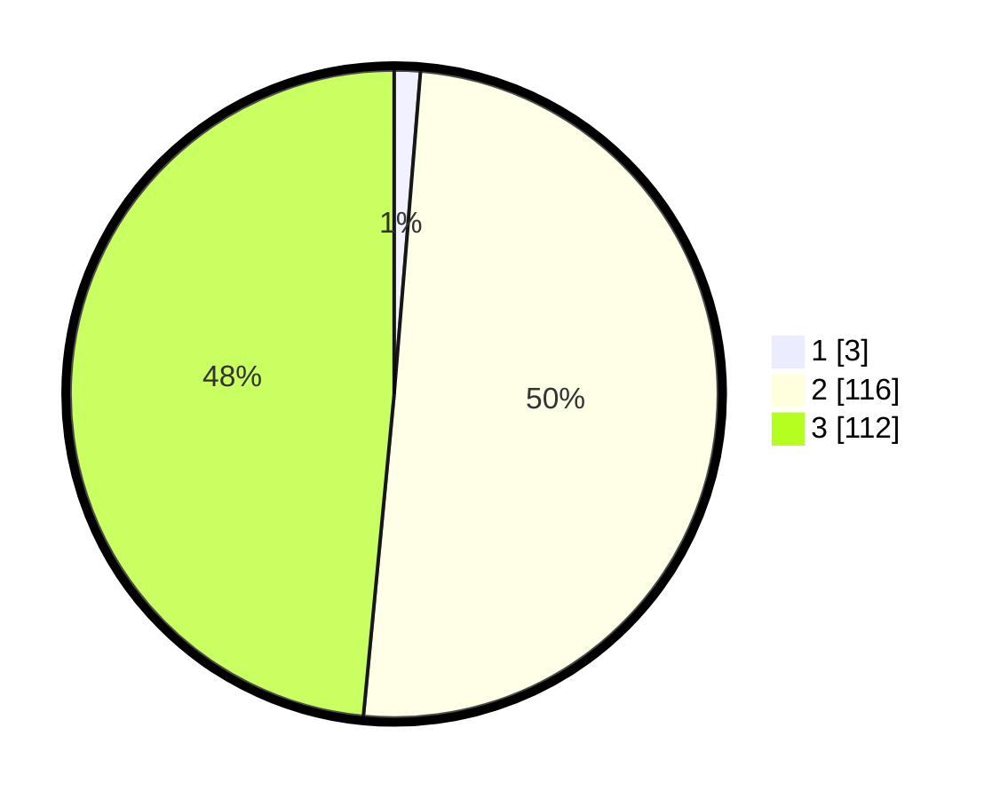

# Hasil

## Grafik

## Tabel

| No. | Nama Paslon    | Suara | Suara (raw) | Persentase |
|:--- |:-------------- | -----:| -----------:| ----------:|
| 1   | ANIES MUHAIMIN | 3     | [3][p-1]    | 1,30       |
| 2   | PRABOWO GIBRAN | 116   | [116][p-2]  | 50,22      |
| 3   | GANJAR MAHFUD  | 112   | [112][p-3]  | 48,48      |

[p-1]: https://github.com/gigit-pemilu/pemilu-2024/blob/main/pilpres/hitung-suara/sub/51-bali/sub/08-buleleng/sub/01-gerokgak/sub/2009-gerokgak/sub/009-tps/sub/paslon-1.txt
[p-2]: https://github.com/gigit-pemilu/pemilu-2024/blob/main/pilpres/hitung-suara/sub/51-bali/sub/08-buleleng/sub/01-gerokgak/sub/2009-gerokgak/sub/009-tps/sub/paslon-2.txt
[p-3]: https://github.com/gigit-pemilu/pemilu-2024/blob/main/pilpres/hitung-suara/sub/51-bali/sub/08-buleleng/sub/01-gerokgak/sub/2009-gerokgak/sub/009-tps/sub/paslon-3.txt

## Foto C Plano

https://sirekap-obj-formc.kpu.go.id/e551/pemilu/ppwp/51/08/01/20/09/5108012009009-20240214-230019--fd9c4003-5487-4b30-b08f-b556827590b9.jpg

https://sirekap-obj-formc.kpu.go.id/e551/pemilu/ppwp/51/08/01/20/09/5108012009009-20240215-013320--41ba78ba-98ef-4e15-a6e1-b36579ff8439.jpg

https://sirekap-obj-formc.kpu.go.id/e551/pemilu/ppwp/51/08/01/20/09/5108012009009-20240214-230209--07e06f13-f571-4604-9f93-b8f281ec6092.jpg

## Metadata

| Key        | Value               |
| ---------- | ------------------- |
| Time Stamp | 2024-02-25 15:00:00 |

