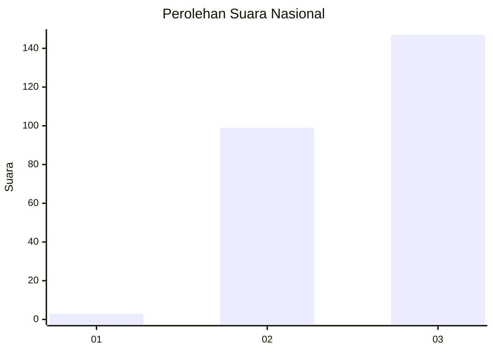
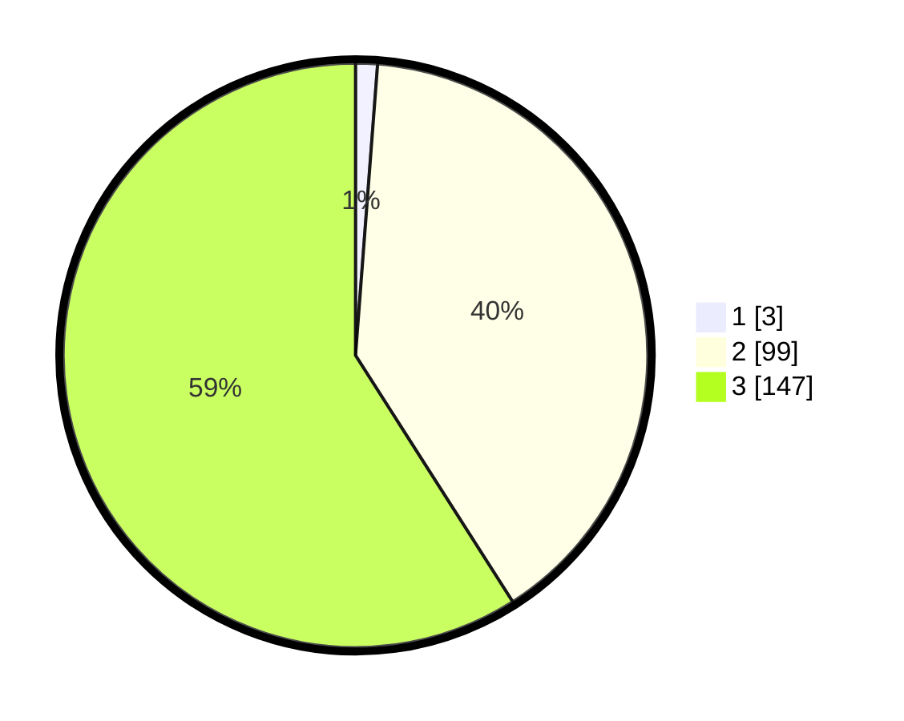

# Hasil

## Grafik

## Tabel

| No. | Nama Paslon    | Suara | Suara (raw) | Persentase |
|:--- |:-------------- | -----:| -----------:| ----------:|
| 1   | ANIES MUHAIMIN | 3     | [3][p-1]    | 1,20       |
| 2   | PRABOWO GIBRAN | 99    | [99][p-2]   | 39,76      |
| 3   | GANJAR MAHFUD  | 147   | [147][p-3]  | 59,04      |

[p-1]: https://github.com/gigit-pemilu/pemilu-2024/blob/main/pilpres/hitung-suara/sub/51-bali/sub/08-buleleng/sub/01-gerokgak/sub/2009-gerokgak/sub/010-tps/sub/paslon-1.txt
[p-2]: https://github.com/gigit-pemilu/pemilu-2024/blob/main/pilpres/hitung-suara/sub/51-bali/sub/08-buleleng/sub/01-gerokgak/sub/2009-gerokgak/sub/010-tps/sub/paslon-2.txt
[p-3]: https://github.com/gigit-pemilu/pemilu-2024/blob/main/pilpres/hitung-suara/sub/51-bali/sub/08-buleleng/sub/01-gerokgak/sub/2009-gerokgak/sub/010-tps/sub/paslon-3.txt

## Foto C Plano

https://sirekap-obj-formc.kpu.go.id/7ded/pemilu/ppwp/51/08/01/20/09/5108012009010-20240215-013326--e3121922-7bff-4741-8e32-efa85730703a.jpg

https://sirekap-obj-formc.kpu.go.id/7ded/pemilu/ppwp/51/08/01/20/09/5108012009010-20240215-013134--ce1ffd31-f8ba-4854-a6d6-e94235597b0f.jpg

https://sirekap-obj-formc.kpu.go.id/7ded/pemilu/ppwp/51/08/01/20/09/5108012009010-20240215-013427--36678425-ac1b-4854-aee1-2891b71760c4.jpg

## Metadata

| Key        | Value               |
| ---------- | ------------------- |
| Time Stamp | 2024-02-24 22:31:28 |

