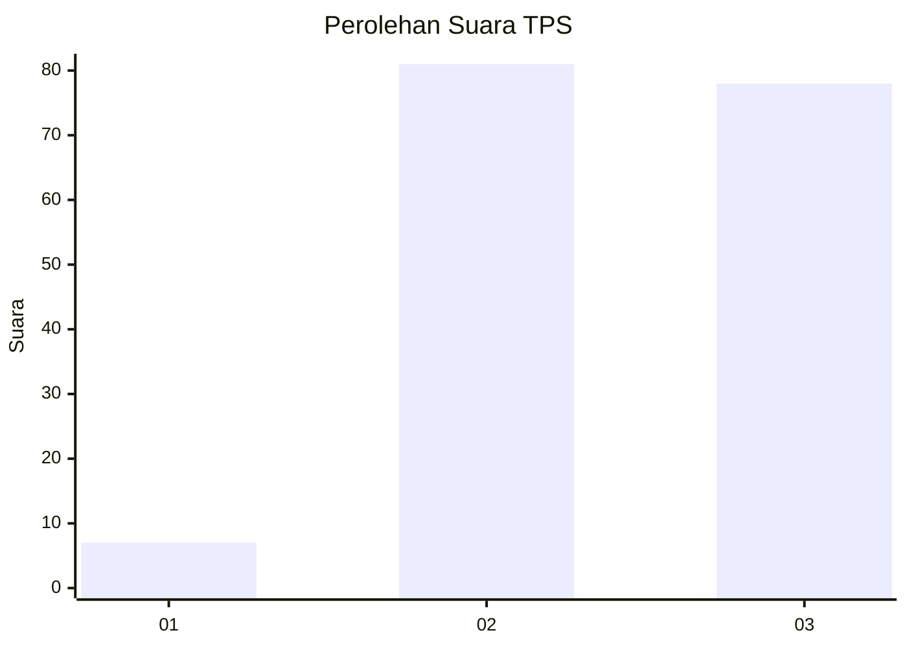
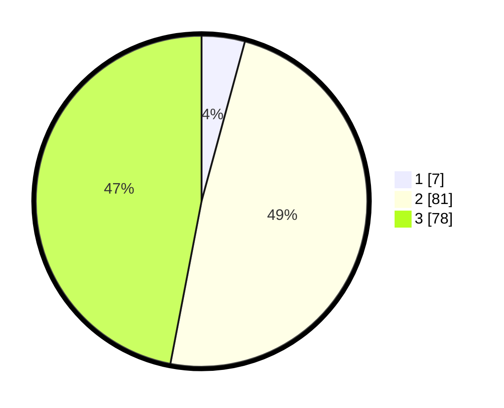

# Hasil

## Grafik

## Tabel

| No. | Nama Paslon    | Suara | Suara (raw) | Persentase |
|:--- |:-------------- | -----:| -----------:| ----------:|
| 1   | ANIES MUHAIMIN | 7     | [7][p-1]    | 4,22       |
| 2   | PRABOWO GIBRAN | 81    | [81][p-2]   | 48,80      |
| 3   | GANJAR MAHFUD  | 78    | [78][p-3]   | 46,99      |

[p-1]: https://github.com/gigit-pemilu/pemilu-2024-51-bali/blob/main/pilpres/hitung-suara/sub/51-bali/sub/08-buleleng/sub/01-gerokgak/sub/2009-gerokgak/sub/013-tps/sub/paslon-1.txt
[p-2]: https://github.com/gigit-pemilu/pemilu-2024-51-bali/blob/main/pilpres/hitung-suara/sub/51-bali/sub/08-buleleng/sub/01-gerokgak/sub/2009-gerokgak/sub/013-tps/sub/paslon-2.txt
[p-3]: https://github.com/gigit-pemilu/pemilu-2024-51-bali/blob/main/pilpres/hitung-suara/sub/51-bali/sub/08-buleleng/sub/01-gerokgak/sub/2009-gerokgak/sub/013-tps/sub/paslon-3.txt

## Foto C Plano

https://sirekap-obj-formc.kpu.go.id/e507/pemilu/ppwp/51/08/01/20/09/5108012009013-20240214-215502--8c054637-ef68-4e51-a9d0-962ededfdc62.jpg

https://sirekap-obj-formc.kpu.go.id/e507/pemilu/ppwp/51/08/01/20/09/5108012009013-20240214-215536--fababa68-7c80-4638-b9c7-a8435966a16a.jpg

https://sirekap-obj-formc.kpu.go.id/e507/pemilu/ppwp/51/08/01/20/09/5108012009013-20240214-215609--66bbd1f0-983f-440c-939f-c633150f5d85.jpg

## Metadata

| Key        | Value               |
| ---------- | ------------------- |
| Time Stamp | 2024-02-24 22:31:28 |

