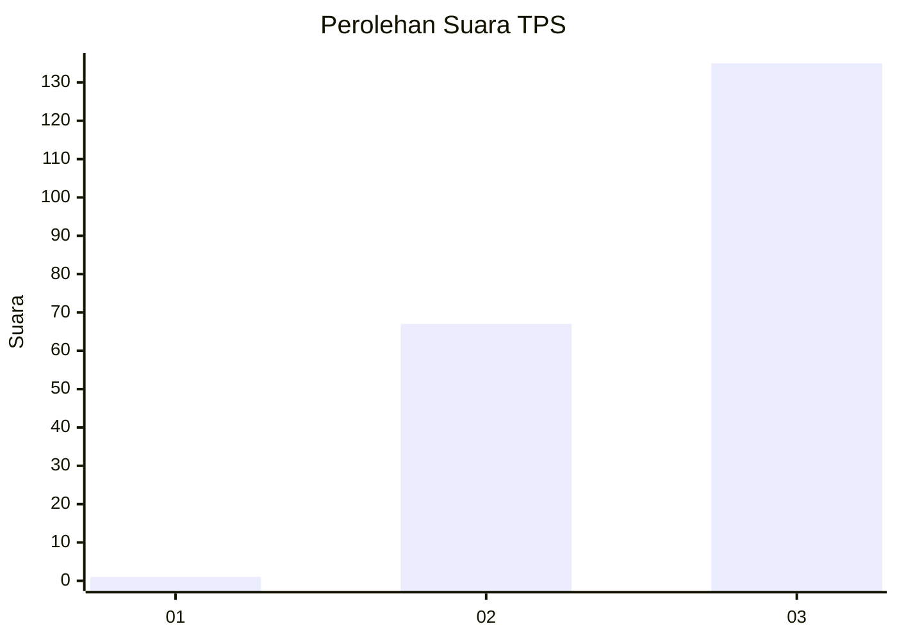
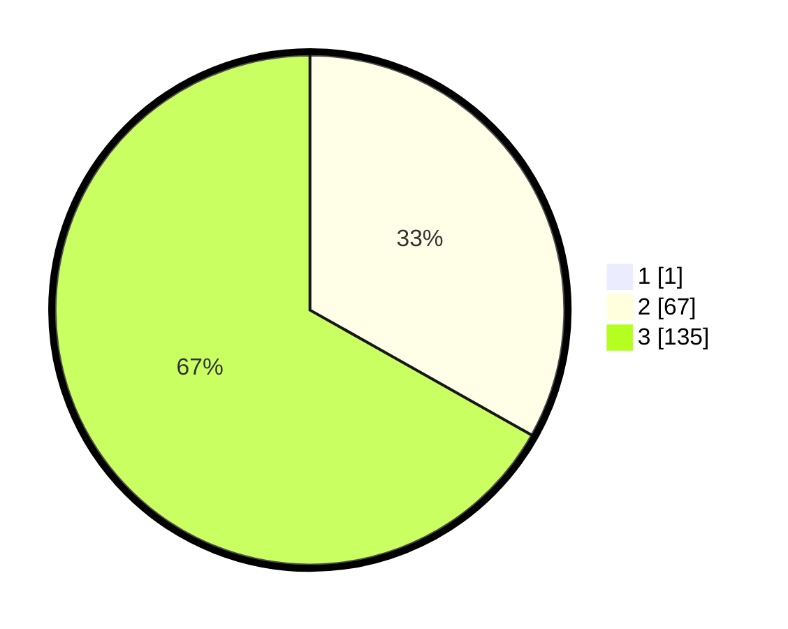

# Hasil

## Grafik

## Tabel

| No. | Nama Paslon    | Suara | Suara (raw) | Persentase |
|:--- |:-------------- | -----:| -----------:| ----------:|
| 1   | ANIES MUHAIMIN | 1     | [1][p-1]    | 0,49       |
| 2   | PRABOWO GIBRAN | 67    | [67][p-2]   | 33,00      |
| 3   | GANJAR MAHFUD  | 135   | [135][p-3]  | 66,50      |

[p-1]: https://github.com/gigit-pemilu/pemilu-2024-51-bali/blob/main/pilpres/hitung-suara/sub/51-bali/sub/08-buleleng/sub/01-gerokgak/sub/2009-gerokgak/sub/017-tps/sub/paslon-1.txt
[p-2]: https://github.com/gigit-pemilu/pemilu-2024-51-bali/blob/main/pilpres/hitung-suara/sub/51-bali/sub/08-buleleng/sub/01-gerokgak/sub/2009-gerokgak/sub/017-tps/sub/paslon-2.txt
[p-3]: https://github.com/gigit-pemilu/pemilu-2024-51-bali/blob/main/pilpres/hitung-suara/sub/51-bali/sub/08-buleleng/sub/01-gerokgak/sub/2009-gerokgak/sub/017-tps/sub/paslon-3.txt

## Foto C Plano

https://sirekap-obj-formc.kpu.go.id/36d6/pemilu/ppwp/51/08/01/20/09/5108012009017-20240215-040318--34cdc5aa-f583-4ea1-b2fa-a78814d1dc35.jpg

https://sirekap-obj-formc.kpu.go.id/36d6/pemilu/ppwp/51/08/01/20/09/5108012009017-20240215-065621--9bdc92ff-85fa-4753-bd72-a29cbf851373.jpg

https://sirekap-obj-formc.kpu.go.id/36d6/pemilu/ppwp/51/08/01/20/09/5108012009017-20240215-040608--275f811b-7d9f-4e8d-ad1b-2c78fd778560.jpg

## Metadata

| Key        | Value               |
| ---------- | ------------------- |
| Time Stamp | 2024-02-24 22:31:28 |

