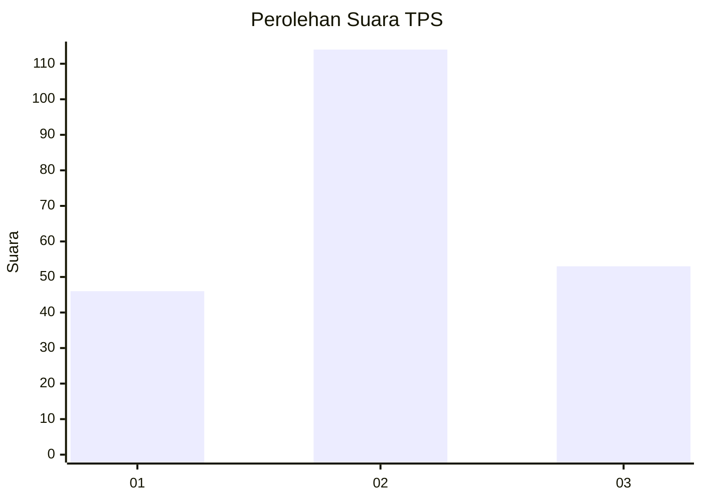
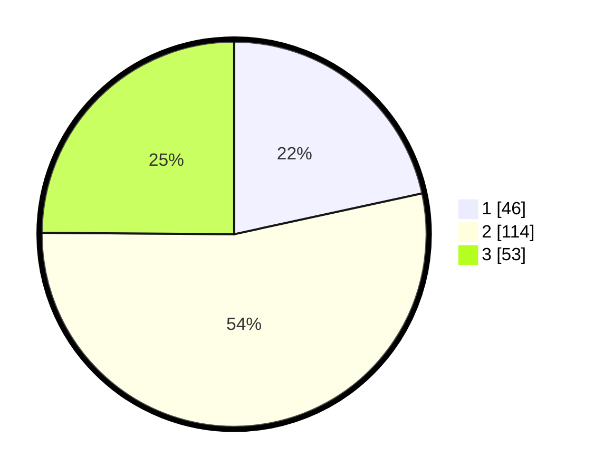

# Hasil

## Grafik

## Tabel

| No. | Nama Paslon    | Suara | Suara (raw) | Persentase |
|:--- |:-------------- | -----:| -----------:| ----------:|
| 1   | ANIES MUHAIMIN | 46    | [46][p-1]   | 21,60      |
| 2   | PRABOWO GIBRAN | 114   | [114][p-2]  | 53,52      |
| 3   | GANJAR MAHFUD  | 53    | [53][p-3]   | 24,88      |

[p-1]: https://github.com/gigit-pemilu/pemilu-2024-51-bali/blob/main/pilpres/hitung-suara/sub/51-bali/sub/08-buleleng/sub/01-gerokgak/sub/2010-patas/sub/028-tps/sub/paslon-1.txt
[p-2]: https://github.com/gigit-pemilu/pemilu-2024-51-bali/blob/main/pilpres/hitung-suara/sub/51-bali/sub/08-buleleng/sub/01-gerokgak/sub/2010-patas/sub/028-tps/sub/paslon-2.txt
[p-3]: https://github.com/gigit-pemilu/pemilu-2024-51-bali/blob/main/pilpres/hitung-suara/sub/51-bali/sub/08-buleleng/sub/01-gerokgak/sub/2010-patas/sub/028-tps/sub/paslon-3.txt

## Foto C Plano

https://sirekap-obj-formc.kpu.go.id/75d5/pemilu/ppwp/51/08/01/20/10/5108012010028-20240215-003252--a0935616-05df-41d3-9237-44fccf8c4739.jpg

https://sirekap-obj-formc.kpu.go.id/75d5/pemilu/ppwp/51/08/01/20/10/5108012010028-20240215-003243--fe06a6ca-2c32-40ca-a32d-afa54f898f2d.jpg

https://sirekap-obj-formc.kpu.go.id/75d5/pemilu/ppwp/51/08/01/20/10/5108012010028-20240215-003259--a6fa7c46-dda5-481e-bb11-10e1e079911d.jpg

## Metadata

| Key        | Value               |
| ---------- | ------------------- |
| Time Stamp | 2024-02-24 22:31:28 |

