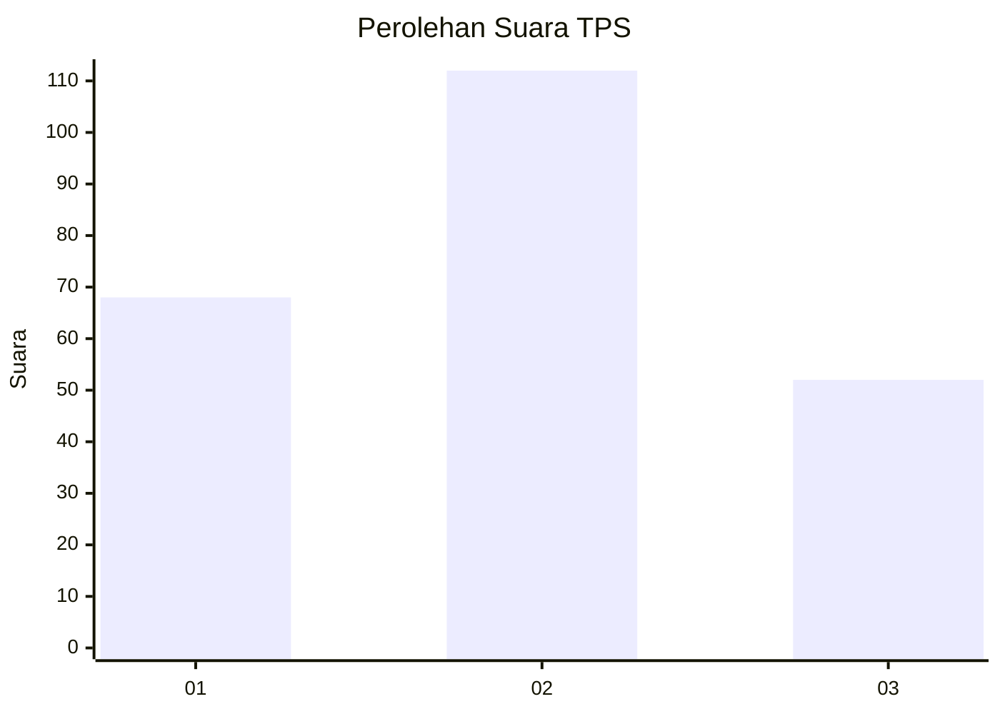
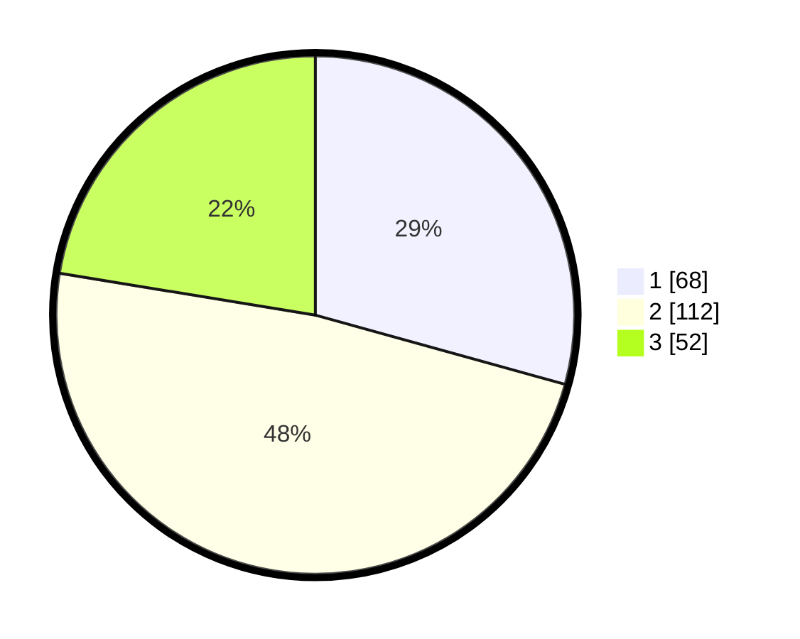

# Hasil

## Grafik

## Tabel

| No. | Nama Paslon    | Suara | Suara (raw) | Persentase |
|:--- |:-------------- | -----:| -----------:| ----------:|
| 1   | ANIES MUHAIMIN | 68    | [68][p-1]   | 29,31      |
| 2   | PRABOWO GIBRAN | 112   | [112][p-2]  | 48,28      |
| 3   | GANJAR MAHFUD  | 52    | [52][p-3]   | 22,41      |

[p-1]: https://github.com/gigit-pemilu/pemilu-2024-51-bali/blob/main/pilpres/hitung-suara/sub/51-bali/sub/08-buleleng/sub/01-gerokgak/sub/2010-patas/sub/030-tps/sub/paslon-1.txt
[p-2]: https://github.com/gigit-pemilu/pemilu-2024-51-bali/blob/main/pilpres/hitung-suara/sub/51-bali/sub/08-buleleng/sub/01-gerokgak/sub/2010-patas/sub/030-tps/sub/paslon-2.txt
[p-3]: https://github.com/gigit-pemilu/pemilu-2024-51-bali/blob/main/pilpres/hitung-suara/sub/51-bali/sub/08-buleleng/sub/01-gerokgak/sub/2010-patas/sub/030-tps/sub/paslon-3.txt

## Foto C Plano

https://sirekap-obj-formc.kpu.go.id/8209/pemilu/ppwp/51/08/01/20/10/5108012010030-20240216-013734--0a3befc3-a13a-4036-89c4-5ba9a03a0460.jpg

https://sirekap-obj-formc.kpu.go.id/8209/pemilu/ppwp/51/08/01/20/10/5108012010030-20240216-013743--f76ccebc-e6ab-449f-9914-01f9b4cc7096.jpg

https://sirekap-obj-formc.kpu.go.id/8209/pemilu/ppwp/51/08/01/20/10/5108012010030-20240216-013737--c241bb28-a6ed-4368-ae7a-a711f1090f9f.jpg

## Metadata

| Key        | Value               |
| ---------- | ------------------- |
| Time Stamp | 2024-02-16 21:01:00 |

## DATA PEMILIH TETAP

Jumlah pemilih dalam DPT: **287**.
 * L: **134**.
 * P: **153**.

## DATA PENGGUNA HAK PILIH

Jumlah pengguna hak pilih dalam DPT: **229**.
 * L: **104**.
 * P: **125**.

Jumlah pengguna hak pilih dalam DPTb: **1**.
 * L: **1**.
 * P: **0**.

Jumlah pengguna hak pilih dalam DPK: **9**.
 * L: **5**.
 * P: **4**.

Jumlah pengguna hak pilih: **239**.
 * L: **110**.
 * P: **129**.

## JUMLAH SUARA SAH DAN TIDAK SAH

JUMLAH SELURUH SUARA SAH: **232**.

JUMLAH SUARA TIDAK SAH: **7**.

JUMLAH SELURUH SUARA SAH DAN SUARA TIDAK SAH: **239**.

