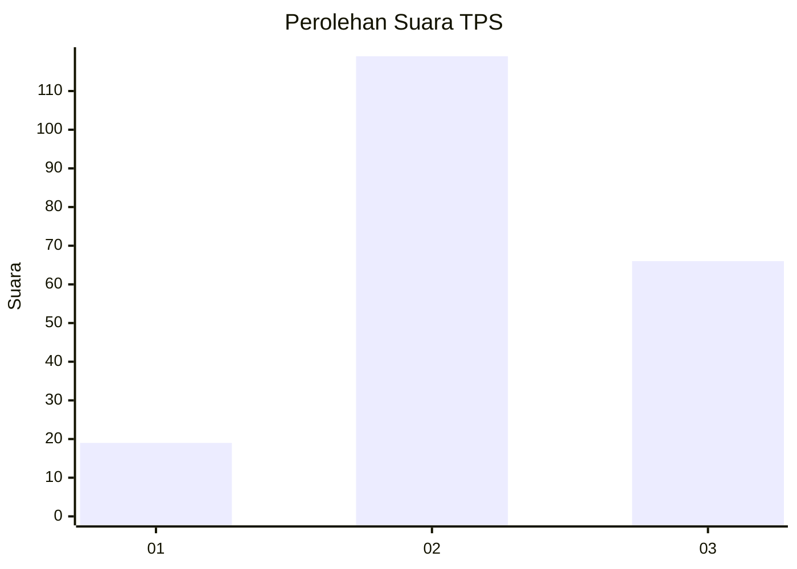
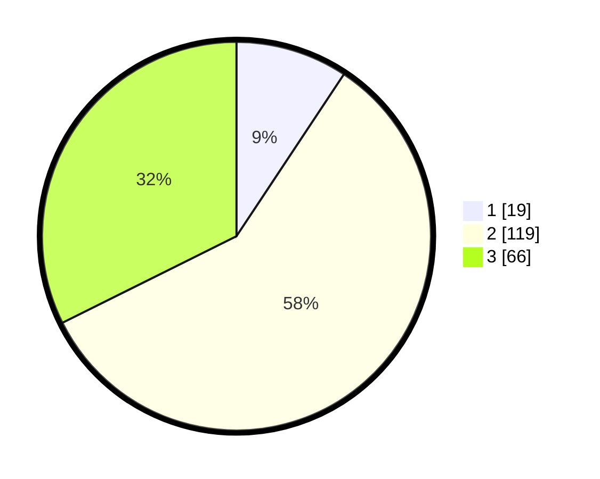

# Hasil

## Grafik

## Tabel

| No. | Nama Paslon    | Suara | Suara (raw) | Persentase |
|:--- |:-------------- | -----:| -----------:| ----------:|
| 1   | ANIES MUHAIMIN | 19    | [19][p-1]   | 9,31       |
| 2   | PRABOWO GIBRAN | 119   | [119][p-2]  | 58,33      |
| 3   | GANJAR MAHFUD  | 66    | [66][p-3]   | 32,35      |

[p-1]: https://github.com/gigit-pemilu/pemilu-2024-51-bali/blob/main/pilpres/hitung-suara/sub/51-bali/sub/08-buleleng/sub/01-gerokgak/sub/2011-pengulon/sub/002-tps/sub/paslon-1.txt
[p-2]: https://github.com/gigit-pemilu/pemilu-2024-51-bali/blob/main/pilpres/hitung-suara/sub/51-bali/sub/08-buleleng/sub/01-gerokgak/sub/2011-pengulon/sub/002-tps/sub/paslon-2.txt
[p-3]: https://github.com/gigit-pemilu/pemilu-2024-51-bali/blob/main/pilpres/hitung-suara/sub/51-bali/sub/08-buleleng/sub/01-gerokgak/sub/2011-pengulon/sub/002-tps/sub/paslon-3.txt

## Foto C Plano

https://sirekap-obj-formc.kpu.go.id/2c27/pemilu/ppwp/51/08/01/20/11/5108012011002-20240214-141148--11e6844b-6b9c-48eb-8751-d00b004b225e.jpg

https://sirekap-obj-formc.kpu.go.id/2c27/pemilu/ppwp/51/08/01/20/11/5108012011002-20240214-141213--34202269-3f5e-413d-ad4b-a92edda815f2.jpg

https://sirekap-obj-formc.kpu.go.id/2c27/pemilu/ppwp/51/08/01/20/11/5108012011002-20240214-141228--970f5db6-9c68-4de3-8d65-b3212e55ebb9.jpg

## Metadata

| Key        | Value               |
| ---------- | ------------------- |
| Time Stamp | 2024-02-14 21:46:01 |

