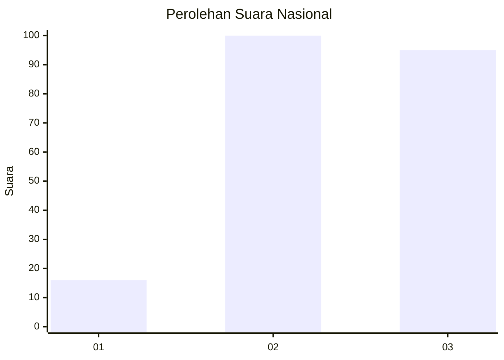
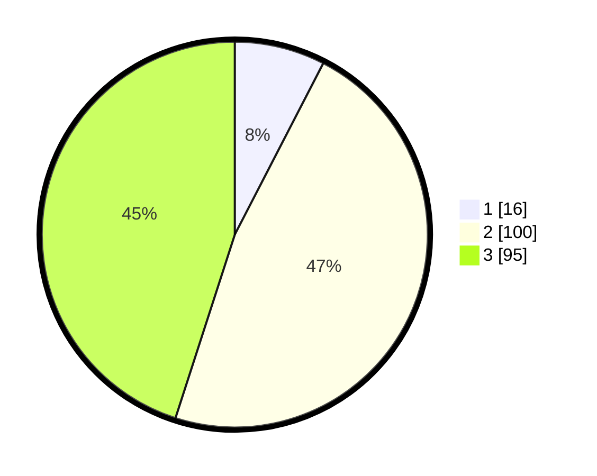

# Hasil

## Grafik

## Tabel

| No. | Nama Paslon    | Suara | Suara (raw) | Persentase |
|:--- |:-------------- | -----:| -----------:| ----------:|
| 1   | ANIES MUHAIMIN | 16    | [16][p-1]   | 7,58       |
| 2   | PRABOWO GIBRAN | 100   | [100][p-2]  | 47,39      |
| 3   | GANJAR MAHFUD  | 95    | [95][p-3]   | 45,02      |

[p-1]: https://github.com/gigit-pemilu/pemilu-2024/blob/main/pilpres/hitung-suara/sub/51-bali/sub/08-buleleng/sub/01-gerokgak/sub/2011-pengulon/sub/004-tps/sub/paslon-1.txt
[p-2]: https://github.com/gigit-pemilu/pemilu-2024/blob/main/pilpres/hitung-suara/sub/51-bali/sub/08-buleleng/sub/01-gerokgak/sub/2011-pengulon/sub/004-tps/sub/paslon-2.txt
[p-3]: https://github.com/gigit-pemilu/pemilu-2024/blob/main/pilpres/hitung-suara/sub/51-bali/sub/08-buleleng/sub/01-gerokgak/sub/2011-pengulon/sub/004-tps/sub/paslon-3.txt

## Foto C Plano

https://sirekap-obj-formc.kpu.go.id/68dd/pemilu/ppwp/51/08/01/20/11/5108012011004-20240214-221126--a0b45acc-808d-4461-b11e-9e63e0b9c6ec.jpg

https://sirekap-obj-formc.kpu.go.id/68dd/pemilu/ppwp/51/08/01/20/11/5108012011004-20240214-221528--beb29bd3-47d5-429e-bf4c-cd9729fa48e2.jpg

https://sirekap-obj-formc.kpu.go.id/68dd/pemilu/ppwp/51/08/01/20/11/5108012011004-20240214-221939--d5bd7f14-4d0b-4164-ace7-b4b81a2f07f0.jpg

## Metadata

| Key        | Value               |
| ---------- | ------------------- |
| Time Stamp | 2024-02-24 22:31:28 |

