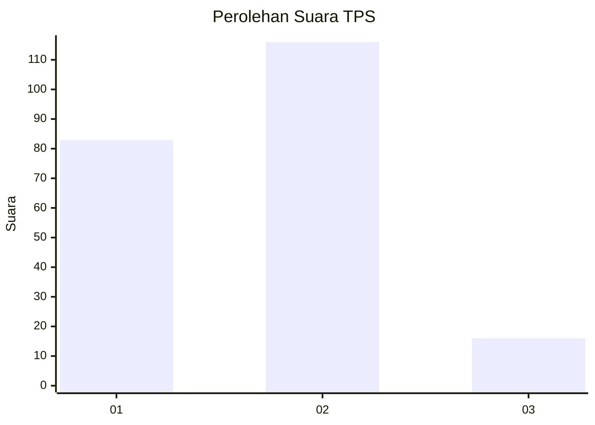

# Hasil

## Grafik

## Tabel

| No. | Nama Paslon    | Suara | Suara (raw) | Persentase |
|:--- |:-------------- | -----:| -----------:| ----------:|
| 1   | ANIES MUHAIMIN | 83    | [83][p-1]   | 38,60      |
| 2   | PRABOWO GIBRAN | 116   | [116][p-2]  | 53,95      |
| 3   | GANJAR MAHFUD  | 16    | [16][p-3]   | 7,44       |

[p-1]: https://github.com/gigit-pemilu/pemilu-2024-51-bali/blob/main/pilpres/hitung-suara/sub/51-bali/sub/08-buleleng/sub/01-gerokgak/sub/2011-pengulon/sub/006-tps/sub/paslon-1.txt
[p-2]: https://github.com/gigit-pemilu/pemilu-2024-51-bali/blob/main/pilpres/hitung-suara/sub/51-bali/sub/08-buleleng/sub/01-gerokgak/sub/2011-pengulon/sub/006-tps/sub/paslon-2.txt
[p-3]: https://github.com/gigit-pemilu/pemilu-2024-51-bali/blob/main/pilpres/hitung-suara/sub/51-bali/sub/08-buleleng/sub/01-gerokgak/sub/2011-pengulon/sub/006-tps/sub/paslon-3.txt

## Foto C Plano

https://sirekap-obj-formc.kpu.go.id/3ec7/pemilu/ppwp/51/08/01/20/11/5108012011006-20240214-141110--acaa6bae-8e01-4fa0-9909-6b1851f9c81c.jpg

https://sirekap-obj-formc.kpu.go.id/3ec7/pemilu/ppwp/51/08/01/20/11/5108012011006-20240214-141129--f5a10a96-308c-4329-8a1a-79441a83931e.jpg

https://sirekap-obj-formc.kpu.go.id/3ec7/pemilu/ppwp/51/08/01/20/11/5108012011006-20240214-141145--96f59eb1-4ab4-4abe-b65c-e83e95af75fe.jpg

## Metadata

| Key        | Value               |
| ---------- | ------------------- |
| Time Stamp | 2024-02-27 15:00:00 |

