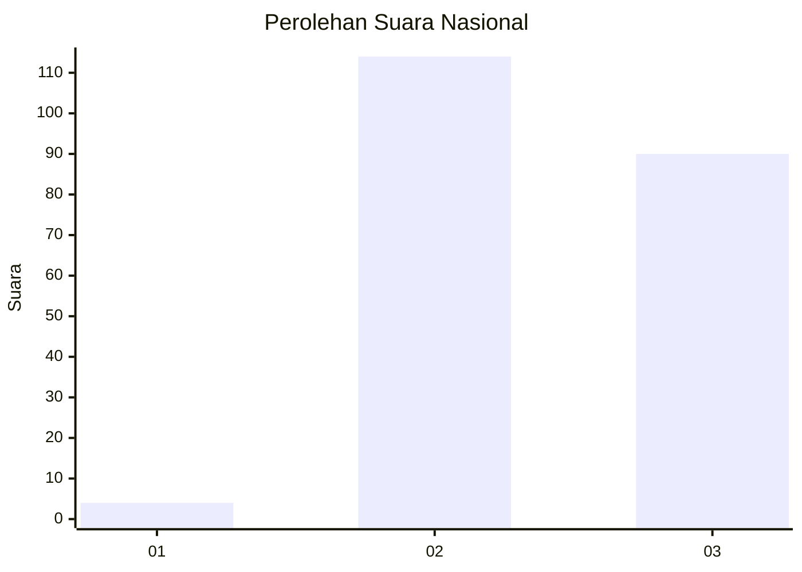
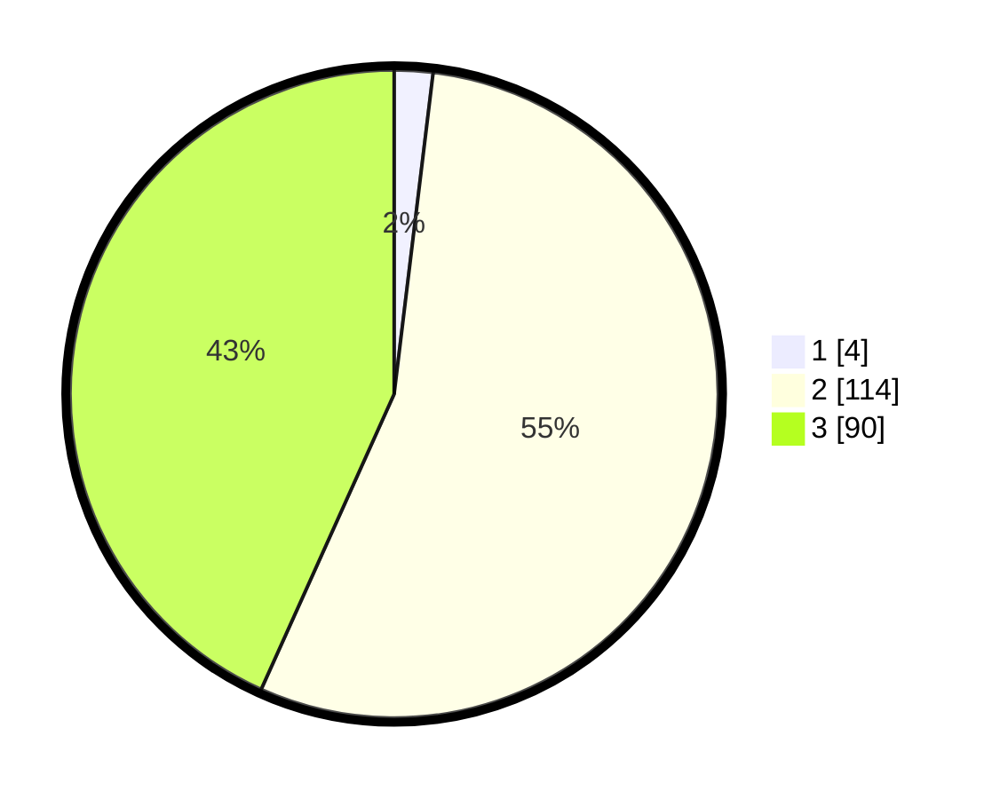

# Hasil

## Grafik

## Tabel

| No. | Nama Paslon    | Suara | Suara (raw) | Persentase |
|:--- |:-------------- | -----:| -----------:| ----------:|
| 1   | ANIES MUHAIMIN | 4     | [4][p-1]    | 1,92       |
| 2   | PRABOWO GIBRAN | 114   | [114][p-2]  | 54,81      |
| 3   | GANJAR MAHFUD  | 90    | [90][p-3]   | 43,27      |

[p-1]: https://github.com/gigit-pemilu/pemilu-2024/blob/main/pilpres/hitung-suara/sub/51-bali/sub/08-buleleng/sub/01-gerokgak/sub/2012-tinga-tinga/sub/006-tps/sub/paslon-1.txt
[p-2]: https://github.com/gigit-pemilu/pemilu-2024/blob/main/pilpres/hitung-suara/sub/51-bali/sub/08-buleleng/sub/01-gerokgak/sub/2012-tinga-tinga/sub/006-tps/sub/paslon-2.txt
[p-3]: https://github.com/gigit-pemilu/pemilu-2024/blob/main/pilpres/hitung-suara/sub/51-bali/sub/08-buleleng/sub/01-gerokgak/sub/2012-tinga-tinga/sub/006-tps/sub/paslon-3.txt

## Foto C Plano

https://sirekap-obj-formc.kpu.go.id/9b19/pemilu/ppwp/51/08/01/20/12/5108012012006-20240214-141348--8396ea1c-172a-4991-8f8a-5019a9816dd5.jpg

https://sirekap-obj-formc.kpu.go.id/9b19/pemilu/ppwp/51/08/01/20/12/5108012012006-20240214-141442--065a0a64-de15-4ef4-9b01-c7b54551af76.jpg

https://sirekap-obj-formc.kpu.go.id/9b19/pemilu/ppwp/51/08/01/20/12/5108012012006-20240214-141606--67204590-8067-48fd-9875-44b0cf0df723.jpg

## Metadata

| Key        | Value               |
| ---------- | ------------------- |
| Time Stamp | 2024-02-14 21:46:01 |

