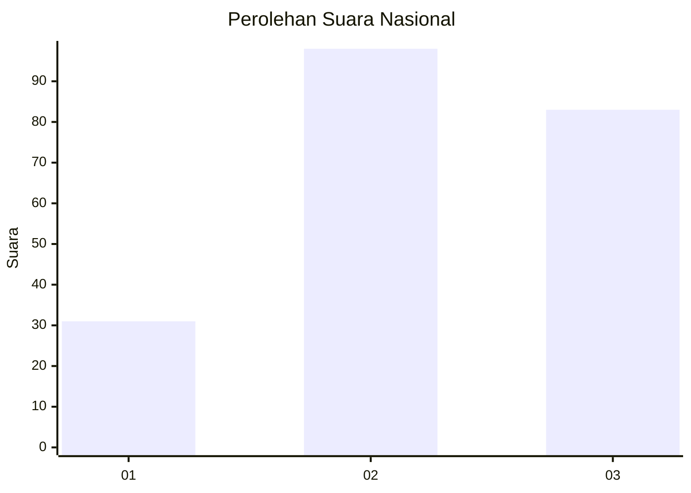
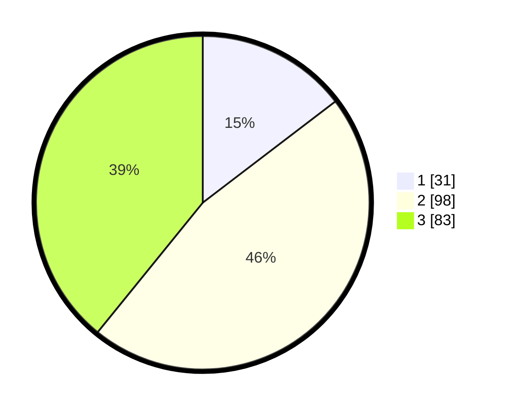

# Hasil

## Grafik

## Tabel

| No. | Nama Paslon    | Suara | Suara (raw) | Persentase |
|:--- |:-------------- | -----:| -----------:| ----------:|
| 1   | ANIES MUHAIMIN | 31    | [31][p-1]   | 14,62      |
| 2   | PRABOWO GIBRAN | 98    | [98][p-2]   | 46,23      |
| 3   | GANJAR MAHFUD  | 83    | [83][p-3]   | 39,15      |

[p-1]: https://github.com/gigit-pemilu/pemilu-2024/blob/main/pilpres/hitung-suara/sub/51-bali/sub/08-buleleng/sub/01-gerokgak/sub/2013-celukanbawang/sub/002-tps/sub/paslon-1.txt
[p-2]: https://github.com/gigit-pemilu/pemilu-2024/blob/main/pilpres/hitung-suara/sub/51-bali/sub/08-buleleng/sub/01-gerokgak/sub/2013-celukanbawang/sub/002-tps/sub/paslon-2.txt
[p-3]: https://github.com/gigit-pemilu/pemilu-2024/blob/main/pilpres/hitung-suara/sub/51-bali/sub/08-buleleng/sub/01-gerokgak/sub/2013-celukanbawang/sub/002-tps/sub/paslon-3.txt

## Foto C Plano

https://sirekap-obj-formc.kpu.go.id/d5b8/pemilu/ppwp/51/08/01/20/13/5108012013002-20240215-005413--c0426701-5230-48f6-af1d-843e1a8cbe2f.jpg

https://sirekap-obj-formc.kpu.go.id/d5b8/pemilu/ppwp/51/08/01/20/13/5108012013002-20240215-005449--4efa6879-175c-4216-9778-ecaeb0e60653.jpg

## Metadata

| Key        | Value               |
| ---------- | ------------------- |
| Time Stamp | 2024-02-24 22:31:28 |

