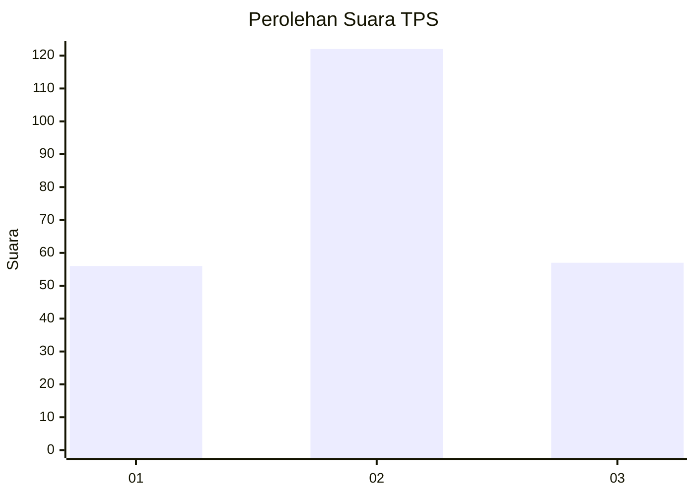
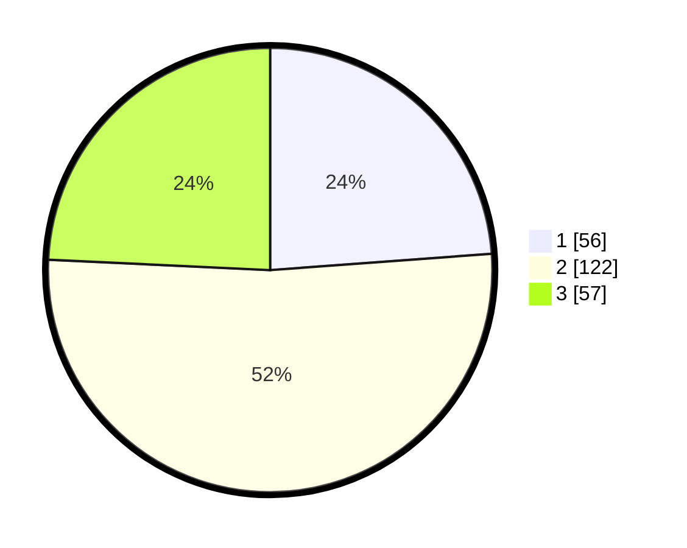

# Hasil

## Grafik

## Tabel

| No. | Nama Paslon    | Suara | Suara (raw) | Persentase |
|:--- |:-------------- | -----:| -----------:| ----------:|
| 1   | ANIES MUHAIMIN | 56    | [56][p-1]   | 23,83      |
| 2   | PRABOWO GIBRAN | 122   | [122][p-2]  | 51,91      |
| 3   | GANJAR MAHFUD  | 57    | [57][p-3]   | 24,26      |

[p-1]: https://github.com/gigit-pemilu/pemilu-2024-51-bali/blob/main/pilpres/hitung-suara/sub/51-bali/sub/08-buleleng/sub/01-gerokgak/sub/2013-celukanbawang/sub/004-tps/sub/paslon-1.txt
[p-2]: https://github.com/gigit-pemilu/pemilu-2024-51-bali/blob/main/pilpres/hitung-suara/sub/51-bali/sub/08-buleleng/sub/01-gerokgak/sub/2013-celukanbawang/sub/004-tps/sub/paslon-2.txt
[p-3]: https://github.com/gigit-pemilu/pemilu-2024-51-bali/blob/main/pilpres/hitung-suara/sub/51-bali/sub/08-buleleng/sub/01-gerokgak/sub/2013-celukanbawang/sub/004-tps/sub/paslon-3.txt

## Foto C Plano

https://sirekap-obj-formc.kpu.go.id/0115/pemilu/ppwp/51/08/01/20/13/5108012013004-20240214-221943--252381b1-f682-4a23-bfab-b55ad655348c.jpg

https://sirekap-obj-formc.kpu.go.id/0115/pemilu/ppwp/51/08/01/20/13/5108012013004-20240215-002922--d4af683c-6d91-41c4-8119-6d9a2a859875.jpg

https://sirekap-obj-formc.kpu.go.id/0115/pemilu/ppwp/51/08/01/20/13/5108012013004-20240215-003048--0374683d-4aa3-4f75-b99b-a99ace76bbd8.jpg

## Metadata

| Key        | Value               |
| ---------- | ------------------- |
| Time Stamp | 2024-02-24 22:31:28 |

