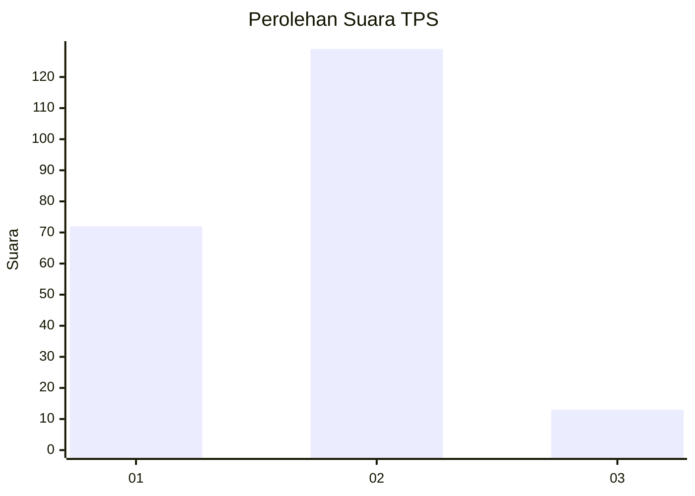
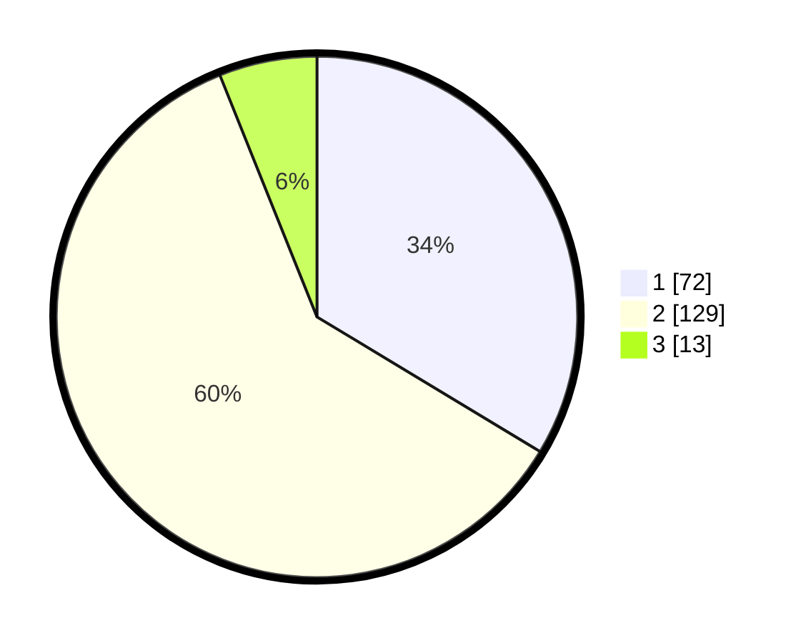

# Hasil

## Grafik

## Tabel

| No. | Nama Paslon    | Suara | Suara (raw) | Persentase |
|:--- |:-------------- | -----:| -----------:| ----------:|
| 1   | ANIES MUHAIMIN | 72    | [72][p-1]   | 33,64      |
| 2   | PRABOWO GIBRAN | 129   | [129][p-2]  | 60,28      |
| 3   | GANJAR MAHFUD  | 13    | [13][p-3]   | 6,07       |

[p-1]: https://github.com/gigit-pemilu/pemilu-2024-51-bali/blob/main/pilpres/hitung-suara/sub/51-bali/sub/08-buleleng/sub/01-gerokgak/sub/2013-celukanbawang/sub/007-tps/sub/paslon-1.txt
[p-2]: https://github.com/gigit-pemilu/pemilu-2024-51-bali/blob/main/pilpres/hitung-suara/sub/51-bali/sub/08-buleleng/sub/01-gerokgak/sub/2013-celukanbawang/sub/007-tps/sub/paslon-2.txt
[p-3]: https://github.com/gigit-pemilu/pemilu-2024-51-bali/blob/main/pilpres/hitung-suara/sub/51-bali/sub/08-buleleng/sub/01-gerokgak/sub/2013-celukanbawang/sub/007-tps/sub/paslon-3.txt

## Foto C Plano

https://sirekap-obj-formc.kpu.go.id/9c7d/pemilu/ppwp/51/08/01/20/13/5108012013007-20240215-020217--3ed67e0e-7ba2-43c9-9c59-3de3e1761cbc.jpg

https://sirekap-obj-formc.kpu.go.id/9c7d/pemilu/ppwp/51/08/01/20/13/5108012013007-20240215-020405--72d20ce9-7ab0-40ef-b272-8d5408a055d9.jpg

https://sirekap-obj-formc.kpu.go.id/9c7d/pemilu/ppwp/51/08/01/20/13/5108012013007-20240215-020532--e66f2fe8-82e9-4110-95da-4bd7c14f5262.jpg

## Metadata

| Key        | Value               |
| ---------- | ------------------- |
| Time Stamp | 2024-02-24 22:31:28 |

