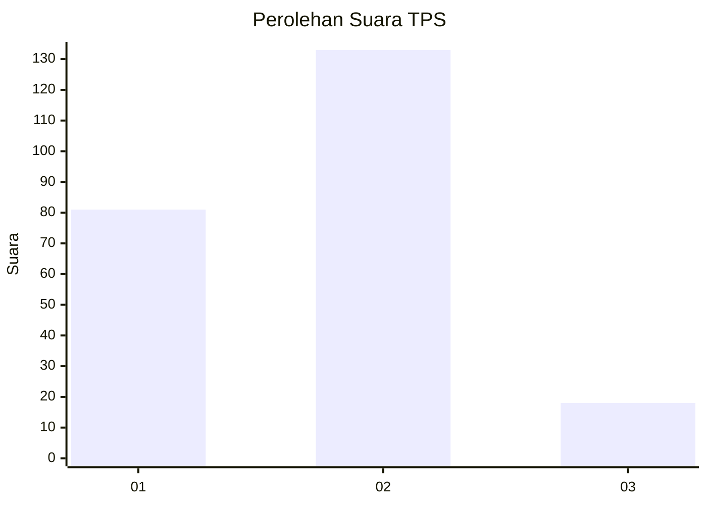
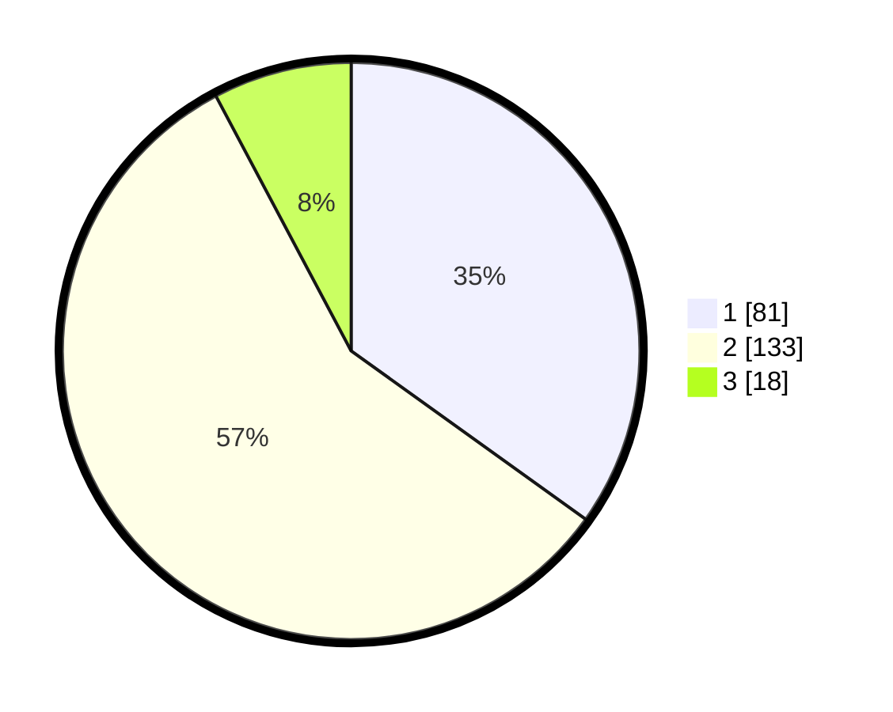

# Hasil

## Grafik

## Tabel

| No. | Nama Paslon    | Suara | Suara (raw) | Persentase |
|:--- |:-------------- | -----:| -----------:| ----------:|
| 1   | ANIES MUHAIMIN | 81    | [81][p-1]   | 34,91      |
| 2   | PRABOWO GIBRAN | 133   | [133][p-2]  | 57,33      |
| 3   | GANJAR MAHFUD  | 18    | [18][p-3]   | 7,76       |

[p-1]: https://github.com/gigit-pemilu/pemilu-2024-51-bali/blob/main/pilpres/hitung-suara/sub/51-bali/sub/08-buleleng/sub/01-gerokgak/sub/2013-celukanbawang/sub/008-tps/sub/paslon-1.txt
[p-2]: https://github.com/gigit-pemilu/pemilu-2024-51-bali/blob/main/pilpres/hitung-suara/sub/51-bali/sub/08-buleleng/sub/01-gerokgak/sub/2013-celukanbawang/sub/008-tps/sub/paslon-2.txt
[p-3]: https://github.com/gigit-pemilu/pemilu-2024-51-bali/blob/main/pilpres/hitung-suara/sub/51-bali/sub/08-buleleng/sub/01-gerokgak/sub/2013-celukanbawang/sub/008-tps/sub/paslon-3.txt

## Foto C Plano

https://sirekap-obj-formc.kpu.go.id/2e37/pemilu/ppwp/51/08/01/20/13/5108012013008-20240214-192625--97f3aaf0-572b-4a6d-9467-e16152a770be.jpg

https://sirekap-obj-formc.kpu.go.id/2e37/pemilu/ppwp/51/08/01/20/13/5108012013008-20240214-192713--41f99cd0-31e2-4cdb-84d5-1176b73bc8f3.jpg

https://sirekap-obj-formc.kpu.go.id/2e37/pemilu/ppwp/51/08/01/20/13/5108012013008-20240214-192814--598c7afb-6fc8-440a-a03c-022e000d5d13.jpg

## Metadata

| Key        | Value               |
| ---------- | ------------------- |
| Time Stamp | 2024-02-15 00:41:44 |

## DATA PEMILIH TETAP

Jumlah pemilih dalam DPT: **281**.
 * L: **143**.
 * P: **138**.

## DATA PENGGUNA HAK PILIH

Jumlah pengguna hak pilih dalam DPT: **228**.
 * L: **113**.
 * P: **115**.

Jumlah pengguna hak pilih dalam DPTb: **0**.
 * L: **0**.
 * P: **0**.

Jumlah pengguna hak pilih dalam DPK: **6**.
 * L: **1**.
 * P: **5**.

Jumlah pengguna hak pilih: **234**.
 * L: **114**.
 * P: **120**.

## JUMLAH SUARA SAH DAN TIDAK SAH

JUMLAH SELURUH SUARA SAH: **232**.

JUMLAH SUARA TIDAK SAH: **2**.

JUMLAH SELURUH SUARA SAH DAN SUARA TIDAK SAH: **234**.

