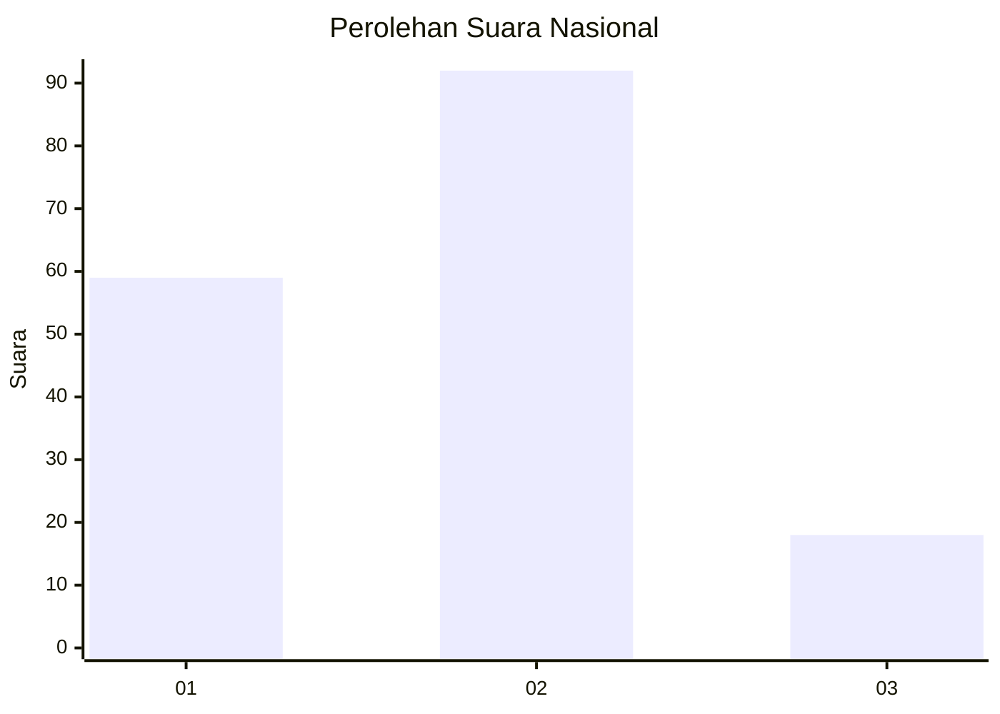
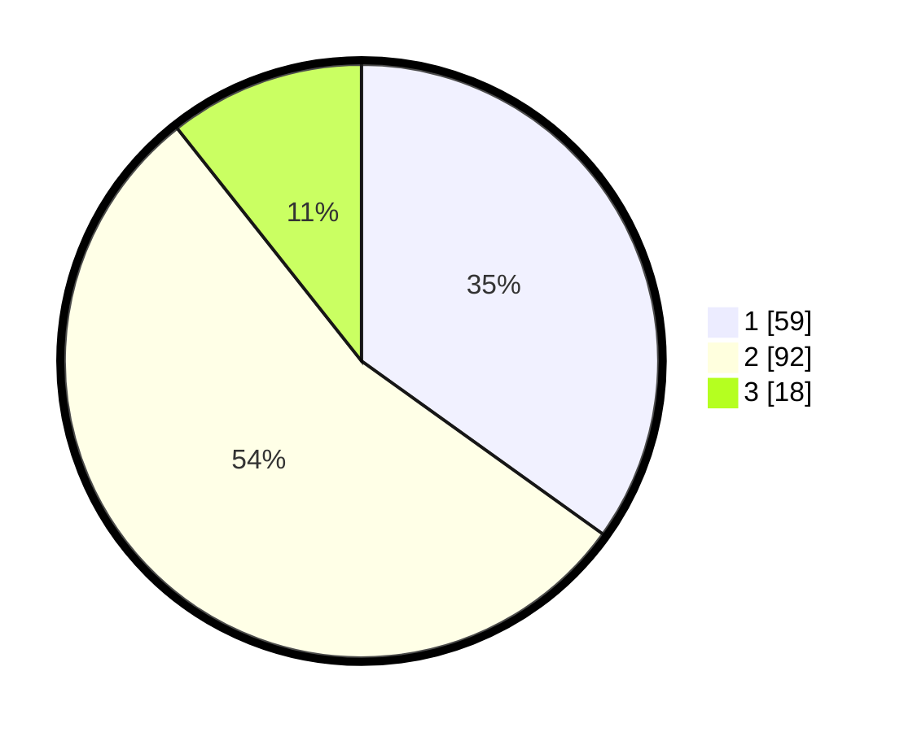

# Hasil

## Grafik

## Tabel

| No. | Nama Paslon    | Suara | Suara (raw) | Persentase |
|:--- |:-------------- | -----:| -----------:| ----------:|
| 1   | ANIES MUHAIMIN | 59    | [59][p-1]   | 34,91      |
| 2   | PRABOWO GIBRAN | 92    | [92][p-2]   | 54,44      |
| 3   | GANJAR MAHFUD  | 18    | [18][p-3]   | 10,65      |

[p-1]: https://github.com/gigit-pemilu/pemilu-2024/blob/main/pilpres/hitung-suara/sub/51-bali/sub/08-buleleng/sub/01-gerokgak/sub/2013-celukanbawang/sub/013-tps/sub/paslon-1.txt
[p-2]: https://github.com/gigit-pemilu/pemilu-2024/blob/main/pilpres/hitung-suara/sub/51-bali/sub/08-buleleng/sub/01-gerokgak/sub/2013-celukanbawang/sub/013-tps/sub/paslon-2.txt
[p-3]: https://github.com/gigit-pemilu/pemilu-2024/blob/main/pilpres/hitung-suara/sub/51-bali/sub/08-buleleng/sub/01-gerokgak/sub/2013-celukanbawang/sub/013-tps/sub/paslon-3.txt

## Foto C Plano

https://sirekap-obj-formc.kpu.go.id/9cb9/pemilu/ppwp/51/08/01/20/13/5108012013013-20240215-015045--b0f5ce8b-046f-4027-a1b5-1cf1b6f28030.jpg

https://sirekap-obj-formc.kpu.go.id/9cb9/pemilu/ppwp/51/08/01/20/13/5108012013013-20240215-015224--2c85e230-7ade-4aa4-b56f-082fd9df77d8.jpg

https://sirekap-obj-formc.kpu.go.id/9cb9/pemilu/ppwp/51/08/01/20/13/5108012013013-20240215-015322--7e6a0d74-6435-4c5e-9fef-b2f4129eca9d.jpg

## Metadata

| Key        | Value               |
| ---------- | ------------------- |
| Time Stamp | 2024-02-15 12:00:28 |

