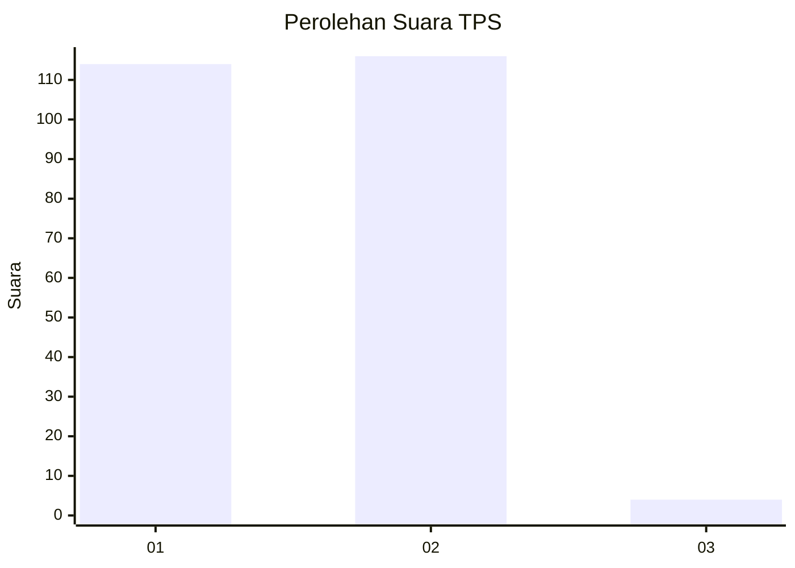
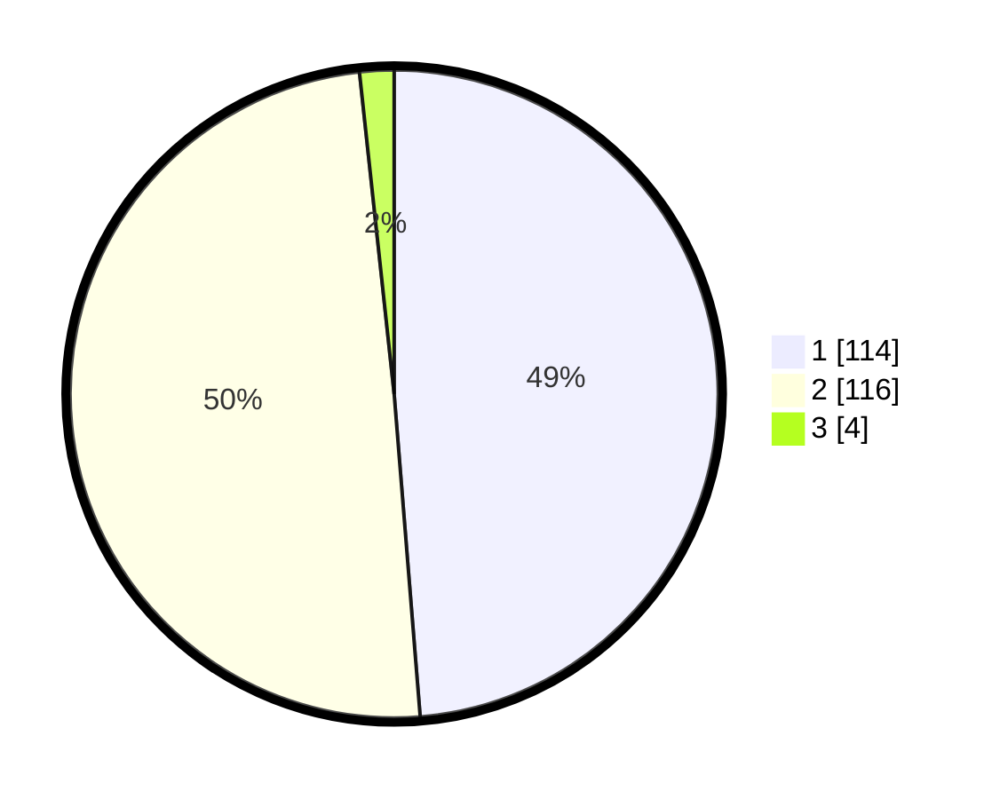

# Hasil

## Grafik

## Tabel

| No. | Nama Paslon    | Suara | Suara (raw) | Persentase |
|:--- |:-------------- | -----:| -----------:| ----------:|
| 1   | ANIES MUHAIMIN | 114   | [114][p-1]  | 48,72      |
| 2   | PRABOWO GIBRAN | 116   | [116][p-2]  | 49,57      |
| 3   | GANJAR MAHFUD  | 4     | [4][p-3]    | 1,71       |

[p-1]: https://github.com/gigit-pemilu/pemilu-2024-51-bali/blob/main/pilpres/hitung-suara/sub/51-bali/sub/08-buleleng/sub/01-gerokgak/sub/2013-celukanbawang/sub/016-tps/sub/paslon-1.txt
[p-2]: https://github.com/gigit-pemilu/pemilu-2024-51-bali/blob/main/pilpres/hitung-suara/sub/51-bali/sub/08-buleleng/sub/01-gerokgak/sub/2013-celukanbawang/sub/016-tps/sub/paslon-2.txt
[p-3]: https://github.com/gigit-pemilu/pemilu-2024-51-bali/blob/main/pilpres/hitung-suara/sub/51-bali/sub/08-buleleng/sub/01-gerokgak/sub/2013-celukanbawang/sub/016-tps/sub/paslon-3.txt

## Foto C Plano

https://sirekap-obj-formc.kpu.go.id/4a36/pemilu/ppwp/51/08/01/20/13/5108012013016-20240215-003632--167449a3-291f-4cee-b712-e5ae3d843f7a.jpg

https://sirekap-obj-formc.kpu.go.id/4a36/pemilu/ppwp/51/08/01/20/13/5108012013016-20240215-004047--0ea23af6-d1d8-412e-9b92-1d9cfbcee1f9.jpg

https://sirekap-obj-formc.kpu.go.id/4a36/pemilu/ppwp/51/08/01/20/13/5108012013016-20240215-033936--6907c401-eaa9-4db5-aab6-b50e087e285f.jpg

## Metadata

| Key        | Value               |
| ---------- | ------------------- |
| Time Stamp | 2024-02-24 22:31:28 |

