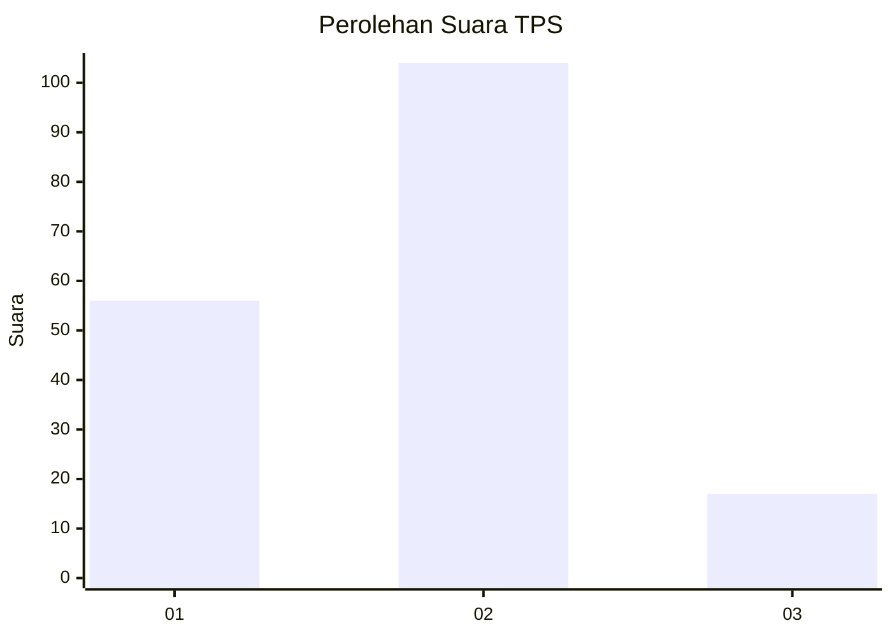
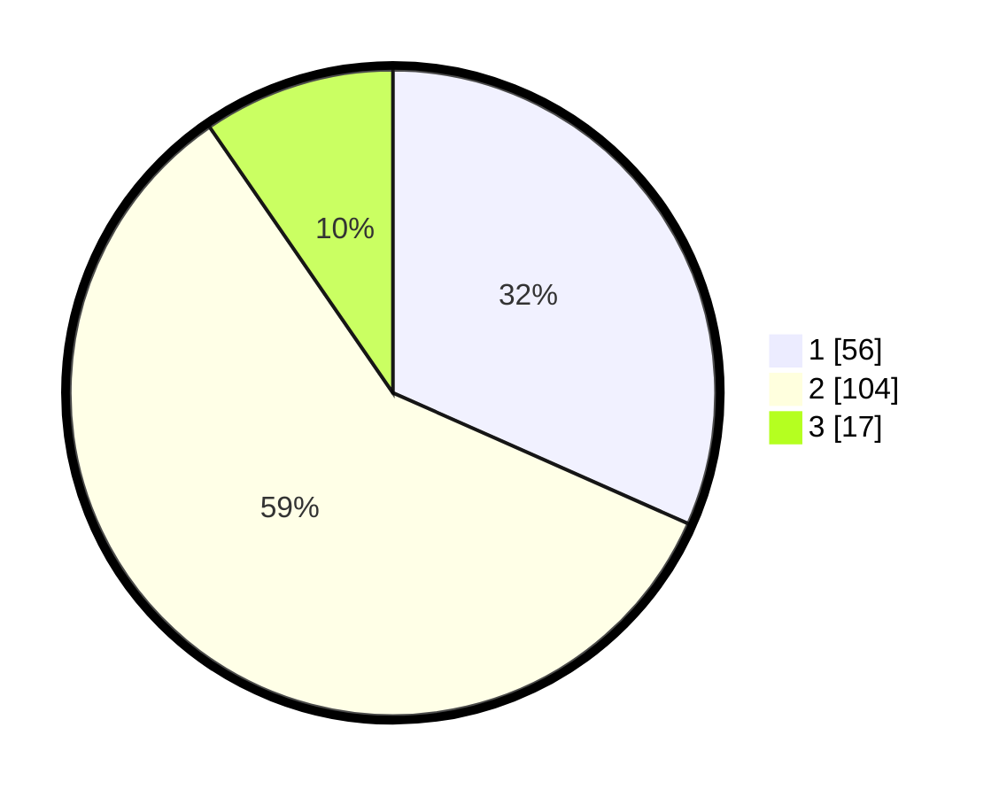

# Hasil

## Grafik

## Tabel

| No. | Nama Paslon    | Suara | Suara (raw) | Persentase |
|:--- |:-------------- | -----:| -----------:| ----------:|
| 1   | ANIES MUHAIMIN | 56    | [56][p-1]   | 31,64      |
| 2   | PRABOWO GIBRAN | 104   | [104][p-2]  | 58,76      |
| 3   | GANJAR MAHFUD  | 17    | [17][p-3]   | 9,60       |

[p-1]: https://github.com/gigit-pemilu/pemilu-2024-51-bali/blob/main/pilpres/hitung-suara/sub/51-bali/sub/08-buleleng/sub/01-gerokgak/sub/2013-celukanbawang/sub/017-tps/sub/paslon-1.txt
[p-2]: https://github.com/gigit-pemilu/pemilu-2024-51-bali/blob/main/pilpres/hitung-suara/sub/51-bali/sub/08-buleleng/sub/01-gerokgak/sub/2013-celukanbawang/sub/017-tps/sub/paslon-2.txt
[p-3]: https://github.com/gigit-pemilu/pemilu-2024-51-bali/blob/main/pilpres/hitung-suara/sub/51-bali/sub/08-buleleng/sub/01-gerokgak/sub/2013-celukanbawang/sub/017-tps/sub/paslon-3.txt

## Foto C Plano

https://sirekap-obj-formc.kpu.go.id/cc3e/pemilu/ppwp/51/08/01/20/13/5108012013017-20240215-013253--6fd3dc1b-4a79-4f64-81f2-1c60512e4ca7.jpg

https://sirekap-obj-formc.kpu.go.id/cc3e/pemilu/ppwp/51/08/01/20/13/5108012013017-20240215-013443--0bedc41d-a3cf-478e-bdcc-6231a48d9de7.jpg

https://sirekap-obj-formc.kpu.go.id/cc3e/pemilu/ppwp/51/08/01/20/13/5108012013017-20240215-013644--3328dc13-4b2a-4ddf-9511-b1dc47e2d299.jpg

## Metadata

| Key        | Value               |
| ---------- | ------------------- |
| Time Stamp | 2024-02-24 22:31:28 |

