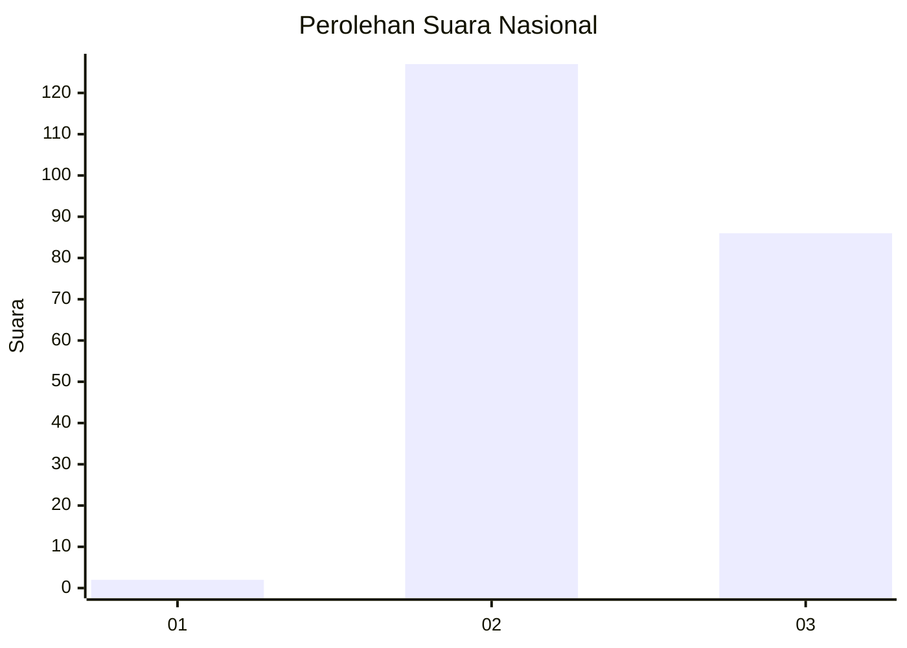
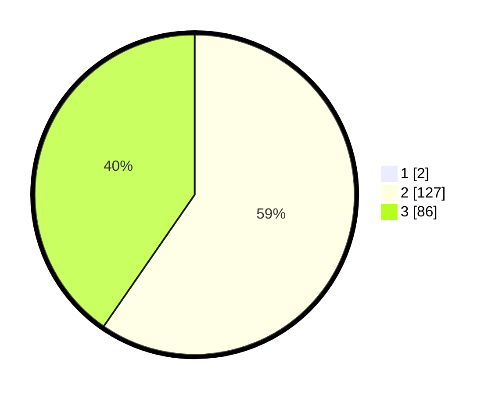

# Hasil

## Grafik

## Tabel

| No. | Nama Paslon    | Suara | Suara (raw) | Persentase |
|:--- |:-------------- | -----:| -----------:| ----------:|
| 1   | ANIES MUHAIMIN | 2     | [2][p-1]    | 0,93       |
| 2   | PRABOWO GIBRAN | 127   | [127][p-2]  | 59,07      |
| 3   | GANJAR MAHFUD  | 86    | [86][p-3]   | 40,00      |

[p-1]: https://github.com/gigit-pemilu/pemilu-2024/blob/main/pilpres/hitung-suara/sub/51-bali/sub/08-buleleng/sub/01-gerokgak/sub/2014-tukadsumaga/sub/001-tps/sub/paslon-1.txt
[p-2]: https://github.com/gigit-pemilu/pemilu-2024/blob/main/pilpres/hitung-suara/sub/51-bali/sub/08-buleleng/sub/01-gerokgak/sub/2014-tukadsumaga/sub/001-tps/sub/paslon-2.txt
[p-3]: https://github.com/gigit-pemilu/pemilu-2024/blob/main/pilpres/hitung-suara/sub/51-bali/sub/08-buleleng/sub/01-gerokgak/sub/2014-tukadsumaga/sub/001-tps/sub/paslon-3.txt

## Foto C Plano

https://sirekap-obj-formc.kpu.go.id/2255/pemilu/ppwp/51/08/01/20/14/5108012014001-20240215-073915--3c8ab1d9-f9ba-489b-b48d-1fbd13a7d715.jpg

https://sirekap-obj-formc.kpu.go.id/2255/pemilu/ppwp/51/08/01/20/14/5108012014001-20240215-074015--68bed0e2-5e60-408f-9cd7-7880c5fa4903.jpg

https://sirekap-obj-formc.kpu.go.id/2255/pemilu/ppwp/51/08/01/20/14/5108012014001-20240215-074103--b52b0a48-e24f-41a6-8fb3-a3e81bafda5c.jpg

## Metadata

| Key        | Value               |
| ---------- | ------------------- |
| Time Stamp | 2024-02-24 22:31:28 |

