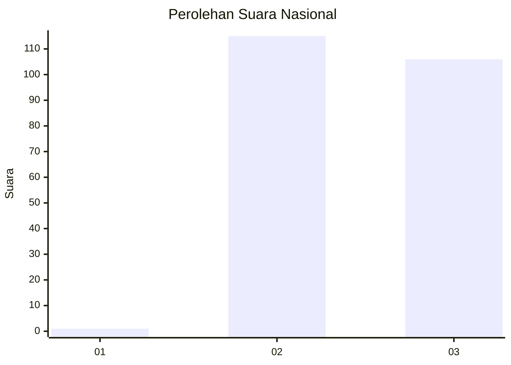
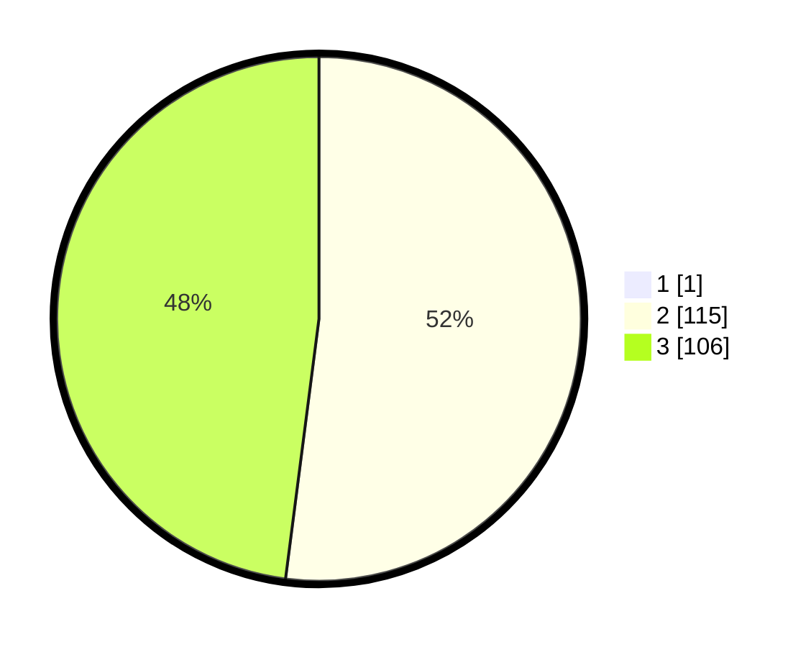

# Hasil

## Grafik

## Tabel

| No. | Nama Paslon    | Suara | Suara (raw) | Persentase |
|:--- |:-------------- | -----:| -----------:| ----------:|
| 1   | ANIES MUHAIMIN | 1     | [1][p-1]    | 0,45       |
| 2   | PRABOWO GIBRAN | 115   | [115][p-2]  | 51,80      |
| 3   | GANJAR MAHFUD  | 106   | [106][p-3]  | 47,75      |

[p-1]: https://github.com/gigit-pemilu/pemilu-2024/blob/main/pilpres/hitung-suara/sub/51-bali/sub/08-buleleng/sub/01-gerokgak/sub/2014-tukadsumaga/sub/002-tps/sub/paslon-1.txt
[p-2]: https://github.com/gigit-pemilu/pemilu-2024/blob/main/pilpres/hitung-suara/sub/51-bali/sub/08-buleleng/sub/01-gerokgak/sub/2014-tukadsumaga/sub/002-tps/sub/paslon-2.txt
[p-3]: https://github.com/gigit-pemilu/pemilu-2024/blob/main/pilpres/hitung-suara/sub/51-bali/sub/08-buleleng/sub/01-gerokgak/sub/2014-tukadsumaga/sub/002-tps/sub/paslon-3.txt

## Foto C Plano

https://sirekap-obj-formc.kpu.go.id/1b27/pemilu/ppwp/51/08/01/20/14/5108012014002-20240214-214831--8531ca4b-a708-4f7c-bc39-4a5ac606cc2a.jpg

https://sirekap-obj-formc.kpu.go.id/1b27/pemilu/ppwp/51/08/01/20/14/5108012014002-20240214-215025--6d72c9dc-f363-4a2c-a06f-2a56f728859b.jpg

https://sirekap-obj-formc.kpu.go.id/1b27/pemilu/ppwp/51/08/01/20/14/5108012014002-20240214-215111--d2ff93af-1c69-4265-aad8-ec26ed2b8104.jpg

## Metadata

| Key        | Value               |
| ---------- | ------------------- |
| Time Stamp | 2024-02-24 22:31:28 |

