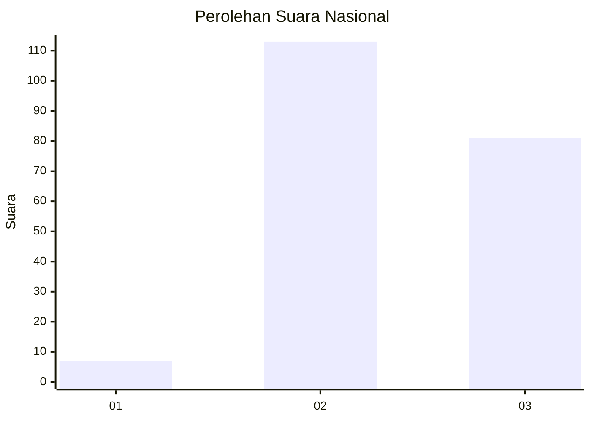
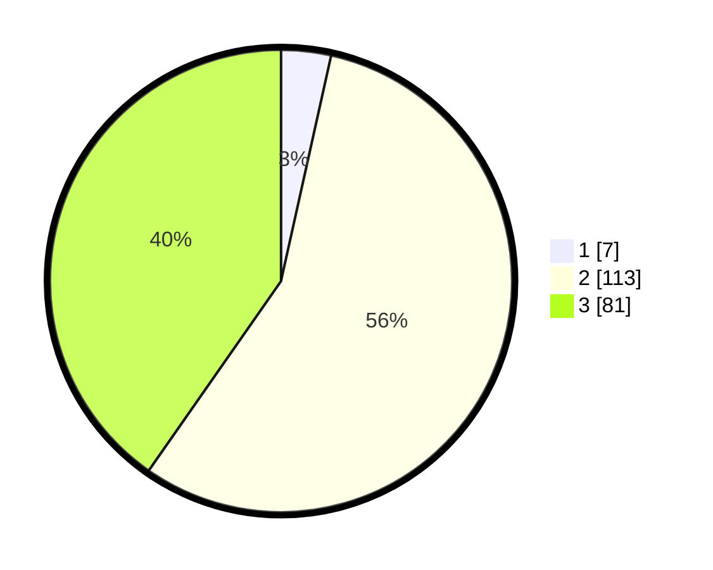

# Hasil

## Grafik

## Tabel

| No. | Nama Paslon    | Suara | Suara (raw) | Persentase |
|:--- |:-------------- | -----:| -----------:| ----------:|
| 1   | ANIES MUHAIMIN | 7     | [7][p-1]    | 3,48       |
| 2   | PRABOWO GIBRAN | 113   | [113][p-2]  | 56,22      |
| 3   | GANJAR MAHFUD  | 81    | [81][p-3]   | 40,30      |

[p-1]: https://github.com/gigit-pemilu/pemilu-2024/blob/main/pilpres/hitung-suara/sub/51-bali/sub/08-buleleng/sub/01-gerokgak/sub/2014-tukadsumaga/sub/003-tps/sub/paslon-1.txt
[p-2]: https://github.com/gigit-pemilu/pemilu-2024/blob/main/pilpres/hitung-suara/sub/51-bali/sub/08-buleleng/sub/01-gerokgak/sub/2014-tukadsumaga/sub/003-tps/sub/paslon-2.txt
[p-3]: https://github.com/gigit-pemilu/pemilu-2024/blob/main/pilpres/hitung-suara/sub/51-bali/sub/08-buleleng/sub/01-gerokgak/sub/2014-tukadsumaga/sub/003-tps/sub/paslon-3.txt

## Foto C Plano

https://sirekap-obj-formc.kpu.go.id/963f/pemilu/ppwp/51/08/01/20/14/5108012014003-20240215-071109--4eea8d41-433c-42f7-978e-9b4b17a5e1da.jpg

https://sirekap-obj-formc.kpu.go.id/963f/pemilu/ppwp/51/08/01/20/14/5108012014003-20240215-071251--5474d246-387f-4e8a-8dcf-e0fc5df31f70.jpg

## Metadata

| Key        | Value               |
| ---------- | ------------------- |
| Time Stamp | 2024-02-24 22:31:28 |

