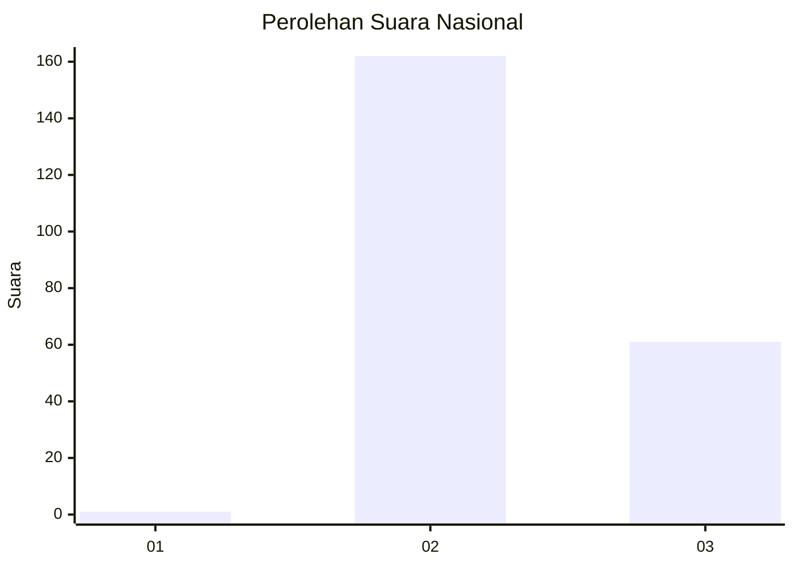
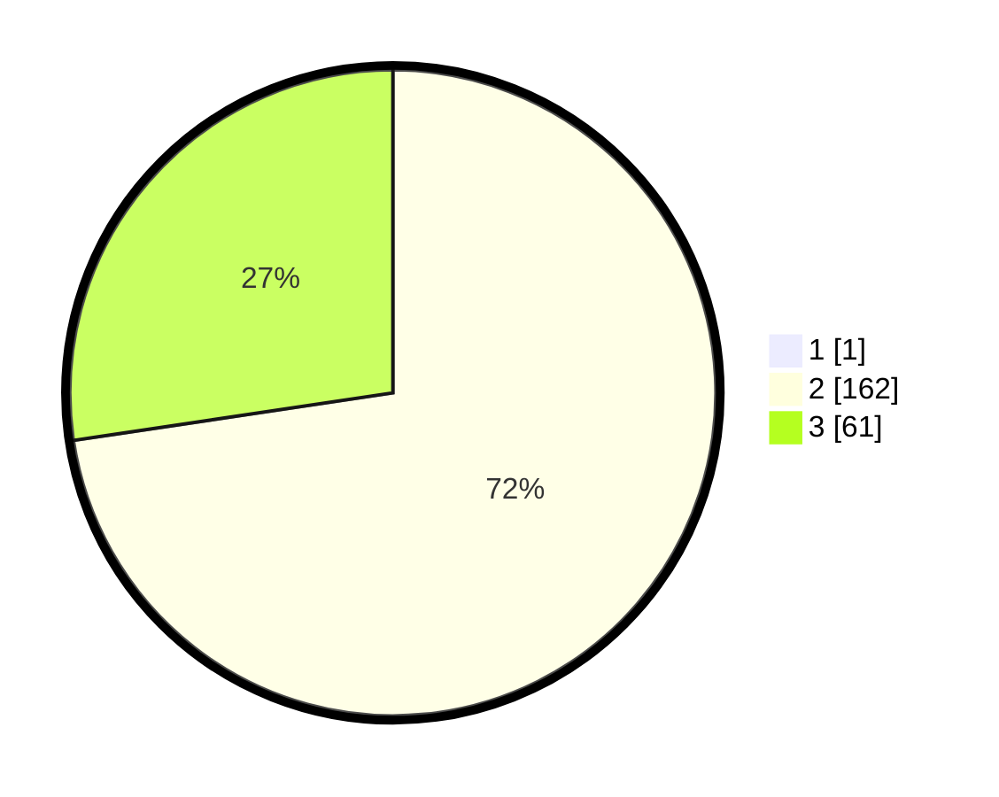

# Hasil

## Grafik

## Tabel

| No. | Nama Paslon    | Suara | Suara (raw) | Persentase |
|:--- |:-------------- | -----:| -----------:| ----------:|
| 1   | ANIES MUHAIMIN | 1     | [1][p-1]    | 0,45       |
| 2   | PRABOWO GIBRAN | 162   | [162][p-2]  | 72,32      |
| 3   | GANJAR MAHFUD  | 61    | [61][p-3]   | 27,23      |

[p-1]: https://github.com/gigit-pemilu/pemilu-2024/blob/main/pilpres/hitung-suara/sub/51-bali/sub/08-buleleng/sub/01-gerokgak/sub/2014-tukadsumaga/sub/004-tps/sub/paslon-1.txt
[p-2]: https://github.com/gigit-pemilu/pemilu-2024/blob/main/pilpres/hitung-suara/sub/51-bali/sub/08-buleleng/sub/01-gerokgak/sub/2014-tukadsumaga/sub/004-tps/sub/paslon-2.txt
[p-3]: https://github.com/gigit-pemilu/pemilu-2024/blob/main/pilpres/hitung-suara/sub/51-bali/sub/08-buleleng/sub/01-gerokgak/sub/2014-tukadsumaga/sub/004-tps/sub/paslon-3.txt

## Foto C Plano

https://sirekap-obj-formc.kpu.go.id/8956/pemilu/ppwp/51/08/01/20/14/5108012014004-20240214-230315--28bb7570-7820-4722-8e6a-a1fe3280dfa2.jpg

https://sirekap-obj-formc.kpu.go.id/8956/pemilu/ppwp/51/08/01/20/14/5108012014004-20240214-230829--0cc7b12e-bd9a-4690-831c-eaafb2bae86e.jpg

https://sirekap-obj-formc.kpu.go.id/8956/pemilu/ppwp/51/08/01/20/14/5108012014004-20240214-230932--a28871a1-0f83-4356-8459-e60f28015248.jpg

## Metadata

| Key        | Value               |
| ---------- | ------------------- |
| Time Stamp | 2024-02-24 22:31:28 |

