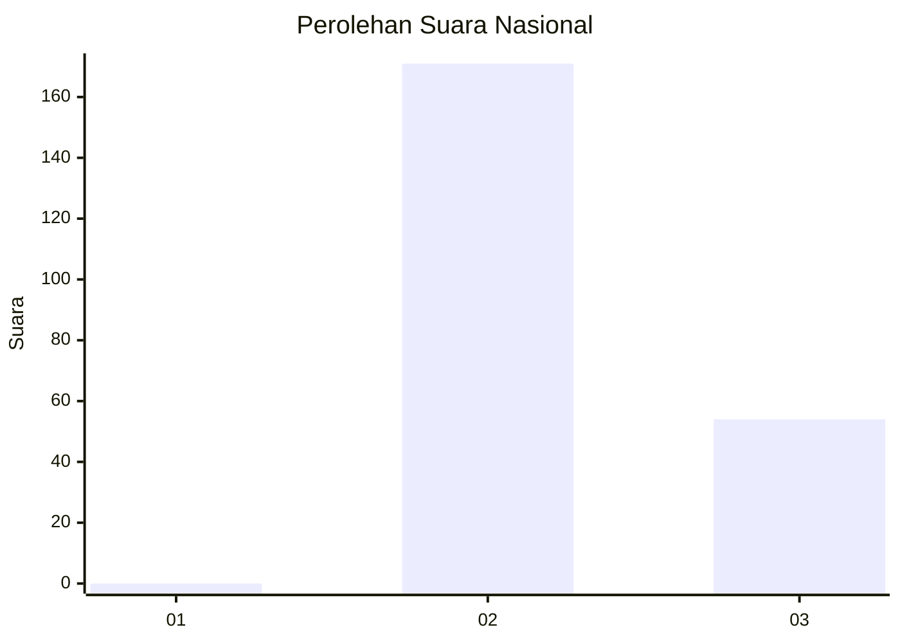
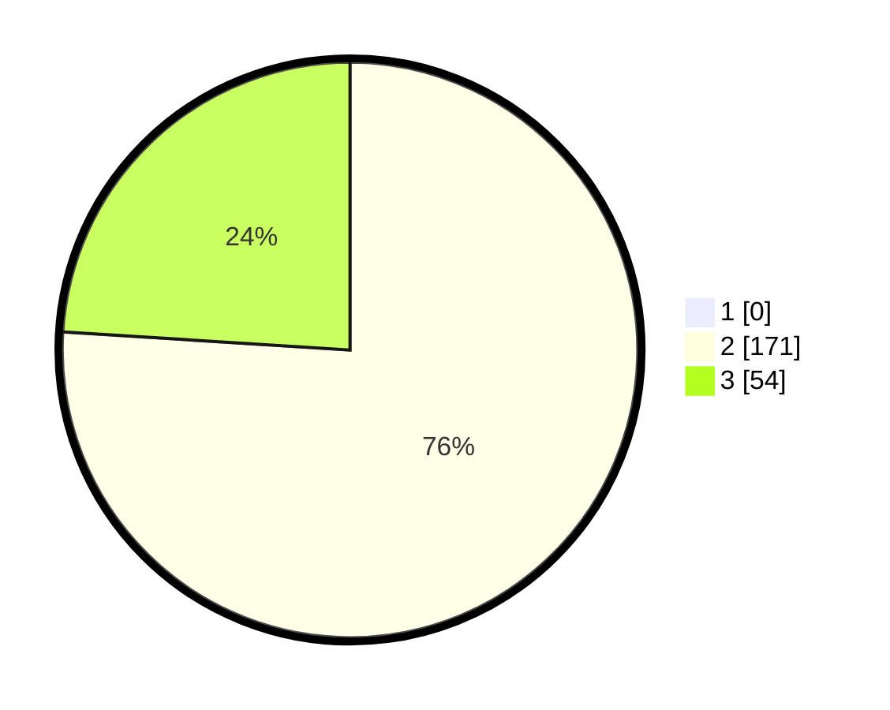

# Hasil

## Grafik

## Tabel

| No. | Nama Paslon    | Suara | Suara (raw) | Persentase |
|:--- |:-------------- | -----:| -----------:| ----------:|
| 1   | ANIES MUHAIMIN | 0     | [0][p-1]    | 0,00       |
| 2   | PRABOWO GIBRAN | 171   | [171][p-2]  | 76,00      |
| 3   | GANJAR MAHFUD  | 54    | [54][p-3]   | 24,00      |

[p-1]: https://github.com/gigit-pemilu/pemilu-2024/blob/main/pilpres/hitung-suara/sub/51-bali/sub/08-buleleng/sub/01-gerokgak/sub/2014-tukadsumaga/sub/005-tps/sub/paslon-1.txt
[p-2]: https://github.com/gigit-pemilu/pemilu-2024/blob/main/pilpres/hitung-suara/sub/51-bali/sub/08-buleleng/sub/01-gerokgak/sub/2014-tukadsumaga/sub/005-tps/sub/paslon-2.txt
[p-3]: https://github.com/gigit-pemilu/pemilu-2024/blob/main/pilpres/hitung-suara/sub/51-bali/sub/08-buleleng/sub/01-gerokgak/sub/2014-tukadsumaga/sub/005-tps/sub/paslon-3.txt

## Foto C Plano

https://sirekap-obj-formc.kpu.go.id/3846/pemilu/ppwp/51/08/01/20/14/5108012014005-20240214-215608--2d6b8470-17e6-441a-b069-316399badef4.jpg

https://sirekap-obj-formc.kpu.go.id/3846/pemilu/ppwp/51/08/01/20/14/5108012014005-20240215-041516--72cc6a44-3503-44c1-bbb7-44aa056e573d.jpg

https://sirekap-obj-formc.kpu.go.id/3846/pemilu/ppwp/51/08/01/20/14/5108012014005-20240214-220107--40ed8aa9-41da-47d6-8f34-5046302d8c0b.jpg

## Metadata

| Key        | Value               |
| ---------- | ------------------- |
| Time Stamp | 2024-02-25 00:00:00 |

