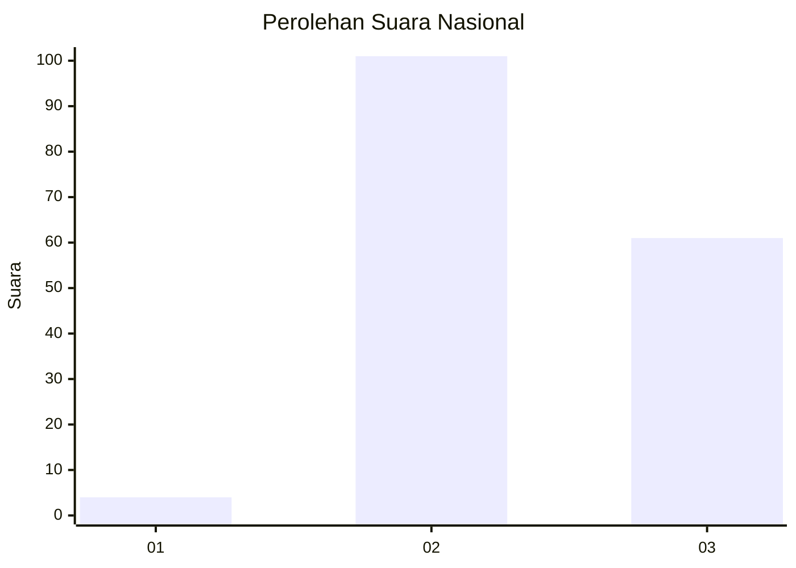
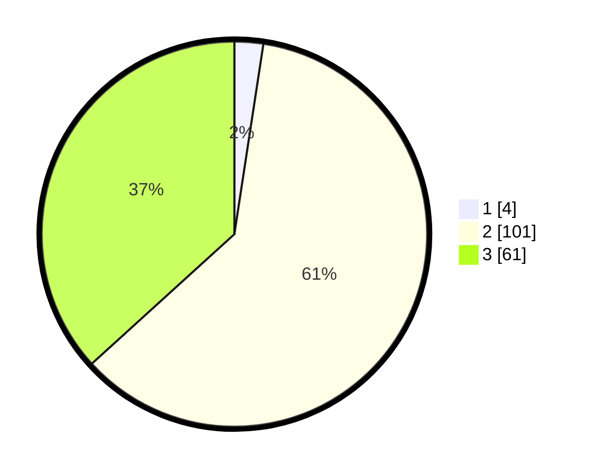

# Hasil

## Grafik

## Tabel

| No. | Nama Paslon    | Suara | Suara (raw) | Persentase |
|:--- |:-------------- | -----:| -----------:| ----------:|
| 1   | ANIES MUHAIMIN | 4     | [4][p-1]    | 2,41       |
| 2   | PRABOWO GIBRAN | 101   | [101][p-2]  | 60,84      |
| 3   | GANJAR MAHFUD  | 61    | [61][p-3]   | 36,75      |

[p-1]: https://github.com/gigit-pemilu/pemilu-2024/blob/main/pilpres/hitung-suara/sub/51-bali/sub/08-buleleng/sub/01-gerokgak/sub/2014-tukadsumaga/sub/020-tps/sub/paslon-1.txt
[p-2]: https://github.com/gigit-pemilu/pemilu-2024/blob/main/pilpres/hitung-suara/sub/51-bali/sub/08-buleleng/sub/01-gerokgak/sub/2014-tukadsumaga/sub/020-tps/sub/paslon-2.txt
[p-3]: https://github.com/gigit-pemilu/pemilu-2024/blob/main/pilpres/hitung-suara/sub/51-bali/sub/08-buleleng/sub/01-gerokgak/sub/2014-tukadsumaga/sub/020-tps/sub/paslon-3.txt

## Foto C Plano

https://sirekap-obj-formc.kpu.go.id/5bb3/pemilu/ppwp/51/08/01/20/14/5108012014020-20240215-044114--7226efe3-7b37-47f7-807f-1166ab0e39eb.jpg

https://sirekap-obj-formc.kpu.go.id/5bb3/pemilu/ppwp/51/08/01/20/14/5108012014020-20240215-044430--442ae623-e850-4d25-87cd-797cb867c88a.jpg

https://sirekap-obj-formc.kpu.go.id/5bb3/pemilu/ppwp/51/08/01/20/14/5108012014020-20240214-214245--82e04560-aa14-415b-8ad5-57dd9237472f.jpg

## Metadata

| Key        | Value               |
| ---------- | ------------------- |
| Time Stamp | 2024-02-24 22:31:28 |

