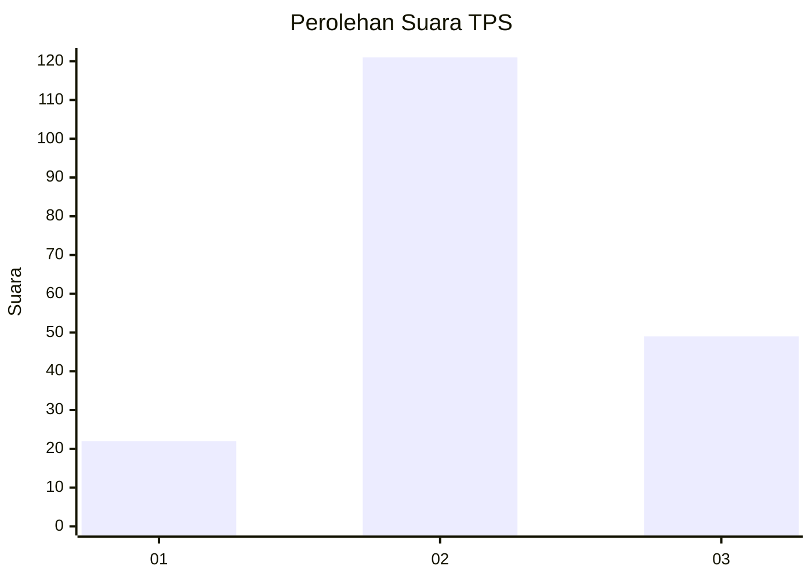
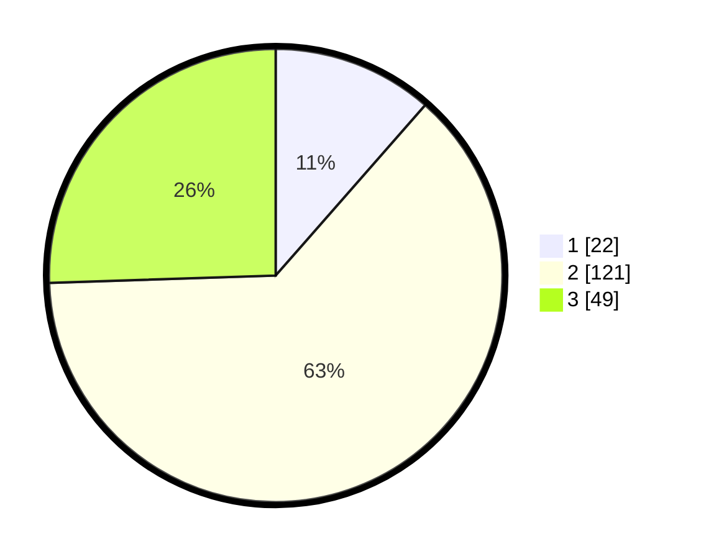

# Hasil

## Grafik

## Tabel

| No. | Nama Paslon    | Suara | Suara (raw) | Persentase |
|:--- |:-------------- | -----:| -----------:| ----------:|
| 1   | ANIES MUHAIMIN | 22    | [22][p-1]   | 11,46      |
| 2   | PRABOWO GIBRAN | 121   | [121][p-2]  | 63,02      |
| 3   | GANJAR MAHFUD  | 49    | [49][p-3]   | 25,52      |

[p-1]: https://github.com/gigit-pemilu/pemilu-2024-51-bali/blob/main/pilpres/hitung-suara/sub/51-bali/sub/08-buleleng/sub/02-seririt/sub/1015-seririt/sub/001-tps/sub/paslon-1.txt
[p-2]: https://github.com/gigit-pemilu/pemilu-2024-51-bali/blob/main/pilpres/hitung-suara/sub/51-bali/sub/08-buleleng/sub/02-seririt/sub/1015-seririt/sub/001-tps/sub/paslon-2.txt
[p-3]: https://github.com/gigit-pemilu/pemilu-2024-51-bali/blob/main/pilpres/hitung-suara/sub/51-bali/sub/08-buleleng/sub/02-seririt/sub/1015-seririt/sub/001-tps/sub/paslon-3.txt

## Foto C Plano

https://sirekap-obj-formc.kpu.go.id/a2ac/pemilu/ppwp/51/08/02/10/15/5108021015001-20240214-194114--2e9556f0-b8b8-46e4-b537-0dc0dc068b55.jpg

https://sirekap-obj-formc.kpu.go.id/a2ac/pemilu/ppwp/51/08/02/10/15/5108021015001-20240214-194126--8345c181-92d1-4f83-a08c-8702d9ad945a.jpg

https://sirekap-obj-formc.kpu.go.id/a2ac/pemilu/ppwp/51/08/02/10/15/5108021015001-20240214-194136--3db4df87-bafb-40b0-9e25-afa36094d19c.jpg

## Metadata

| Key        | Value               |
| ---------- | ------------------- |
| Time Stamp | 2024-02-15 19:00:26 |

## DATA PEMILIH TETAP

Jumlah pemilih dalam DPT: **295**.
 * L: **147**.
 * P: **148**.

## DATA PENGGUNA HAK PILIH

Jumlah pengguna hak pilih dalam DPT: **190**.
 * L: **95**.
 * P: **95**.

Jumlah pengguna hak pilih dalam DPTb: **3**.
 * L: **1**.
 * P: **2**.

Jumlah pengguna hak pilih dalam DPK: **1**.
 * L: **1**.
 * P: **0**.

Jumlah pengguna hak pilih: **194**.
 * L: **97**.
 * P: **97**.

## JUMLAH SUARA SAH DAN TIDAK SAH

JUMLAH SELURUH SUARA SAH: **192**.

JUMLAH SUARA TIDAK SAH: **2**.

JUMLAH SELURUH SUARA SAH DAN SUARA TIDAK SAH: **194**.

