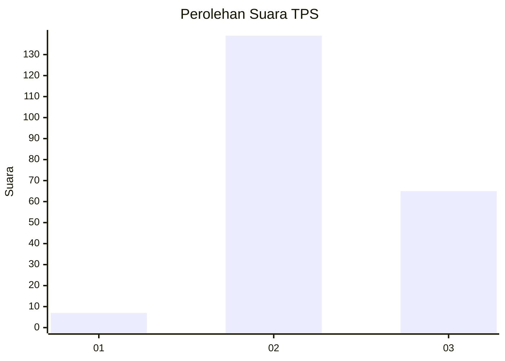
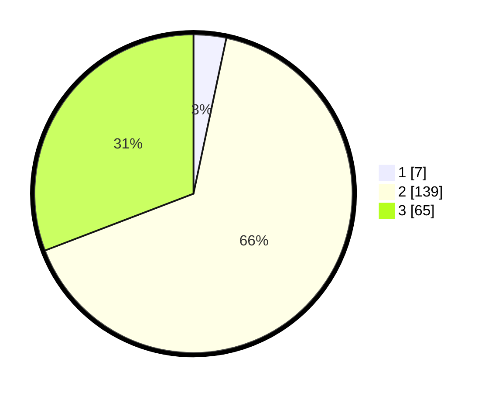

# Hasil

## Grafik

## Tabel

| No. | Nama Paslon    | Suara | Suara (raw) | Persentase |
|:--- |:-------------- | -----:| -----------:| ----------:|
| 1   | ANIES MUHAIMIN | 7     | [7][p-1]    | 3,32       |
| 2   | PRABOWO GIBRAN | 139   | [139][p-2]  | 65,88      |
| 3   | GANJAR MAHFUD  | 65    | [65][p-3]   | 30,81      |

[p-1]: https://github.com/gigit-pemilu/pemilu-2024-51-bali/blob/main/pilpres/hitung-suara/sub/51-bali/sub/08-buleleng/sub/02-seririt/sub/1015-seririt/sub/002-tps/sub/paslon-1.txt
[p-2]: https://github.com/gigit-pemilu/pemilu-2024-51-bali/blob/main/pilpres/hitung-suara/sub/51-bali/sub/08-buleleng/sub/02-seririt/sub/1015-seririt/sub/002-tps/sub/paslon-2.txt
[p-3]: https://github.com/gigit-pemilu/pemilu-2024-51-bali/blob/main/pilpres/hitung-suara/sub/51-bali/sub/08-buleleng/sub/02-seririt/sub/1015-seririt/sub/002-tps/sub/paslon-3.txt

## Foto C Plano

https://sirekap-obj-formc.kpu.go.id/6407/pemilu/ppwp/51/08/02/10/15/5108021015002-20240214-233932--2ec73964-3c79-4b3c-9cce-5370ae8c9e39.jpg

https://sirekap-obj-formc.kpu.go.id/6407/pemilu/ppwp/51/08/02/10/15/5108021015002-20240214-234131--8de3e56a-7c05-427e-837f-e2833729117e.jpg

https://sirekap-obj-formc.kpu.go.id/6407/pemilu/ppwp/51/08/02/10/15/5108021015002-20240214-234506--53940d9a-e827-4a7e-9fbe-7524db74ec03.jpg

## Metadata

| Key        | Value               |
| ---------- | ------------------- |
| Time Stamp | 2024-02-24 22:31:28 |

## DATA PEMILIH TETAP

Jumlah pemilih dalam DPT: **289**.
 * L: **142**.
 * P: **147**.

## DATA PENGGUNA HAK PILIH

Jumlah pengguna hak pilih dalam DPT: **211**.
 * L: **103**.
 * P: **108**.

Jumlah pengguna hak pilih dalam DPTb: **1**.
 * L: **1**.
 * P: **0**.

Jumlah pengguna hak pilih dalam DPK: **0**.
 * L: **0**.
 * P: **0**.

Jumlah pengguna hak pilih: **212**.
 * L: **104**.
 * P: **108**.

## JUMLAH SUARA SAH DAN TIDAK SAH

JUMLAH SELURUH SUARA SAH: **211**.

JUMLAH SUARA TIDAK SAH: **0**.

JUMLAH SELURUH SUARA SAH DAN SUARA TIDAK SAH: **211**.

