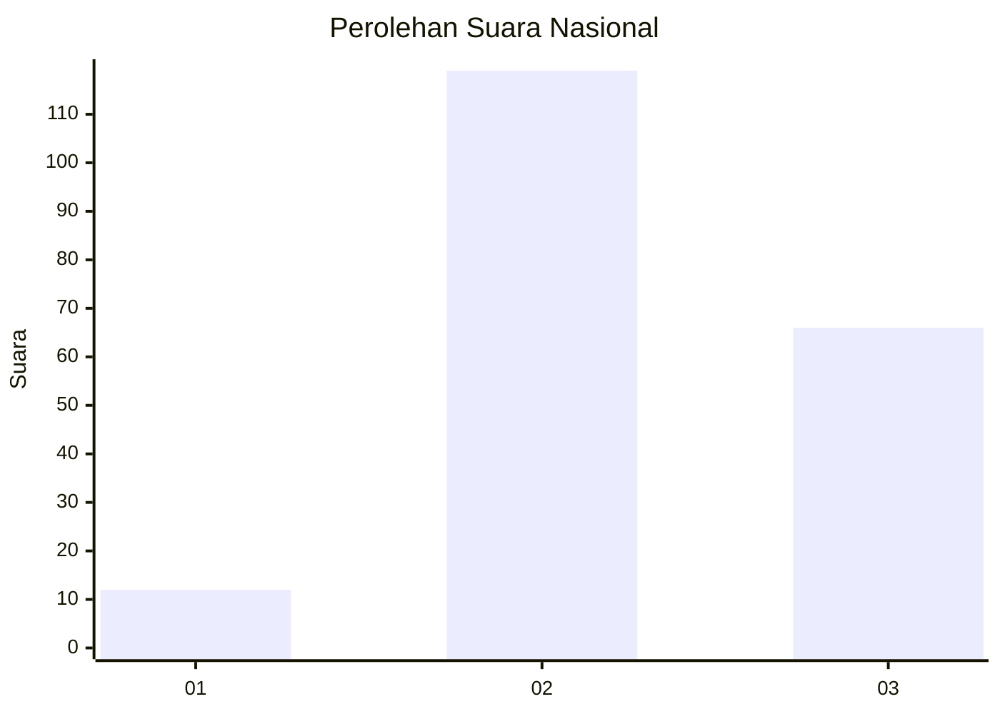
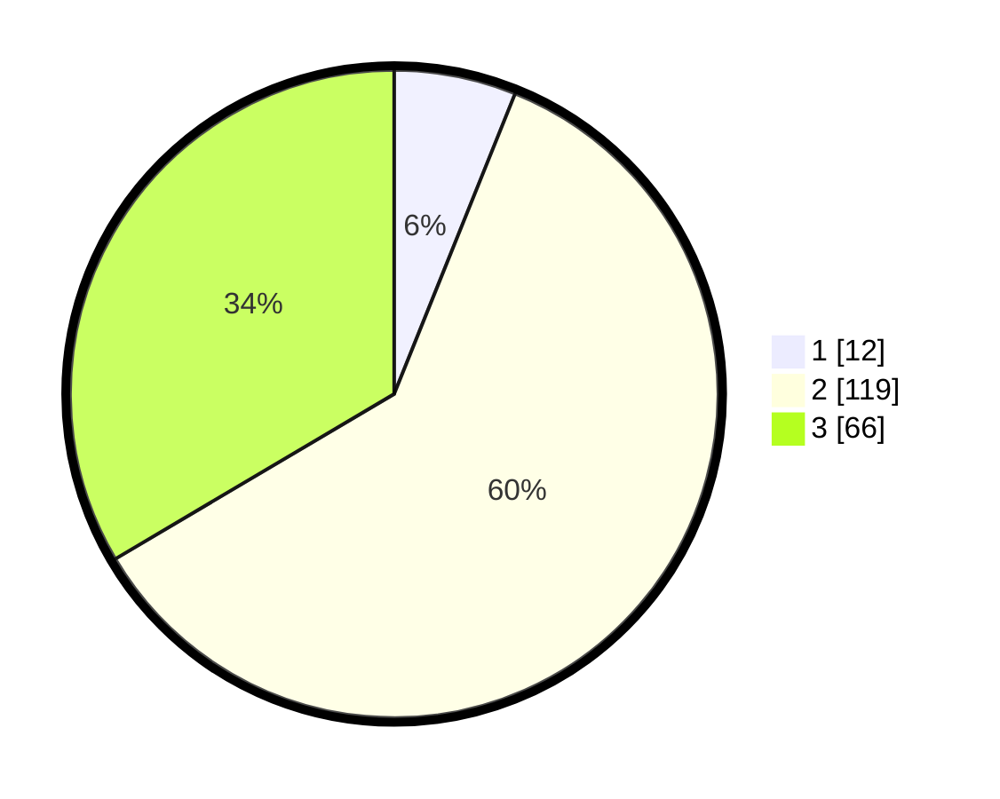

# Hasil

## Grafik

## Tabel

| No. | Nama Paslon    | Suara | Suara (raw) | Persentase |
|:--- |:-------------- | -----:| -----------:| ----------:|
| 1   | ANIES MUHAIMIN | 12    | [12][p-1]   | 6,09       |
| 2   | PRABOWO GIBRAN | 119   | [119][p-2]  | 60,41      |
| 3   | GANJAR MAHFUD  | 66    | [66][p-3]   | 33,50      |

[p-1]: https://github.com/gigit-pemilu/pemilu-2024/blob/main/pilpres/hitung-suara/sub/51-bali/sub/08-buleleng/sub/02-seririt/sub/1015-seririt/sub/003-tps/sub/paslon-1.txt
[p-2]: https://github.com/gigit-pemilu/pemilu-2024/blob/main/pilpres/hitung-suara/sub/51-bali/sub/08-buleleng/sub/02-seririt/sub/1015-seririt/sub/003-tps/sub/paslon-2.txt
[p-3]: https://github.com/gigit-pemilu/pemilu-2024/blob/main/pilpres/hitung-suara/sub/51-bali/sub/08-buleleng/sub/02-seririt/sub/1015-seririt/sub/003-tps/sub/paslon-3.txt

## Foto C Plano

https://sirekap-obj-formc.kpu.go.id/87f0/pemilu/ppwp/51/08/02/10/15/5108021015003-20240215-022947--cdde0850-f0b1-4ebc-b354-40874a9a0fab.jpg

https://sirekap-obj-formc.kpu.go.id/87f0/pemilu/ppwp/51/08/02/10/15/5108021015003-20240215-023159--2cb6ff83-813b-49c2-84c4-faa8275a282b.jpg

https://sirekap-obj-formc.kpu.go.id/87f0/pemilu/ppwp/51/08/02/10/15/5108021015003-20240215-023418--d256e9c3-d85e-4e37-8a00-b2c413797107.jpg

## Metadata

| Key        | Value               |
| ---------- | ------------------- |
| Time Stamp | 2024-02-24 22:31:28 |

