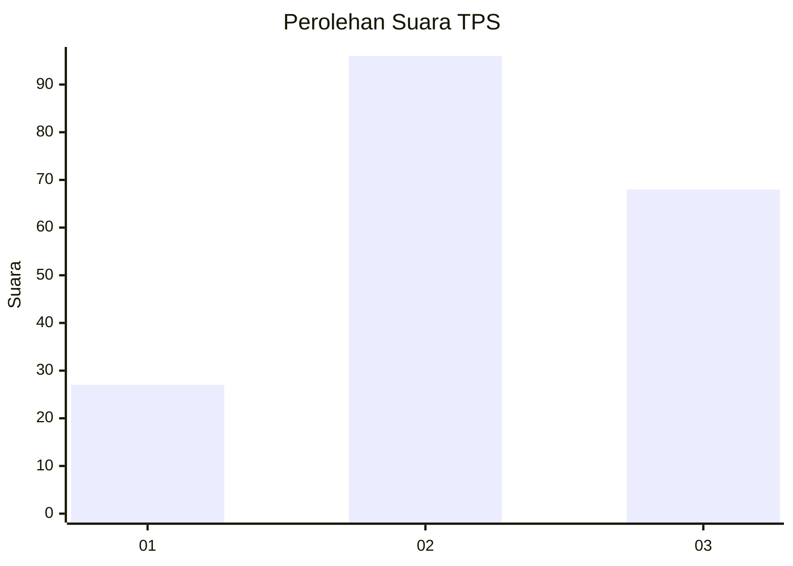
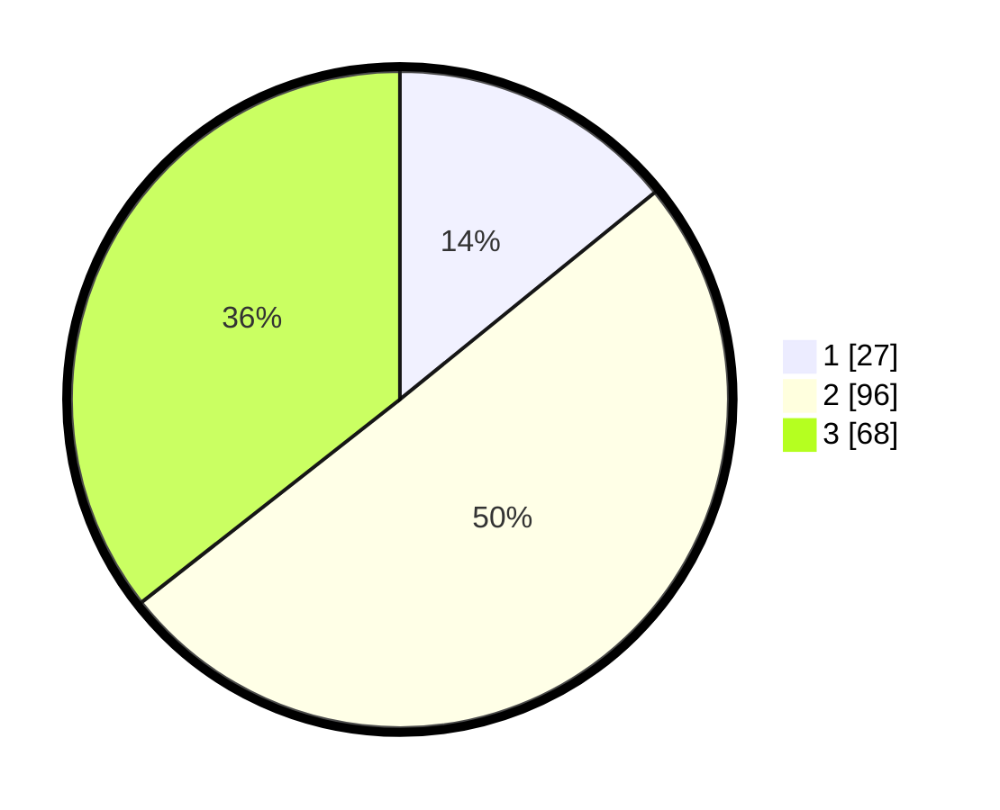

# Hasil

## Grafik

## Tabel

| No. | Nama Paslon    | Suara | Suara (raw) | Persentase |
|:--- |:-------------- | -----:| -----------:| ----------:|
| 1   | ANIES MUHAIMIN | 27    | [27][p-1]   | 14,14      |
| 2   | PRABOWO GIBRAN | 96    | [96][p-2]   | 50,26      |
| 3   | GANJAR MAHFUD  | 68    | [68][p-3]   | 35,60      |

[p-1]: https://github.com/gigit-pemilu/pemilu-2024-51-bali/blob/main/pilpres/hitung-suara/sub/51-bali/sub/08-buleleng/sub/02-seririt/sub/1015-seririt/sub/004-tps/sub/paslon-1.txt
[p-2]: https://github.com/gigit-pemilu/pemilu-2024-51-bali/blob/main/pilpres/hitung-suara/sub/51-bali/sub/08-buleleng/sub/02-seririt/sub/1015-seririt/sub/004-tps/sub/paslon-2.txt
[p-3]: https://github.com/gigit-pemilu/pemilu-2024-51-bali/blob/main/pilpres/hitung-suara/sub/51-bali/sub/08-buleleng/sub/02-seririt/sub/1015-seririt/sub/004-tps/sub/paslon-3.txt

## Foto C Plano

https://sirekap-obj-formc.kpu.go.id/44aa/pemilu/ppwp/51/08/02/10/15/5108021015004-20240214-220626--0b059aee-4e9c-4262-87b4-034e6aea3b4c.jpg

https://sirekap-obj-formc.kpu.go.id/44aa/pemilu/ppwp/51/08/02/10/15/5108021015004-20240214-220946--35ed2c95-9df0-4fd2-8704-0550fd03c0c9.jpg

https://sirekap-obj-formc.kpu.go.id/44aa/pemilu/ppwp/51/08/02/10/15/5108021015004-20240214-221146--663a6941-2f97-47de-98a9-82aba25b2208.jpg

## Metadata

| Key        | Value               |
| ---------- | ------------------- |
| Time Stamp | 2024-02-24 22:31:28 |

