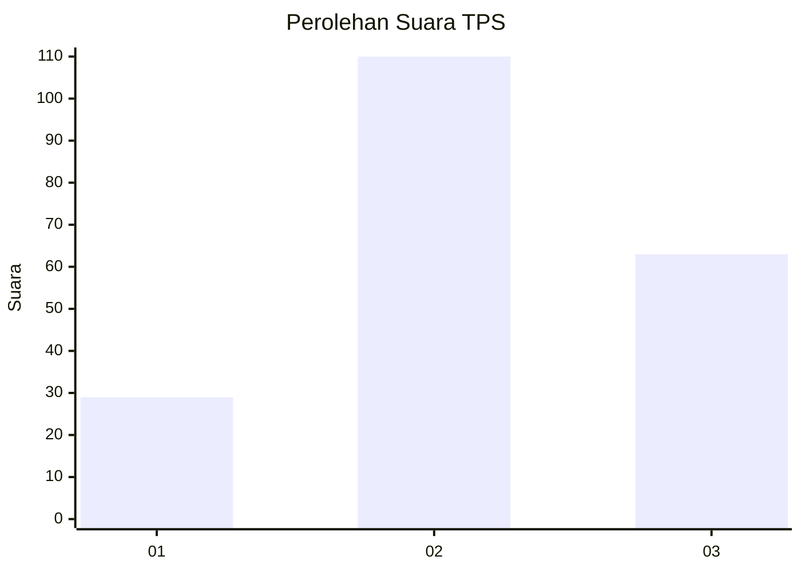
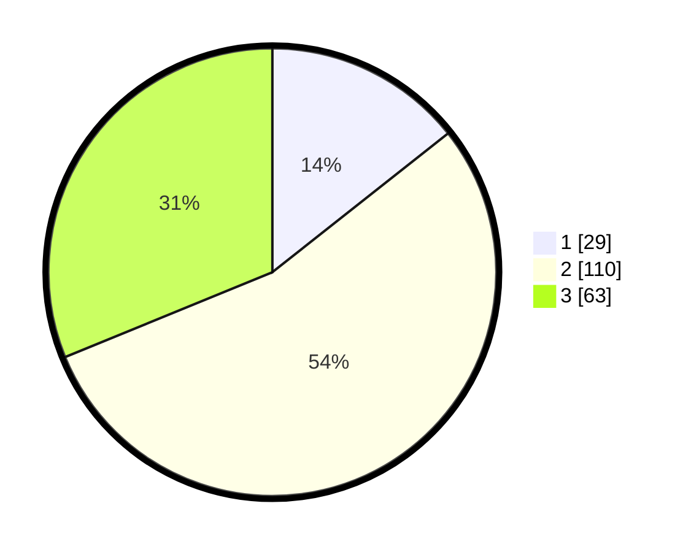

# Hasil

## Grafik

## Tabel

| No. | Nama Paslon    | Suara | Suara (raw) | Persentase |
|:--- |:-------------- | -----:| -----------:| ----------:|
| 1   | ANIES MUHAIMIN | 29    | [29][p-1]   | 14,36      |
| 2   | PRABOWO GIBRAN | 110   | [110][p-2]  | 54,46      |
| 3   | GANJAR MAHFUD  | 63    | [63][p-3]   | 31,19      |

[p-1]: https://github.com/gigit-pemilu/pemilu-2024-51-bali/blob/main/pilpres/hitung-suara/sub/51-bali/sub/08-buleleng/sub/02-seririt/sub/1015-seririt/sub/005-tps/sub/paslon-1.txt
[p-2]: https://github.com/gigit-pemilu/pemilu-2024-51-bali/blob/main/pilpres/hitung-suara/sub/51-bali/sub/08-buleleng/sub/02-seririt/sub/1015-seririt/sub/005-tps/sub/paslon-2.txt
[p-3]: https://github.com/gigit-pemilu/pemilu-2024-51-bali/blob/main/pilpres/hitung-suara/sub/51-bali/sub/08-buleleng/sub/02-seririt/sub/1015-seririt/sub/005-tps/sub/paslon-3.txt

## Foto C Plano

https://sirekap-obj-formc.kpu.go.id/f4b8/pemilu/ppwp/51/08/02/10/15/5108021015005-20240214-141400--79b9b1d9-aaa3-42f0-8b40-f11563a97d67.jpg

https://sirekap-obj-formc.kpu.go.id/f4b8/pemilu/ppwp/51/08/02/10/15/5108021015005-20240214-141222--44d291c1-ba99-45ca-bd58-619d39e192ed.jpg

https://sirekap-obj-formc.kpu.go.id/f4b8/pemilu/ppwp/51/08/02/10/15/5108021015005-20240214-141318--42d20a1f-ef56-4d26-9ea3-211ae434a920.jpg

## Metadata

| Key        | Value               |
| ---------- | ------------------- |
| Time Stamp | 2024-02-14 21:46:01 |

