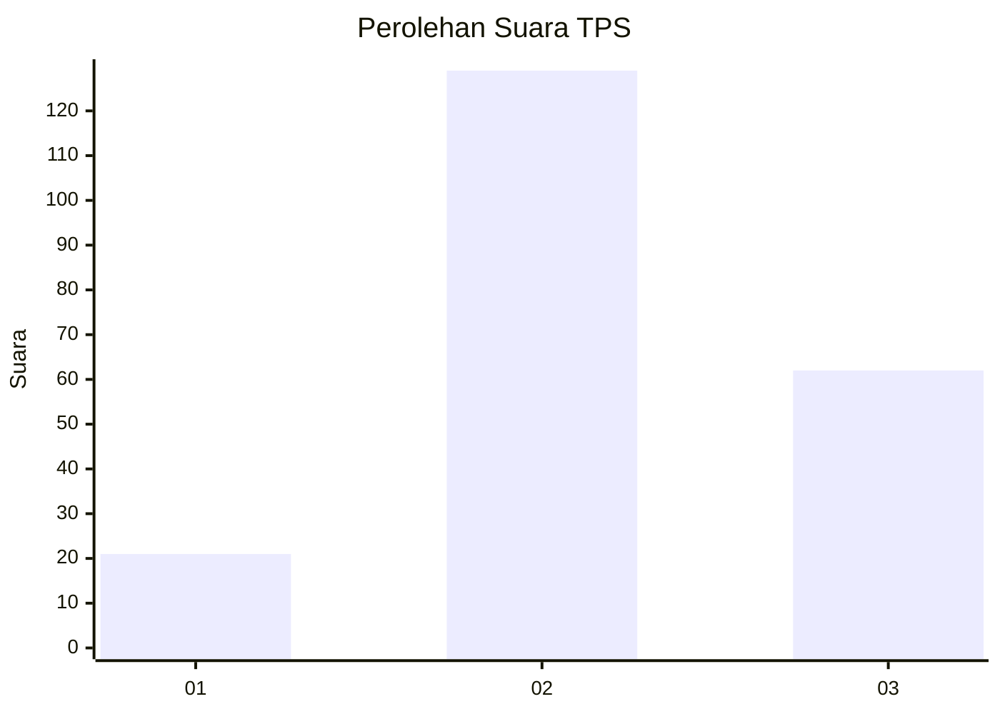
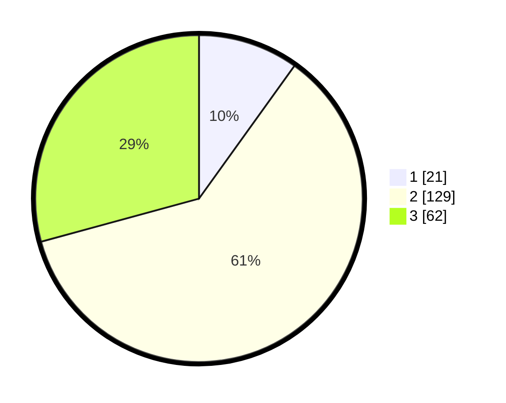

# Hasil

## Grafik

## Tabel

| No. | Nama Paslon    | Suara | Suara (raw) | Persentase |
|:--- |:-------------- | -----:| -----------:| ----------:|
| 1   | ANIES MUHAIMIN | 21    | [21][p-1]   | 9,91       |
| 2   | PRABOWO GIBRAN | 129   | [129][p-2]  | 60,85      |
| 3   | GANJAR MAHFUD  | 62    | [62][p-3]   | 29,25      |

[p-1]: https://github.com/gigit-pemilu/pemilu-2024-51-bali/blob/main/pilpres/hitung-suara/sub/51-bali/sub/08-buleleng/sub/02-seririt/sub/1015-seririt/sub/007-tps/sub/paslon-1.txt
[p-2]: https://github.com/gigit-pemilu/pemilu-2024-51-bali/blob/main/pilpres/hitung-suara/sub/51-bali/sub/08-buleleng/sub/02-seririt/sub/1015-seririt/sub/007-tps/sub/paslon-2.txt
[p-3]: https://github.com/gigit-pemilu/pemilu-2024-51-bali/blob/main/pilpres/hitung-suara/sub/51-bali/sub/08-buleleng/sub/02-seririt/sub/1015-seririt/sub/007-tps/sub/paslon-3.txt

## Foto C Plano

https://sirekap-obj-formc.kpu.go.id/8cdd/pemilu/ppwp/51/08/02/10/15/5108021015007-20240214-222856--f9920d6b-568d-4bdf-998c-089d4fd15ce0.jpg

https://sirekap-obj-formc.kpu.go.id/8cdd/pemilu/ppwp/51/08/02/10/15/5108021015007-20240214-214222--885f42fb-0fe8-4ede-95d9-a68b8ed602a7.jpg

https://sirekap-obj-formc.kpu.go.id/8cdd/pemilu/ppwp/51/08/02/10/15/5108021015007-20240214-202740--c0432e5e-3816-45d0-a278-a19e855c073d.jpg

## Metadata

| Key        | Value               |
| ---------- | ------------------- |
| Time Stamp | 2024-02-24 22:31:28 |

