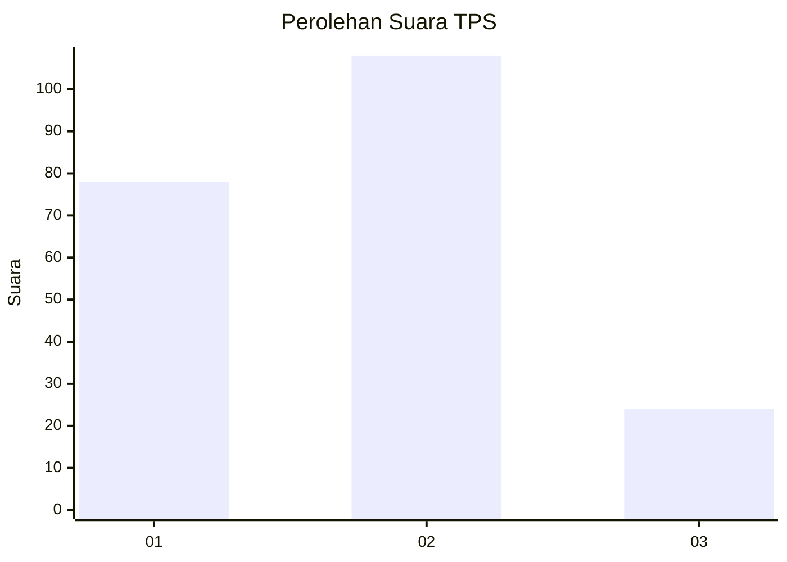
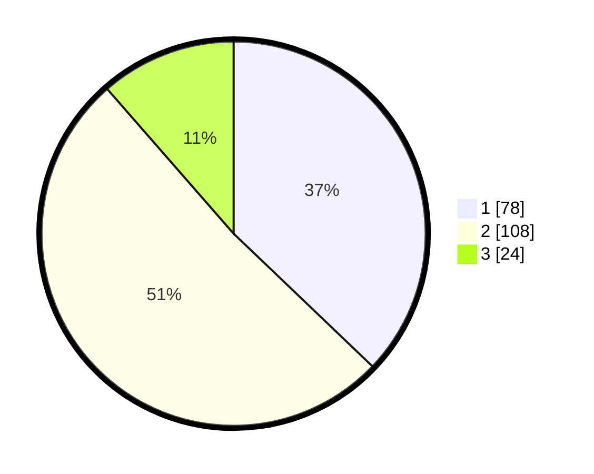

# Hasil

## Grafik

## Tabel

| No. | Nama Paslon    | Suara | Suara (raw) | Persentase |
|:--- |:-------------- | -----:| -----------:| ----------:|
| 1   | ANIES MUHAIMIN | 78    | [78][p-1]   | 37,14      |
| 2   | PRABOWO GIBRAN | 108   | [108][p-2]  | 51,43      |
| 3   | GANJAR MAHFUD  | 24    | [24][p-3]   | 11,43      |

[p-1]: https://github.com/gigit-pemilu/pemilu-2024-51-bali/blob/main/pilpres/hitung-suara/sub/51-bali/sub/08-buleleng/sub/02-seririt/sub/1015-seririt/sub/009-tps/sub/paslon-1.txt
[p-2]: https://github.com/gigit-pemilu/pemilu-2024-51-bali/blob/main/pilpres/hitung-suara/sub/51-bali/sub/08-buleleng/sub/02-seririt/sub/1015-seririt/sub/009-tps/sub/paslon-2.txt
[p-3]: https://github.com/gigit-pemilu/pemilu-2024-51-bali/blob/main/pilpres/hitung-suara/sub/51-bali/sub/08-buleleng/sub/02-seririt/sub/1015-seririt/sub/009-tps/sub/paslon-3.txt

## Foto C Plano

https://sirekap-obj-formc.kpu.go.id/1f63/pemilu/ppwp/51/08/02/10/15/5108021015009-20240215-025120--47c95c94-a4ce-4d4d-9059-d2f9644cae23.jpg

https://sirekap-obj-formc.kpu.go.id/1f63/pemilu/ppwp/51/08/02/10/15/5108021015009-20240215-025214--d8e0a7d4-81c3-4922-b322-a95de4fe51a5.jpg

https://sirekap-obj-formc.kpu.go.id/1f63/pemilu/ppwp/51/08/02/10/15/5108021015009-20240215-025307--1f66ab39-2947-43d1-9b49-f0bf545d49da.jpg

## Metadata

| Key        | Value               |
| ---------- | ------------------- |
| Time Stamp | 2024-02-15 12:00:28 |

