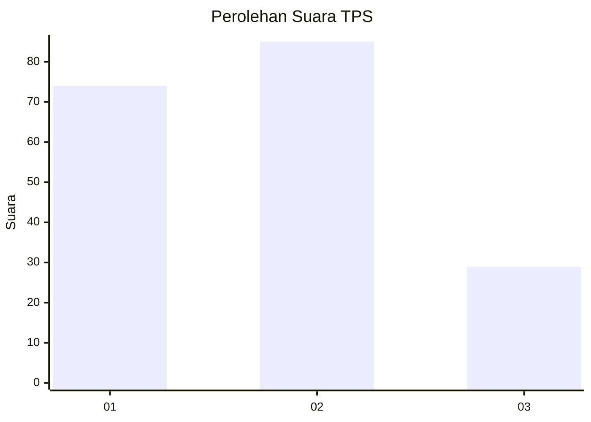
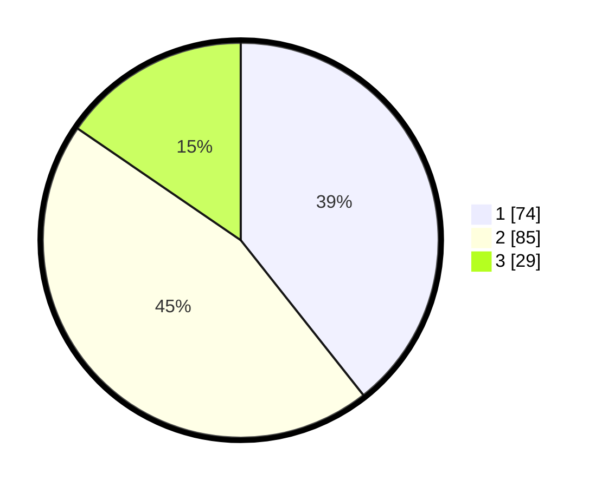

# Hasil

## Grafik

## Tabel

| No. | Nama Paslon    | Suara | Suara (raw) | Persentase |
|:--- |:-------------- | -----:| -----------:| ----------:|
| 1   | ANIES MUHAIMIN | 74    | [74][p-1]   | 39,36      |
| 2   | PRABOWO GIBRAN | 85    | [85][p-2]   | 45,21      |
| 3   | GANJAR MAHFUD  | 29    | [29][p-3]   | 15,43      |

[p-1]: https://github.com/gigit-pemilu/pemilu-2024-51-bali/blob/main/pilpres/hitung-suara/sub/51-bali/sub/08-buleleng/sub/02-seririt/sub/1015-seririt/sub/010-tps/sub/paslon-1.txt
[p-2]: https://github.com/gigit-pemilu/pemilu-2024-51-bali/blob/main/pilpres/hitung-suara/sub/51-bali/sub/08-buleleng/sub/02-seririt/sub/1015-seririt/sub/010-tps/sub/paslon-2.txt
[p-3]: https://github.com/gigit-pemilu/pemilu-2024-51-bali/blob/main/pilpres/hitung-suara/sub/51-bali/sub/08-buleleng/sub/02-seririt/sub/1015-seririt/sub/010-tps/sub/paslon-3.txt

## Foto C Plano

https://sirekap-obj-formc.kpu.go.id/9f64/pemilu/ppwp/51/08/02/10/15/5108021015010-20240214-140925--9c8abcac-1421-4962-ab10-b8d2cc5ab5b4.jpg

https://sirekap-obj-formc.kpu.go.id/9f64/pemilu/ppwp/51/08/02/10/15/5108021015010-20240214-141023--6bf4df1c-ed7e-4914-bbbd-ffbb6b654bbe.jpg

https://sirekap-obj-formc.kpu.go.id/9f64/pemilu/ppwp/51/08/02/10/15/5108021015010-20240214-141107--53fb5344-4af2-48d5-914e-455ccf77d393.jpg

## Metadata

| Key        | Value               |
| ---------- | ------------------- |
| Time Stamp | 2024-02-15 04:00:24 |

## DATA PEMILIH TETAP

Jumlah pemilih dalam DPT: **266**.
 * L: **128**.
 * P: **138**.

## DATA PENGGUNA HAK PILIH

Jumlah pengguna hak pilih dalam DPT: **188**.
 * L: **90**.
 * P: **98**.

Jumlah pengguna hak pilih dalam DPTb: **0**.
 * L: **0**.
 * P: **0**.

Jumlah pengguna hak pilih dalam DPK: **0**.
 * L: **0**.
 * P: **0**.

Jumlah pengguna hak pilih: **188**.
 * L: **90**.
 * P: **98**.

## JUMLAH SUARA SAH DAN TIDAK SAH

JUMLAH SELURUH SUARA SAH: **188**.

JUMLAH SUARA TIDAK SAH: **0**.

JUMLAH SELURUH SUARA SAH DAN SUARA TIDAK SAH: **188**.

