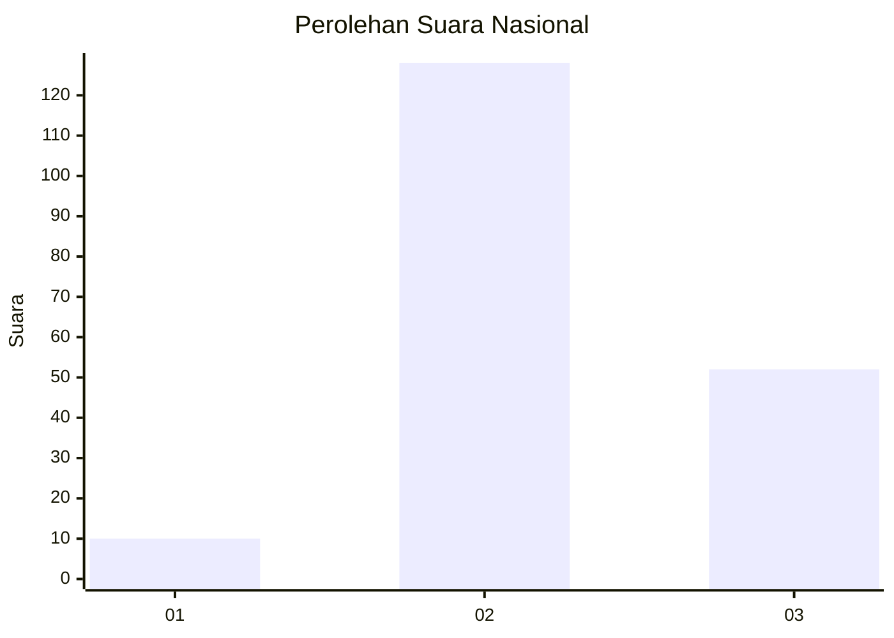

# Hasil

## Grafik

## Tabel

| No. | Nama Paslon    | Suara | Suara (raw) | Persentase |
|:--- |:-------------- | -----:| -----------:| ----------:|
| 1   | ANIES MUHAIMIN | 10    | [10][p-1]   | 5,26       |
| 2   | PRABOWO GIBRAN | 128   | [128][p-2]  | 67,37      |
| 3   | GANJAR MAHFUD  | 52    | [52][p-3]   | 27,37      |

[p-1]: https://github.com/gigit-pemilu/pemilu-2024/blob/main/pilpres/hitung-suara/sub/51-bali/sub/08-buleleng/sub/02-seririt/sub/1015-seririt/sub/013-tps/sub/paslon-1.txt
[p-2]: https://github.com/gigit-pemilu/pemilu-2024/blob/main/pilpres/hitung-suara/sub/51-bali/sub/08-buleleng/sub/02-seririt/sub/1015-seririt/sub/013-tps/sub/paslon-2.txt
[p-3]: https://github.com/gigit-pemilu/pemilu-2024/blob/main/pilpres/hitung-suara/sub/51-bali/sub/08-buleleng/sub/02-seririt/sub/1015-seririt/sub/013-tps/sub/paslon-3.txt

## Foto C Plano

https://sirekap-obj-formc.kpu.go.id/ba9e/pemilu/ppwp/51/08/02/10/15/5108021015013-20240214-233649--337b34f9-4c9f-484b-8268-bd203ef10822.jpg

https://sirekap-obj-formc.kpu.go.id/ba9e/pemilu/ppwp/51/08/02/10/15/5108021015013-20240214-234152--ab7c0ed6-caa8-4262-bf10-da8735cd1745.jpg

https://sirekap-obj-formc.kpu.go.id/ba9e/pemilu/ppwp/51/08/02/10/15/5108021015013-20240214-234227--0955c6d6-53f1-4dc6-9aef-71843d354a12.jpg

## Metadata

| Key        | Value               |
| ---------- | ------------------- |
| Time Stamp | 2024-02-24 22:31:28 |

