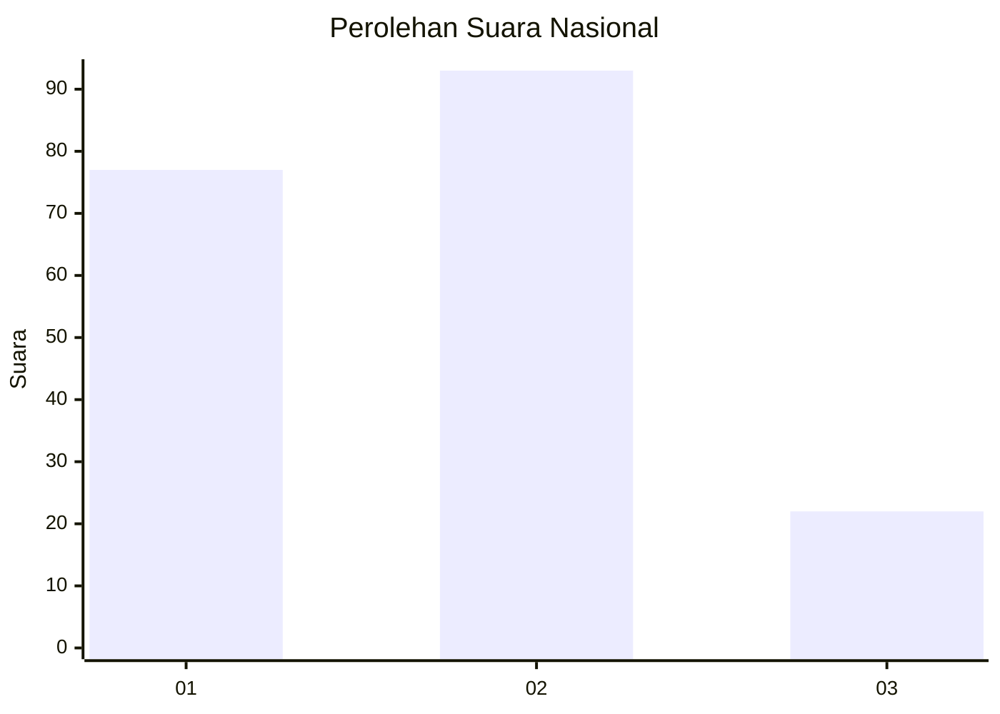
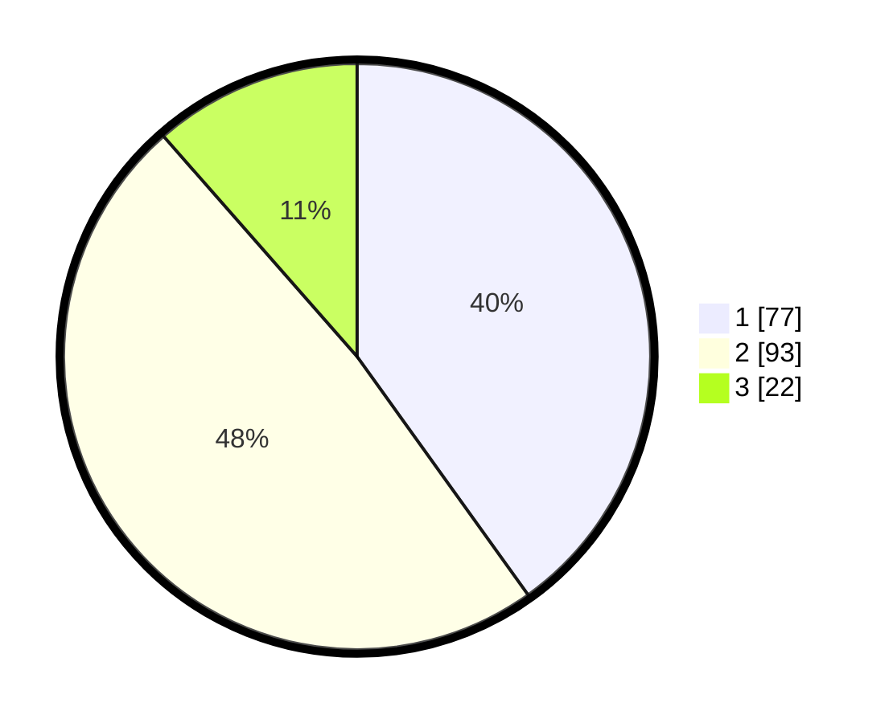

# Hasil

## Grafik

## Tabel

| No. | Nama Paslon    | Suara | Suara (raw) | Persentase |
|:--- |:-------------- | -----:| -----------:| ----------:|
| 1   | ANIES MUHAIMIN | 77    | [77][p-1]   | 40,10      |
| 2   | PRABOWO GIBRAN | 93    | [93][p-2]   | 48,44      |
| 3   | GANJAR MAHFUD  | 22    | [22][p-3]   | 11,46      |

[p-1]: https://github.com/gigit-pemilu/pemilu-2024/blob/main/pilpres/hitung-suara/sub/51-bali/sub/08-buleleng/sub/02-seririt/sub/1015-seririt/sub/014-tps/sub/paslon-1.txt
[p-2]: https://github.com/gigit-pemilu/pemilu-2024/blob/main/pilpres/hitung-suara/sub/51-bali/sub/08-buleleng/sub/02-seririt/sub/1015-seririt/sub/014-tps/sub/paslon-2.txt
[p-3]: https://github.com/gigit-pemilu/pemilu-2024/blob/main/pilpres/hitung-suara/sub/51-bali/sub/08-buleleng/sub/02-seririt/sub/1015-seririt/sub/014-tps/sub/paslon-3.txt

## Foto C Plano

https://sirekap-obj-formc.kpu.go.id/f6e3/pemilu/ppwp/51/08/02/10/15/5108021015014-20240214-141242--7a32e204-f34a-41da-8818-04c8e44e07a0.jpg

https://sirekap-obj-formc.kpu.go.id/f6e3/pemilu/ppwp/51/08/02/10/15/5108021015014-20240214-141342--b1f2c594-20cc-4e5e-9db6-791d8ffb6242.jpg

https://sirekap-obj-formc.kpu.go.id/f6e3/pemilu/ppwp/51/08/02/10/15/5108021015014-20240214-141546--8c4fbb1c-dd5b-4869-a0a1-cca188dadf56.jpg

## Metadata

| Key        | Value               |
| ---------- | ------------------- |
| Time Stamp | 2024-02-15 00:41:44 |

