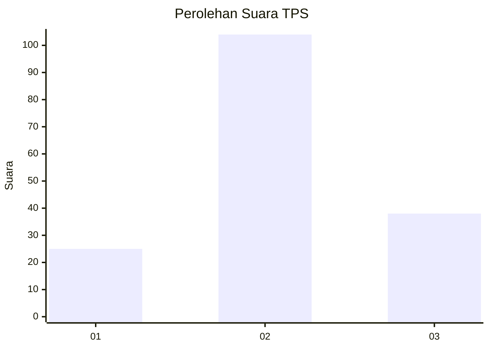
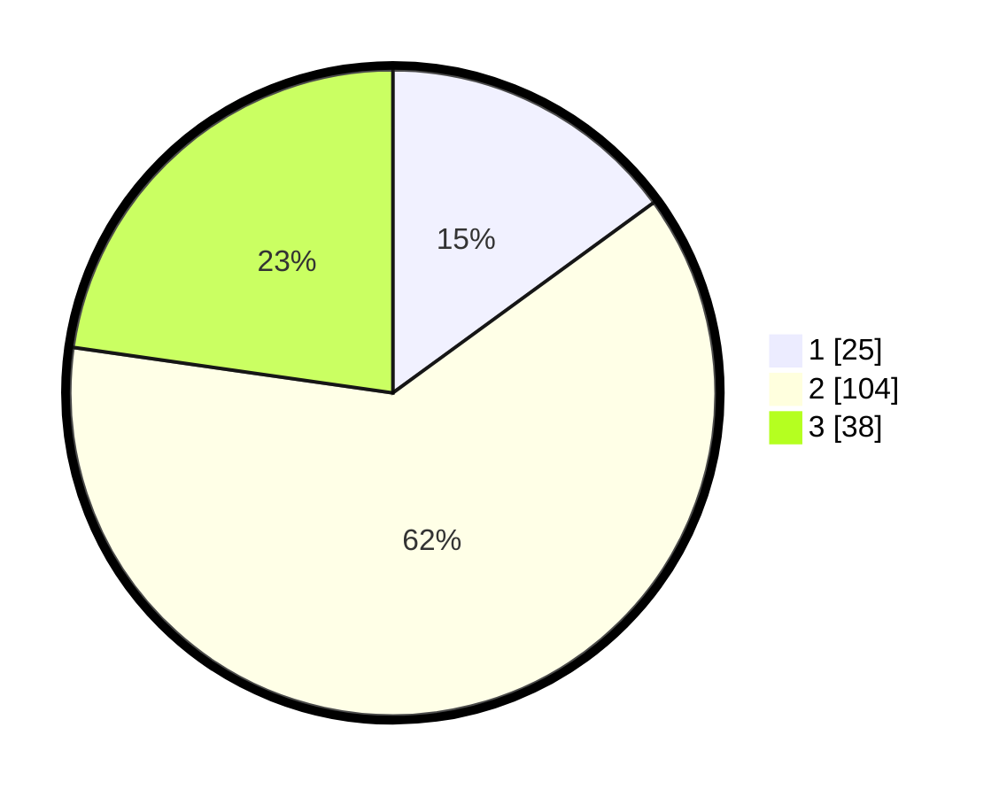

# Hasil

## Grafik

## Tabel

| No. | Nama Paslon    | Suara | Suara (raw) | Persentase |
|:--- |:-------------- | -----:| -----------:| ----------:|
| 1   | ANIES MUHAIMIN | 25    | [25][p-1]   | 14,97      |
| 2   | PRABOWO GIBRAN | 104   | [104][p-2]  | 62,28      |
| 3   | GANJAR MAHFUD  | 38    | [38][p-3]   | 22,75      |

[p-1]: https://github.com/gigit-pemilu/pemilu-2024-51-bali/blob/main/pilpres/hitung-suara/sub/51-bali/sub/08-buleleng/sub/02-seririt/sub/1015-seririt/sub/017-tps/sub/paslon-1.txt
[p-2]: https://github.com/gigit-pemilu/pemilu-2024-51-bali/blob/main/pilpres/hitung-suara/sub/51-bali/sub/08-buleleng/sub/02-seririt/sub/1015-seririt/sub/017-tps/sub/paslon-2.txt
[p-3]: https://github.com/gigit-pemilu/pemilu-2024-51-bali/blob/main/pilpres/hitung-suara/sub/51-bali/sub/08-buleleng/sub/02-seririt/sub/1015-seririt/sub/017-tps/sub/paslon-3.txt

## Foto C Plano

https://sirekap-obj-formc.kpu.go.id/60d4/pemilu/ppwp/51/08/02/10/15/5108021015017-20240215-011106--2cda4068-ee9a-4ed9-af51-4b57d6d0efcc.jpg

https://sirekap-obj-formc.kpu.go.id/60d4/pemilu/ppwp/51/08/02/10/15/5108021015017-20240215-011445--af133ae3-cb19-41e9-a3c0-057e70616ea4.jpg

https://sirekap-obj-formc.kpu.go.id/60d4/pemilu/ppwp/51/08/02/10/15/5108021015017-20240215-011600--d37a8639-0a0d-434e-a0ea-0829e015f87b.jpg

## Metadata

| Key        | Value               |
| ---------- | ------------------- |
| Time Stamp | 2024-02-24 22:31:28 |

