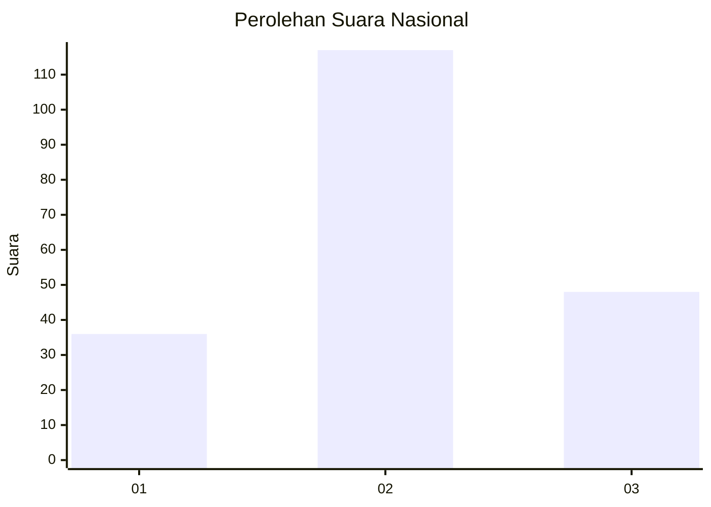
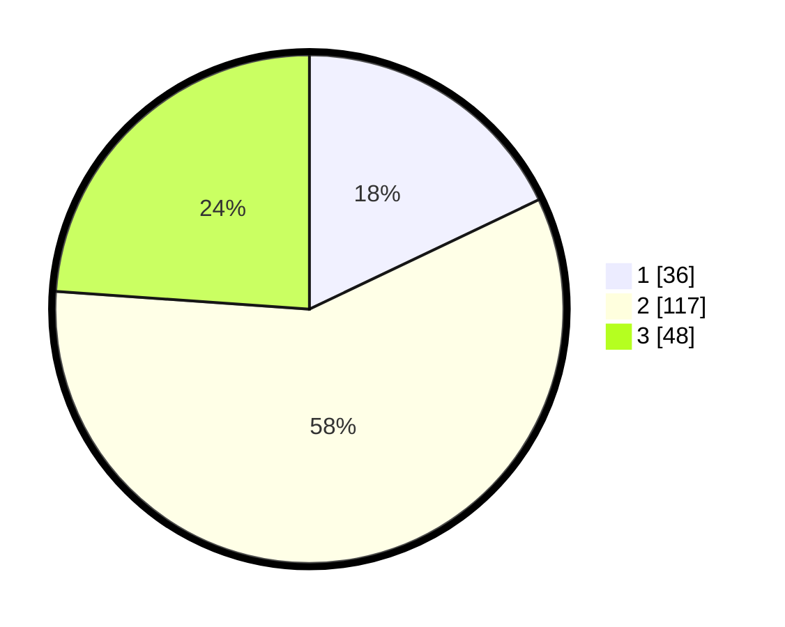

# Hasil

## Grafik

## Tabel

| No. | Nama Paslon    | Suara | Suara (raw) | Persentase |
|:--- |:-------------- | -----:| -----------:| ----------:|
| 1   | ANIES MUHAIMIN | 36    | [36][p-1]   | 17,91      |
| 2   | PRABOWO GIBRAN | 117   | [117][p-2]  | 58,21      |
| 3   | GANJAR MAHFUD  | 48    | [48][p-3]   | 23,88      |

[p-1]: https://github.com/gigit-pemilu/pemilu-2024/blob/main/pilpres/hitung-suara/sub/51-bali/sub/08-buleleng/sub/02-seririt/sub/1015-seririt/sub/019-tps/sub/paslon-1.txt
[p-2]: https://github.com/gigit-pemilu/pemilu-2024/blob/main/pilpres/hitung-suara/sub/51-bali/sub/08-buleleng/sub/02-seririt/sub/1015-seririt/sub/019-tps/sub/paslon-2.txt
[p-3]: https://github.com/gigit-pemilu/pemilu-2024/blob/main/pilpres/hitung-suara/sub/51-bali/sub/08-buleleng/sub/02-seririt/sub/1015-seririt/sub/019-tps/sub/paslon-3.txt

## Foto C Plano

https://sirekap-obj-formc.kpu.go.id/0ebc/pemilu/ppwp/51/08/02/10/15/5108021015019-20240214-220235--053ed8fa-332b-48ad-b1ce-316b55139f5f.jpg

https://sirekap-obj-formc.kpu.go.id/0ebc/pemilu/ppwp/51/08/02/10/15/5108021015019-20240214-220310--d9705f09-cbde-4c00-ad32-1baa559113aa.jpg

https://sirekap-obj-formc.kpu.go.id/0ebc/pemilu/ppwp/51/08/02/10/15/5108021015019-20240214-220333--d4b20e77-3c0e-430c-a2d4-f13a564ea59a.jpg

## Metadata

| Key        | Value               |
| ---------- | ------------------- |
| Time Stamp | 2024-02-17 17:30:00 |

