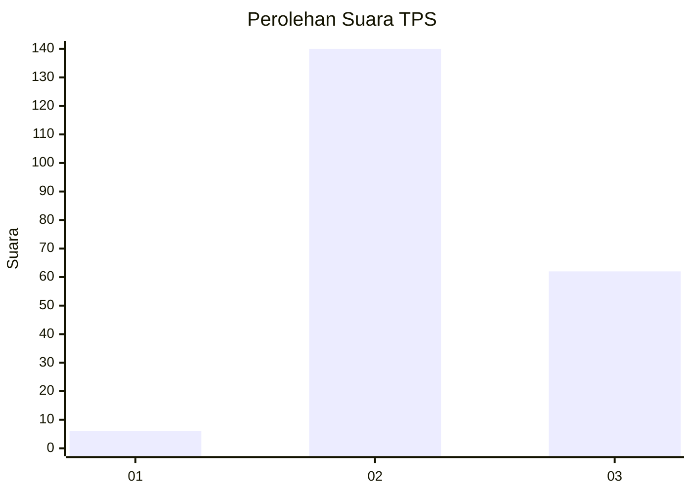

# Hasil

## Grafik

## Tabel

| No. | Nama Paslon    | Suara | Suara (raw) | Persentase |
|:--- |:-------------- | -----:| -----------:| ----------:|
| 1   | ANIES MUHAIMIN | 6     | [6][p-1]    | 2,88       |
| 2   | PRABOWO GIBRAN | 140   | [140][p-2]  | 67,31      |
| 3   | GANJAR MAHFUD  | 62    | [62][p-3]   | 29,81      |

[p-1]: https://github.com/gigit-pemilu/pemilu-2024-51-bali/blob/main/pilpres/hitung-suara/sub/51-bali/sub/08-buleleng/sub/02-seririt/sub/2001-unggahan/sub/003-tps/sub/paslon-1.txt
[p-2]: https://github.com/gigit-pemilu/pemilu-2024-51-bali/blob/main/pilpres/hitung-suara/sub/51-bali/sub/08-buleleng/sub/02-seririt/sub/2001-unggahan/sub/003-tps/sub/paslon-2.txt
[p-3]: https://github.com/gigit-pemilu/pemilu-2024-51-bali/blob/main/pilpres/hitung-suara/sub/51-bali/sub/08-buleleng/sub/02-seririt/sub/2001-unggahan/sub/003-tps/sub/paslon-3.txt

## Foto C Plano

https://sirekap-obj-formc.kpu.go.id/ad2d/pemilu/ppwp/51/08/02/20/01/5108022001003-20240215-005348--6a4e09b2-40db-4432-8507-f8fe484a1fb4.jpg

https://sirekap-obj-formc.kpu.go.id/ad2d/pemilu/ppwp/51/08/02/20/01/5108022001003-20240214-222109--aae97462-a2f5-44fd-91f2-f089fa95c68c.jpg

https://sirekap-obj-formc.kpu.go.id/ad2d/pemilu/ppwp/51/08/02/20/01/5108022001003-20240214-222147--aeeeb070-6b53-4854-9f05-5f39296d9371.jpg

## Metadata

| Key        | Value               |
| ---------- | ------------------- |
| Time Stamp | 2024-02-24 22:31:28 |

