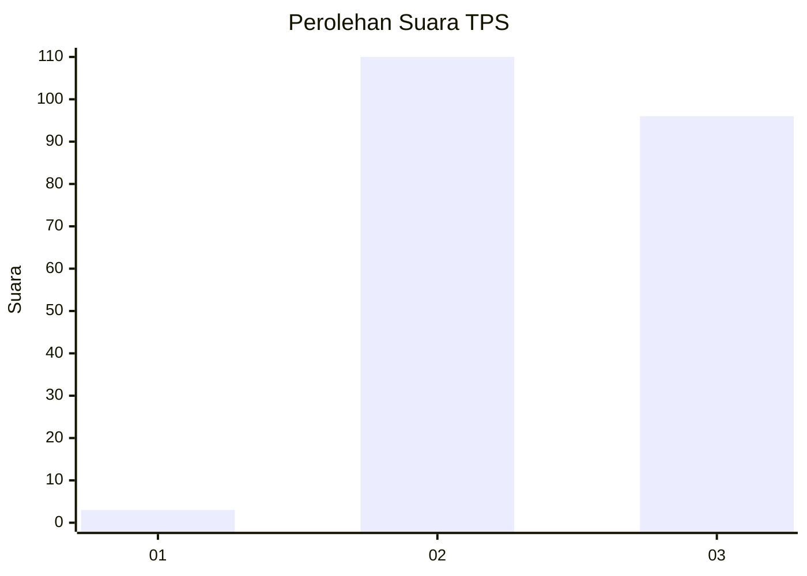
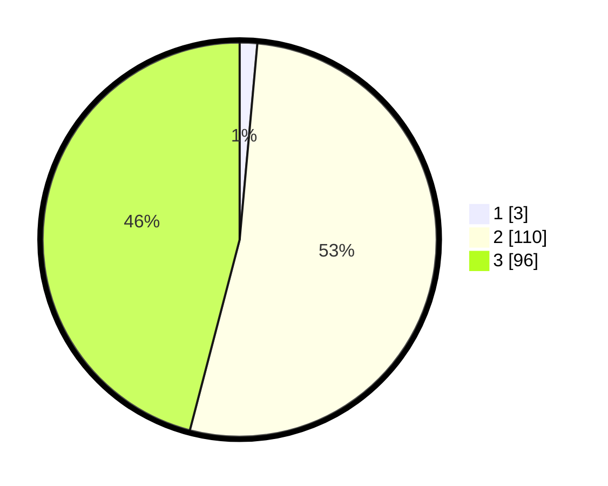

# Hasil

## Grafik

## Tabel

| No. | Nama Paslon    | Suara | Suara (raw) | Persentase |
|:--- |:-------------- | -----:| -----------:| ----------:|
| 1   | ANIES MUHAIMIN | 3     | [3][p-1]    | 1,44       |
| 2   | PRABOWO GIBRAN | 110   | [110][p-2]  | 52,63      |
| 3   | GANJAR MAHFUD  | 96    | [96][p-3]   | 45,93      |

[p-1]: https://github.com/gigit-pemilu/pemilu-2024-51-bali/blob/main/pilpres/hitung-suara/sub/51-bali/sub/08-buleleng/sub/02-seririt/sub/2001-unggahan/sub/006-tps/sub/paslon-1.txt
[p-2]: https://github.com/gigit-pemilu/pemilu-2024-51-bali/blob/main/pilpres/hitung-suara/sub/51-bali/sub/08-buleleng/sub/02-seririt/sub/2001-unggahan/sub/006-tps/sub/paslon-2.txt
[p-3]: https://github.com/gigit-pemilu/pemilu-2024-51-bali/blob/main/pilpres/hitung-suara/sub/51-bali/sub/08-buleleng/sub/02-seririt/sub/2001-unggahan/sub/006-tps/sub/paslon-3.txt

## Foto C Plano

https://sirekap-obj-formc.kpu.go.id/1ea7/pemilu/ppwp/51/08/02/20/01/5108022001006-20240214-233608--870f0992-8fcd-4673-8593-09e09512e1ae.jpg

https://sirekap-obj-formc.kpu.go.id/1ea7/pemilu/ppwp/51/08/02/20/01/5108022001006-20240214-233631--8b3c9244-9e6f-4fe3-b164-3e2d50a2202f.jpg

https://sirekap-obj-formc.kpu.go.id/1ea7/pemilu/ppwp/51/08/02/20/01/5108022001006-20240214-233650--fa2f72e2-1624-48b9-87cc-0ffbc8dd934a.jpg

## Metadata

| Key        | Value               |
| ---------- | ------------------- |
| Time Stamp | 2024-02-24 22:31:28 |

